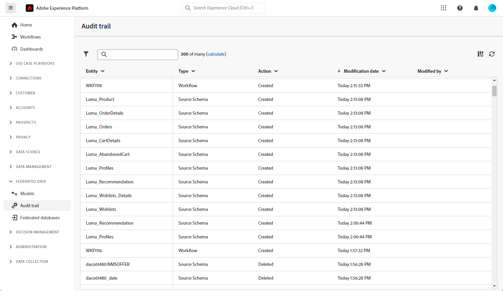

# Audit Trail {#audit-trail}

>[!CONTEXTUALHELP]
>id="dc_audit_trail"
>title="Audit trail"
>abstract="La funzionalità Audit trail fornisce un record cronologico e dettagliato di tutte le azioni e degli eventi eseguiti nell’ambiente di composizione del pubblico federato di Adobe Experience Platform in tempo reale."

La funzione **[!UICONTROL Audit trail]** registra costantemente in tempo reale un registro dettagliato delle azioni e degli eventi che si verificano all&#39;interno dell&#39;istanza di Adobe Federated Composition. Offre un metodo comodo per accedere a un record cronologico di dati, che affronta query quali: lo stato dei flussi di lavoro, gli utenti più recenti per modificarli o le attività eseguite dagli utenti all’interno dell’istanza.

+++ Ulteriori informazioni sulle entità disponibili in Audit Trail

* **Audit trail dello schema di Source** consente di monitorare le attività e le modifiche recenti apportate agli schemi all&#39;interno dell&#39;istanza di Adobe Federated Audience Composition.

  Per informazioni dettagliate sugli schemi, consulta questa [pagina](../customer/schemas.md).

* **Audit trail del flusso di lavoro** consente di tenere traccia delle attività e delle modifiche recenti apportate ai flussi di lavoro, inclusi i relativi stati correnti, ad esempio:

   * Inizio
   * Pausa
   * Interruzione
   * Riavvio
   * Pulizia uguale all’azione Cancella cronologia
   * Simula, che è uguale all’azione Avvia in modalità simulazione
   * Attivazione uguale all&#39;azione Esegui attività in sospeso ora
   * Arresto totale

  Per ulteriori informazioni sui flussi di lavoro, consulta questa [pagina](../compositions/gs-compositions.md).

* **Account esterno** consente di controllare le modifiche apportate agli account esterni nell&#39;istanza di Adobe Audience Composition.

  Per ulteriori informazioni sull&#39;account esterno, fare riferimento a questa [pagina](../connections/federated-db.md).

+++

## Accesso a Audit trail {#accessing-audit-trail}

Per accedere al **[!UICONTROL riepilogo di controllo]** dell&#39;istanza:

1. Nel menu **[!UICONTROL Dati federati]**, seleziona **[!UICONTROL Audit trail]**.

1. Viene visualizzata la finestra **[!UICONTROL Audit trail]** con l&#39;elenco delle entità. Federated Audience Composition controlla le azioni di creazione, modifica ed eliminazione per flussi di lavoro, opzioni, consegne e schemi.

   

1. La finestra **[!UICONTROL Entità di controllo]** fornisce informazioni più dettagliate sull&#39;entità scelta, ad esempio:

   * **[!UICONTROL Tipo]**: flusso di lavoro, opzioni, consegne o schemi.
   * **[!UICONTROL Entità]**: nome interno delle attività.
   * **[!UICONTROL Modificato da]**: nome utente dell&#39;ultima persona che ha modificato questa entità.
   * **[!UICONTROL Azione]**: ultima azione eseguita su questa entità, Creata, Modificata o Eliminata.
   * **[!UICONTROL Data di modifica]**: data dell&#39;ultima azione eseguita su questa entità.
