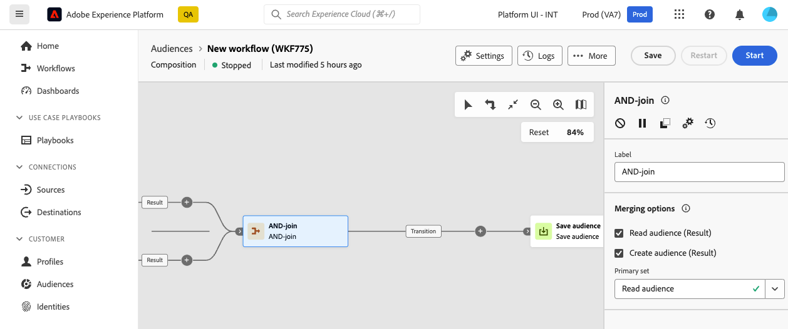

# AND-join {#join}

>[!CONTEXTUALHELP]
>id="dc_orchestration_and-join"
>title="Attività AND-join"
>abstract="L’attività **AND-join** consente di sincronizzare più rami di esecuzione di una composizione. Viene attivata al termie di tutte le attività precedenti. Questo consente di verificare che alcune attività siano state completate prima di continuare a eseguire la composizione."

L&#39;attività **AND-join** consente di sincronizzare più rami di esecuzione di una composizione.

Questa attività attiva la relativa transizione in uscita solo dopo che tutte le transizioni in entrata sono state attivate, in altre parole, dopo che tutte le attività precedenti sono state completate. Questo ti consente di verificare che alcune attività siano state completate prima di continuare a eseguire la composizione.

## Configurare l’attività And-join {#and-join-configuration}

>[!CONTEXTUALHELP]
>id="dc_orchestration_and-join_merging"
>title="Configurare l’attività And-join"
>abstract="Seleziona le attività che vuoi unire. Nel menu a discesa **[!UICONTROL Set primario]**, scegli la popolazione di transizione in entrata da mantenere."

Per configurare l’attività **Unione AND**, segui questi passaggi:

1. Aggiungi più attività per creare almeno due rami di esecuzione diversi.
1. Aggiungi un’attività **Unione AND** a uno dei rami.

   

1. Nella sezione **[!UICONTROL Opzioni di unione]**, seleziona tutte le attività precedenti che desideri sincronizzare.
1. Nel menu a discesa **[!UICONTROL Set primario]**, scegli la popolazione di transizione in entrata da mantenere. La transizione in uscita può contenere solo una delle popolazioni di transizione in entrata. Se l’attività non è configurata, la transizione in uscita selezionerà in modo casuale una delle popolazioni in entrata.
