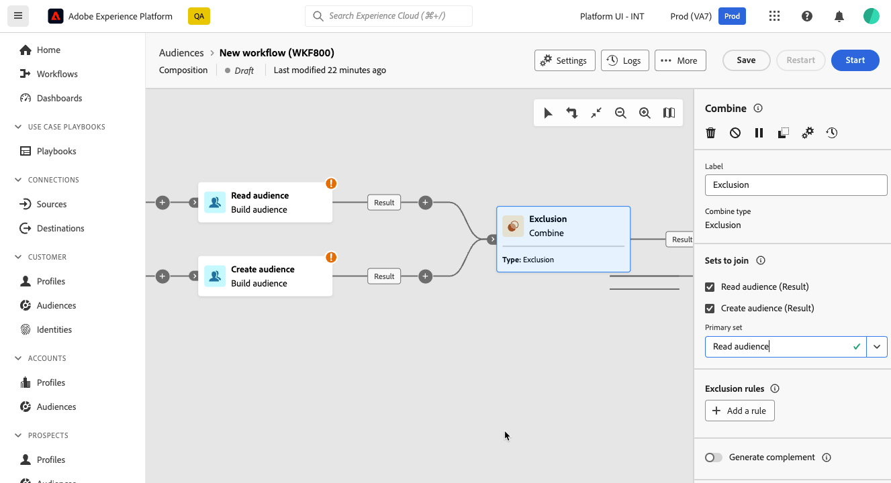

# Combina {#combine}

>[!CONTEXTUALHELP]
>id="dc_orchestration_combine"
>title="Attività Combina"
>abstract="L’attività **Combina** consente di eseguire la segmentazione sulla popolazione in entrata. Puoi quindi combinare più popolazioni, escluderne una parte o mantenere i dati comuni a più target."

L’attività **Combina** consente di eseguire la segmentazione sulla popolazione in entrata. Puoi quindi combinare più popolazioni, escluderne parte o mantenere i dati comuni a più destinazioni.

L&#39;attività **Combine** può essere inserita dopo qualsiasi altra attività, ma non all&#39;inizio della composizione. Qualsiasi attività può essere inserita dopo **Combina**.

## Configurare l’attività Combina {#combine-configuration}

>[!CONTEXTUALHELP]
>id="dc_orchestration_intersection_merging_options"
>title="Opzioni di unione per Intersezione"
>abstract="L’attività **Intersezione** consente di mantenere solo gli elementi comuni alle diverse popolazioni in entrata all’interno dell’attività. Nella sezione **Set da unire**, seleziona tutte le attività precedenti che desideri unire."

>[!CONTEXTUALHELP]
>id="dc_orchestration_exclusion_merging_options"
>title="Opzioni di unione per Esclusione"
>abstract="L’attività **Esclusione** consente di escludere elementi da una popolazione in base a determinati criteri. Nella sezione **Set da unire**, seleziona tutte le attività precedenti che desideri unire."

>[!CONTEXTUALHELP]
>id="dc_orchestration_combine_options"
>title="Selezionare il tipo di segmentazione"
>abstract="Seleziona la modalità di combinazione dei tipi di pubblico: unione, intersezione o esclusione."

Per iniziare a configurare l’attività **Combina**, segui questi passaggi comuni:

1. Aggiungi più attività per creare almeno due rami di esecuzione diversi.

1. Aggiungi un’attività **Combina** ad uno dei rami precedenti.

1. Seleziona il tipo di segmentazione: [Unione](#union), [Intersezione](#intersection) o [Esclusione](#exclusion), quindi fai clic su **Continua**.

   

1. Nella sezione **Imposta per partecipare**, controlla tutte le attività precedenti a cui vuoi partecipare.

## Unione {#combine-union}

>[!CONTEXTUALHELP]
>id="dc_orchestration_intersection_reconciliation_options"
>title="Opzioni di riconciliazione dell’intersezione"
>abstract="Seleziona il tipo di riconciliazione per definire la modalità di gestione dei duplicati."

>[!CONTEXTUALHELP]
>id="dc_orchestration_combine_reconciliation"
>title="Opzioni di riconciliazione"
>abstract="Seleziona il **Tipo di riconciliazione** per definire la modalità di gestione dei duplicati."

Nell&#39;attività **Combina** è possibile configurare una **Unione**.

Per l’attività Unione, è necessario selezionare il **Tipo di riconciliazione** per definire la modalità di gestione dei duplicati:

* **Solo chiavi**: è la modalità predefinita. L’attività mantiene un solo elemento quando gli elementi delle diverse transizioni in entrata hanno la stessa chiave. È possibile utilizzare questa opzione solo se le popolazioni in entrata sono omogenee.
* **Una seleziona di colonne**: seleziona questa opzione per definire l’elenco di colonne alle quali viene applicata la riconciliazione dei dati. Innanzitutto è necessario selezionare il set primario (quello contenente i dati di origine), quindi le colonne da utilizzare per l’unione.

## Intersezione  {#combine-intersection}

Nell&#39;attività **Combina** è possibile configurare un&#39;intersezione ****.

A questo scopo, segui i passaggi aggiuntivi seguenti:

1. Seleziona il **Tipo di riconciliazione** per definire la modalità di gestione dei duplicati. Consulta la sezione [Unione](#union).
1. È possibile selezionare l&#39;opzione **Genera complemento** se si desidera elaborare la popolazione rimanente. Il complemento conterrà l’unione dei risultati di tutte le attività in entrata senza l’intersezione. Verrà quindi aggiunta all’attività un’ulteriore transizione in uscita.

## Esclusione {#combine-exclusion}

>[!CONTEXTUALHELP]
>id="dc_orchestration_exclusion_options"
>title="Regole di esclusione"
>abstract="Se necessario, è possibile elaborare le tabelle in entrata. In effetti per escludere un target da un altro schema, noto anche come dimensione targeting, tale target deve essere restituito nello stesso schema del target principale. A questo scopo, nella sezione **Regole di esclusione**, fai clic su **Aggiungi una regola** e specifica le condizioni per la modifica dello schema. La riconciliazione dei dati viene eseguita tramite un attributo o un’unione."

>[!CONTEXTUALHELP]
>id="dc_orchestration_combine_sets"
>title="Selezionare i set da combinare"
>abstract="Nella sezione **Set da unire**, dalle transizioni in entrata, seleziona **Set primario**. Questo è il set da cui gli elementi sono esclusi. Gli altri set confrontano gli elementi prima che vengano esclusi dal set primario."

>[!CONTEXTUALHELP]
>id="dc_orchestration_combine_exclusion"
>title="Regole di esclusione"
>abstract="Se necessario, è possibile elaborare le tabelle in entrata. In effetti per escludere un target da un altro schema, noto anche come dimensione targeting, tale target deve essere restituito nello stesso schema del target principale. A questo scopo, nella sezione **Regole di esclusione**, fai clic su **Aggiungi una regola** e specifica le condizioni per la modifica dello schema. La riconciliazione dei dati viene eseguita tramite un attributo o un’unione."

>[!CONTEXTUALHELP]
>id="dc_orchestration_combine_complement"
>title="Complemento generato da combinazione"
>abstract="Attiva l’opzione **Genera complemento** per elaborare la popolazione rimanente in una transizione aggiuntiva."

Nell&#39;attività **Combina**, puoi configurare un&#39;esclusione ****.

A questo scopo, segui i passaggi aggiuntivi riportati di seguito:

1. Nella sezione **Set da unire**, dalle transizioni in entrata, seleziona **Set primario**. Questo è il set da cui gli elementi sono esclusi. Gli altri set confrontano gli elementi prima che vengano esclusi dal set primario.

1. Se necessario, è possibile elaborare le tabelle in entrata. Infatti, per escludere un target da un altro schema, questo target deve essere restituito allo stesso schema del target principale. A questo scopo, nella sezione **Regole di esclusione**, fai clic su **Aggiungi una regola** e specifica le condizioni per la modifica dello schema. La riconciliazione dei dati viene eseguita tramite un attributo o un join. <!-- pas compris-->
1. Puoi selezionare l’opzione **Genera complemento** se desideri elaborare la popolazione rimanente. Consulta la sezione [Intersezione](#intersection).

<!--
## Examples{#combine-examples}

In the following example, we are using a **Combine** activity and we add a **union** to retrieves all the profiles of the two queries: persons between 18 and 27 years old and persons between 34 and 40 years old.

The following example shows the **intersection** between two query activities. It is being used here to retrieve profiles who are between 18 to 27 years old and whose email address has been provided.

The following **exclusion** example shows two queries configured to filter profiles who are between 18 and 27 years old and have an Adobe email domain. The profiles with an Adobe email domain are then excluded from the first set. 

-->
