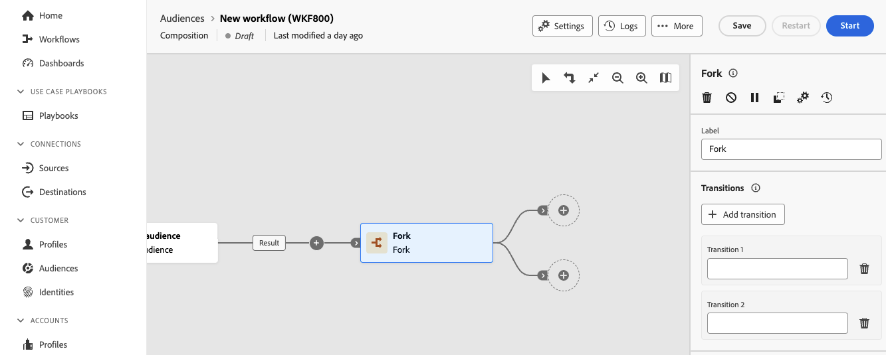

# Fork {#fork}

>[!CONTEXTUALHELP]
>id="dc_orchestration_fork"
>title="Attività Fork"
>abstract="L’attività **Fork** consente di creare transizioni in uscita per avviare più attività contemporaneamente."

>[!CONTEXTUALHELP]
>id="dc_orchestration_fork_transitions"
>title="Transizioni delle attività Fork"
>abstract="Per impostazione predefinita, vengono create due transizioni con attività **Fork**. Fai clic sul pulsante **Aggiungi transizione** per definire una transizione in uscita aggiuntiva e immetterne l’etichetta."

L’attività **Fork** consente di creare transizioni in uscita per avviare più attività contemporaneamente.

## Configurare l’attività Fork {#fork-configuration}

Per configurare l’attività **Fork** segui questi passaggi:

1. Aggiungi un&#39;attività **Fork** alla composizione.
1. Fai clic su **Aggiungi transizione** per aggiungere una nuova transizione in uscita. Per impostazione predefinita sono definite due transizioni.
1. Aggiungi un’etichetta a ciascuna delle transizioni.

   
