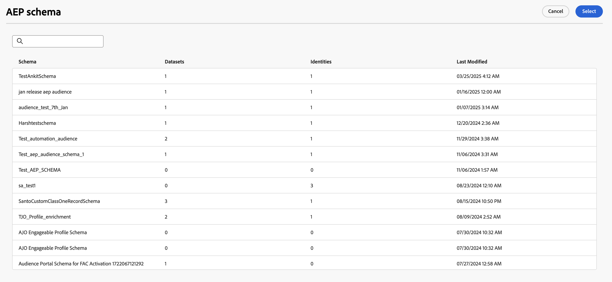

# Salva i profili {#save-profile}

>[!CONTEXTUALHELP]
>id="dc_orchestration_saveprofile"
>title="Salva i profili"
>abstract="L’attività Salva profili consente di arricchire i profili di Experience Platform mediante la federazione di dati provenienti da warehouse esterni, in modo da migliorare i profili clienti con attributi aggiuntivi. "

>[!CONTEXTUALHELP]
>id="dc_orchestration_saveprofile_aepschemalist"
>title="Seleziona schema Experience Platform"
>abstract="Scegli lo schema Experience Platform per i profili."

>[!CONTEXTUALHELP]
>id="dc_orchestration_saveprofile_primaryidentitynamespace"
>title="Seleziona campo dell’identità primaria"
>abstract="Seleziona l’identità primaria da utilizzare per identificare i profili target nel database."

>[!CONTEXTUALHELP]
>id="dc_orchestration_saveprofile_selectaepschema"
>title="Seleziona schema Experience Platform"
>abstract="Scegli lo schema Experience Platform per i profili."

>[!CONTEXTUALHELP]
>id="dc_orchestration_saveprofile_updatemode"
>title="Modalità di aggiornamento Salva profilo"
>abstract="Le modalità di aggiornamento disponibili per l’attività Save profile includono l’aggiornamento completo e l’aggiornamento incrementale."

>[!CONTEXTUALHELP]
>id="dc_orchestration_saveprofile_updatemode_full"
>title="Aggiornamento completo"
>abstract="La modalità di aggiornamento completo aggiorna l’intero set di profili per l’arricchimento."

>[!CONTEXTUALHELP]
>id="dc_orchestration_saveprofile_updatemode_incremental"
>title="Aggiornamento incrementale"
>abstract="La modalità di aggiornamento incrementale aggiorna i profili che sono stati modificati dall’ultima esecuzione dell’arricchimento."

>[!CONTEXTUALHELP]
>id="dc_orchestration_saveprofile_primaryidentityfield"
>title="Campo dell’identità primaria"
>abstract="Il campo dell’identità primaria indica la fonte di verità quando si uniscono i profili per l’arricchimento."

>[!CONTEXTUALHELP]
>id="dc_orchestration_saveprofile_requiredfieldscheck"
>title="Criteri dei campi obbligatori"
>abstract="Un campo obbligatorio è un attributo che deve essere compilato per ogni profilo o record durante l’esportazione dei dati. Se manca un campo obbligatorio, l’esportazione non sarà completa o valida."

>[!CONTEXTUALHELP]
>id="dc_orchestration_saveprofile_primaryidentitycheck"
>title="Criteri del campo di identità primaria"
>abstract="L’identificatore univoco di ciascun profilo o record. In questo modo, ogni record può essere riconosciuto e abbinato in modo distinto, evitando la duplicazione dei dati."

L&#39;attività **[!UICONTROL Salva profili]** consente di arricchire i profili Adobe Experience Platform con dati federati da warehouse esterni.

Questa attività viene generalmente utilizzata per migliorare i profili dei clienti inserendo attributi e informazioni aggiuntivi senza spostare o duplicare fisicamente i dati nella piattaforma.

## Configura l&#39;attività [!UICONTROL Salva profili] {#save-profile-configuration}

>[!IMPORTANT]
>
>L&#39;attività **Salva profili** richiede uno schema e un set di dati abilitati per il profilo. Per informazioni su come abilitare il set di dati per l&#39;abilitazione del profilo, leggere la [guida utente del set di dati](https://experienceleague.adobe.com/en/docs/experience-platform/catalog/datasets/user-guide#enable-profile){target="_blank"}.
>
>Inoltre, se il set di dati selezionato **non** ha upsert abilitato, i dati dei profili saranno **sostituiti**. Per informazioni su come abilitare l&#39;upsert per i set di dati, leggere la [guida all&#39;upsert](https://experienceleague.adobe.com/en/docs/experience-platform/catalog/datasets/enable-upsert).

Segui questi passaggi per configurare l&#39;attività **[!UICONTROL Salva profili]**:

1. Aggiungi un&#39;attività **[!UICONTROL Salva profili]** alla composizione.

   {width="1500" zoomable="yes"}

1. Specifica l’etichetta dei profili da creare.

   >[!IMPORTANT]
   >
   >L’etichetta del pubblico deve essere univoca nella sandbox corrente. Non può essere la stessa etichetta di un pubblico esistente.

1. Seleziona lo schema Adobe Experience Platform da utilizzare.

   {width="1500" zoomable="yes"}

1. Seleziona il set di dati in cui desideri salvare l’arricchimento.

   {width="300" zoomable="yes"}

1. Dopo aver selezionato il set di dati, puoi visualizzare il campo dell’identità primaria che verrà utilizzato per identificare i profili nel database.

1. Seleziona **[!UICONTROL Aggiungi campi]** per aggiungere i campi di identità primari e obbligatori.

   {width="300" zoomable="yes"}

   Puoi specificare il campo **Source** (dati esterni) e il campo **Destination** (campo schema) per ogni attributo che desideri mappare.

   {width="300" zoomable="yes"}

1. Puoi anche specificare la modalità di aggiornamento per l’arricchimento.

   {width="300" zoomable="yes"}

   | Modalità di aggiornamento | Descrizione |
   | ----------- | ----------- |
   | Aggiornamenti completi | L’intero set di profili viene aggiornato per l’arricchimento. |
   | Aggiornamenti incrementali | Per l’arricchimento vengono aggiornati solo i profili che sono stati modificati dopo l’ultimo arricchimento eseguito. |

   Se selezioni [!UICONTROL Aggiornamenti incrementali], devi anche scegliere la data dell&#39;ultima modifica per determinare quali dati vengono inviati.

1. Una volta configurata, selezionare **Inizio**.
