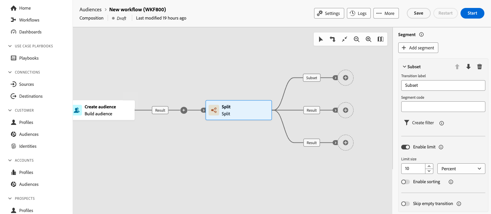

# Dividi {#split}

>[!CONTEXTUALHELP]
>id="dc_orchestration_split"
>title="Attività Dividi"
>abstract="L’attività **Dividi** consente di segmentare le popolazioni in ingresso in più sottoinsiemi in base a criteri di selezione diversi, ad esempio le regole di filtro o le dimensioni della popolazione."

L’attività **Dividi** consente di segmentare le popolazioni in ingresso in più sottoinsiemi in base a criteri di selezione diversi, ad esempio le regole di filtro o le dimensioni della popolazione.

## Configurare l’attività Dividi {#split-configuration}

>[!CONTEXTUALHELP]
>id="dc_orchestration_split_segments"
>title="Segmenti per attività Dividi"
>abstract="Aggiungi tutti i sottoinsiemi desiderati per segmentare la popolazione in ingresso.  Quando viene eseguita l’attività **Dividi**, la popolazione viene segmentata tra i diversi sottoinsiemi nell’ordine in cui vengono aggiunti all’attività. Prima di avviare la composizione, assicurati di aver ordinato i sottoinsiemi nell’ordine più adatto alle tue esigenze utilizzando i pulsanti freccia."

>[!CONTEXTUALHELP]
>id="dc_orchestration_split_filter"
>title="Filtro attività Dividi"
>abstract="Per applicare una condizione di filtro al sottoinsieme, fai clic su **[!UICONTROL Crea filtro]** e configura la regola di filtro desiderata utiizzando il query modeler. Ad esempio, includi i profili della popolazione in ingresso il cui indirizzo e-mail esiste nel database."

>[!CONTEXTUALHELP]
>id="dc_orchestration_split_limit"
>title="Limite attività Dividi"
>abstract="Per limitare il numero di profili selezionati dal sottoinsieme, attiva l’opzione **[!UICONTROL Abilita limite]** e specifica il numero o le percentuali della popolazione da includere."

>[!CONTEXTUALHELP]
>id="dc_orchestration_split_sorting"
>title="Ordinamento attività Dividi"
>abstract="Quando imposti un limite di popolazione per un sottoinsieme, puoi classificare i profili selezionati in base a un attributo di profilo specifico, in ordine crescente o decrescente. A tale scopo, attiva l’opzione **Abilita ordinamento**. Ad esempio, puoi limitare un sottoinsieme in modo da includere solo i primi 50 profili con l’importo di acquisto più alto."

>[!CONTEXTUALHELP]
>id="dc_orchestration_split_complement"
>title="Complemento generato da suddivisione"
>abstract="Dopo aver configurato tutti i sottoinsiemi, puoi selezionare la popolazione rimanente che non corrisponde a nessuno dei sottoinsiemi e includerli in un’ulteriore transizione in uscita. A tale scopo, attiva l’opzione **Genera complemento**."

>[!CONTEXTUALHELP]
>id="dc_orchestration_split_generatesubsets"
>title="Generare tutti i sottoinsiemi nella stessa tabella"
>abstract="Attiva questa opzione per raggruppare tutti i sottoinsiemi in una singola transizione di output."

>[!CONTEXTUALHELP]
>id="dc_orchestration_split_emptytransition"
>title="Ignora transizione vuota"
>abstract="Attiva l’opzione **[!UICONTROL Ignora transizione vuota]** per disabilitare la transizione di output per questo sottoinsieme se la popolazione in ingresso è vuota."

>[!CONTEXTUALHELP]
>id="dc_orchestration_split_enable_overlapping"
>title="Abilita sovrapposizione popolazioni di output"
>abstract="L’opzione **[!UICONTROL Abilita sovrapposizione popolazioni di output]** consente di gestire le popolazioni appartenenti a diversi sottoinsiemi. Quando questa opzione non è selezionata, l’attività Dividi si assicura che un destinatario non possa essere presente in diverse transizioni di output, anche se soddisfa i criteri di diversi sottoinsiemi. Saranno nella destinazione della prima scheda con i criteri corrispondenti. Quando questa opzione è selezionata, i destinatari possono essere in più sottoinsiemi se soddisfano i rispettivi criteri di filtro. "

Per configurare l’attività **Dividi** segui questi passaggi:

1. Aggiungi un&#39;attività **Dividi** alla composizione.

1. Il riquadro di configurazione dell’attività si apre con un sottoinsieme predefinito. Fai clic sul pulsante **Aggiungi segmento** per aggiungere tutti i sottoinsiemi desiderati per segmentare la popolazione in ingresso.

   >[!IMPORTANT]
   >
   >Quando l&#39;attività **Split** viene eseguita, il gruppo viene segmentato tra i diversi sottoinsiemi nell&#39;ordine in cui vengono aggiunti all&#39;attività. Ad esempio, se il primo sottoinsieme recupera il 70% della popolazione iniziale, il sottoinsieme aggiunto successivamente applicherà i propri criteri di selezione solo al restante 30% e così via.
   >
   >Prima di iniziare la composizione, accertatevi di aver ordinato i sottoinsiemi nell&#39;ordine più adatto alle vostre esigenze. A tale scopo, utilizzare i pulsanti freccia per modificare la posizione di un sottoinsieme.

1. Una volta aggiunti i sottoinsiemi, l’attività mostra tante transizioni di output quanti sono i sottoinsiemi. Si consiglia vivamente di modificare l’etichetta di ciascun sottoinsieme per identificarlo facilmente nell’area di lavoro della composizione.

   

1. Configura in che modo ogni sottoinsieme deve filtrare la popolazione in ingresso. Per farlo, segui questi passaggi:

   1. Espandere il sottoinsieme per visualizzarne le proprietà.

      

   1. Per applicare una condizione di filtro al sottoinsieme, fai clic su **[!UICONTROL Crea filtro]** e configura la regola di filtro desiderata utiizzando il query modeler. Ad esempio, includi i profili della popolazione in ingresso il cui indirizzo e-mail esiste nel database. [Scopri come utilizzare Query Modeler](../../query/query-modeler-overview.md)

   1. Per limitare il numero di profili selezionati dal sottoinsieme, attiva l’opzione **[!UICONTROL Abilita limite]** e specifica il numero o le percentuali della popolazione da includere.

   1. Per disabilitare una transizione se il gruppo in ingresso è vuoto, attiva l&#39;opzione **[!UICONTROL Ignora transizione vuota]**. Se nessun profilo corrisponde al sottoinsieme, la composizione non passerà all’attività successiva.

   >[!NOTE]
   >
   >Quando imposti un limite di popolazione per un sottoinsieme, puoi classificare i profili selezionati in base a un attributo di profilo specifico, in ordine crescente o decrescente. A tale scopo, attiva l’opzione **[!UICONTROL Abilita ordinamento]**. Ad esempio, puoi limitare un sottoinsieme in modo da includere solo i primi 50 profili con l’importo di acquisto più alto.

1. Dopo aver configurato tutti i sottoinsiemi, puoi selezionare la popolazione rimanente che non corrisponde a nessuno dei sottoinsiemi e includerli in un’ulteriore transizione in uscita. A tale scopo, attiva l’opzione **[!UICONTROL Genera complemento]**.

1. L&#39;opzione **[!UICONTROL Genera tutti i sottoinsiemi nella stessa tabella]** consente di raggruppare tutti i sottoinsiemi in un&#39;unica transizione di output.

1. L&#39;opzione **[!UICONTROL Abilita la sovrapposizione delle popolazioni di output]** consente di gestire le popolazioni appartenenti a diversi sottoinsiemi:

   * Quando questa opzione non è selezionata, l’attività Dividi si assicura che un destinatario non possa essere presente in diverse transizioni di output, anche se soddisfa i criteri di diversi sottoinsiemi. Saranno nel target della prima scheda con criteri corrispondenti.
   * Quando questa opzione è selezionata, i destinatari possono essere in più sottoinsiemi se soddisfano i rispettivi criteri di filtro. Si consiglia di utilizzare un criterio esclusivo.

L’attività adesso è configurata. Al momento dell’esecuzione, la popolazione verrà segmentata in diversi sottoinsiemi, nell’ordine in cui sono stati aggiunti all’attività.

<!--
## Example{#split-example}

In the following example, the **[!UICONTROL Split]** activity is used to segment an audience into distinct subsets based on the communication channel that we want to use :

* **Subset 1 "push"**: This subset comprises all profiles who have installed our mobile application.
* **Subset 2 "sms"**: Mobile phone users: For the remaining population that did not fall into Subset 1, subset 2 applies a filtering rule to select profiles with mobile phones in the database.
* **Complement transition**: This transition captures all the remaining profiles that did not match Subset 1 or Subset 2. Specifically, it includes profiles who neither installed the mobile application nor have a mobile phone, such as users who haven't installed the mobile app or lack a registered mobile number.

-->
