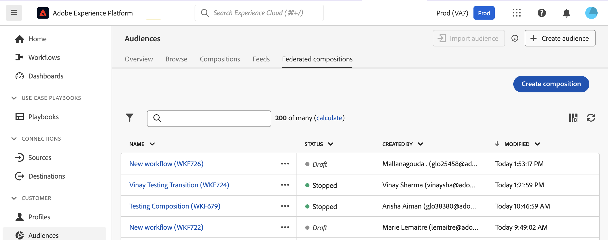
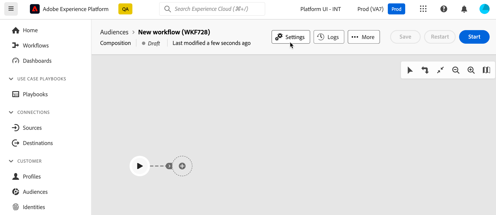

# Creare e configurare la composizione {#create}

Il primo passaggio per creare una composizione consiste nel definirne l’etichetta e, se necessario, configurare ulteriori impostazioni.

## Creare la composizione {#create-the-composition}

1. Accedere a **[!UICONTROL Tipi di pubblico]** e selezionare il **[!UICONTROL Composizioni federate]** scheda.

1. Fai clic su **[!UICONTROL Crea composizione]** pulsante.

   

1. In **[!UICONTROL Proprietà]** , specificare un&#39;etichetta per la composizione e fare clic su **[!UICONTROL Crea]**.

1. Viene visualizzata l’area di lavoro della composizione. Ora puoi configurare la composizione aggiungendo tutte le attività necessarie per soddisfare le tue esigenze prima di eseguirla:

   * [Scopri come coordinare le attività](#action-activities)
   * [Scopri come avviare e monitorare una composizione](#save)

## Configurare le impostazioni della composizione {#settings}

>[!CONTEXTUALHELP]
>id="dc_composition_settings_properties"
>title="Proprietà di composizione"
>abstract="Questa sezione fornisce proprietà di composizione generiche accessibili anche durante la creazione della composizione."

>[!CONTEXTUALHELP]
>id="dc_composition_settings_segmentation"
>title="Segmentazione della composizione"
>abstract="Per impostazione predefinita, vengono mantenute solo le tabelle di lavoro dell&#39;ultima esecuzione della composizione. È possibile abilitare questa opzione per mantenere tabelle di lavoro a scopo di test. Deve essere utilizzato **solo** in ambienti di sviluppo o di staging. Non deve mai essere controllato in un ambiente di produzione."

>[!CONTEXTUALHELP]
>id="dc_composition_settings_error"
>title="Impostazioni di gestione degli errori"
>abstract="In questa sezione puoi definire come gestire gli errori durante l’esecuzione. Potete scegliere di sospendere il processo, ignorare un certo numero di errori o interrompere l&#39;esecuzione della composizione."

Quando accedete a una composizione, potete accedere a impostazioni avanzate che consentono, ad esempio, di definire il comportamento della composizione in caso di errore.

Per accedere ad altre opzioni per la composizione, fate clic su **Impostazioni** nella sezione superiore della schermata di creazione della composizione.

Le impostazioni disponibili sono le seguenti:

* **[!UICONTROL Etichetta]**: modifica l’etichetta della composizione.

* **[!UICONTROL Mantieni il risultato delle popolazioni provvisorie tra due esecuzioni]**: per impostazione predefinita, vengono mantenute solo le tabelle di lavoro dell’ultima esecuzione della composizione. Le tabelle di lavoro delle esecuzioni precedenti sono eliminate da una composizione tecnica, che viene eseguita su base giornaliera.

  Se questa opzione è attivata, le tabelle di lavoro verranno mantenute anche dopo l&#39;esecuzione della composizione. Puoi utilizzarlo a scopo di test e quindi deve essere utilizzato **solo** in ambienti di sviluppo o di staging. Non deve mai essere controllato in una composizione di produzione.

* **[!UICONTROL Gestione degli errori]**: questa opzione ti consente di definire le azioni da intraprendere in caso di errori in un’attività di composizione. Sono disponibili tre opzioni:

   * **[!UICONTROL Sospendi il processo]**: la composizione viene automaticamente messa in pausa e il suo stato cambia in **[!UICONTROL Non riuscito]**. Una volta risolto il problema, riprendere la composizione utilizzando **[!UICONTROL Riprendi]** pulsanti.
   * **[!UICONTROL Ignora]**: lo stato dell’attività che ha attivato l’errore cambia in **[!UICONTROL Non riuscito]**, ma la composizione mantiene il **[!UICONTROL Avviato]** stato.
   * **[!UICONTROL Interrompi il processo]**: la composizione viene arrestata automaticamente e il suo stato cambia in **[!UICONTROL Non riuscito]**. Una volta risolto il problema, riavvia la composizione utilizzando **[!UICONTROL Inizio]** pulsante.

* **[!UICONTROL Errori consecutivi]**: specifica il numero di errori che possono essere ignorati prima dell’interruzione del processo. Una volta raggiunto questo numero, lo stato della composizione cambia in **[!UICONTROL Non riuscito]**. Se il valore di questo campo è 0, la composizione non verrà mai interrotta indipendentemente dal numero di errori.
