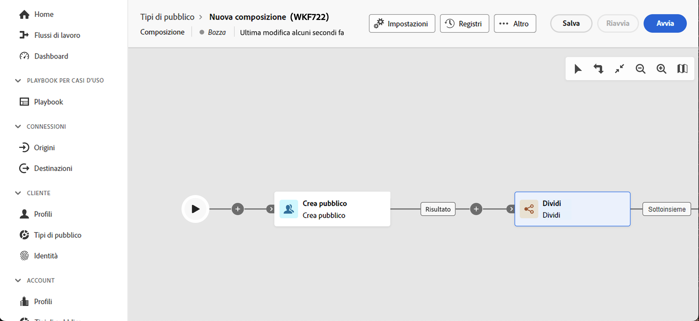
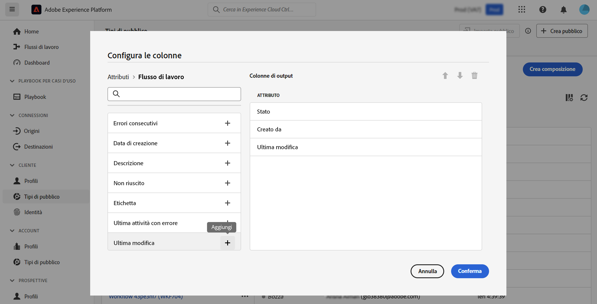

# Introduzione alle composizioni {#compositions}

## Che cos&#39;è una composizione? {#what}

Adobe Data Composition consente di creare composizioni, in cui è possibile sfruttare varie attività (suddivisione, esclusione...) in un’area di lavoro visiva per creare tipi di pubblico. Al termine, i tipi di pubblico risultanti vengono salvati in Adobe Experience Platform insieme ai tipi di pubblico esistenti e possono essere utilizzati in destinazioni come Journey Optimizer per eseguire il targeting dei clienti.

## Accedere alle composizioni {#access}

>[!CONTEXTUALHELP]
>id="dc_workflow_list"
>title="Composizioni"
>abstract="In questa schermata puoi accedere all’elenco completo delle composizioni, verificarne lo stato corrente, le date dell’ultima/successiva esecuzione e creare una nuova composizione."

Le composizioni sono accessibili dal Adobe Experience Platform **[!UICONTROL Tipi di pubblico]** nel menu **Composizioni federate** scheda.

Da questa schermata, puoi creare nuove composizioni e accedere a quelle esistenti.

Per perfezionare l’elenco e trovare facilmente la composizione che stai cercando, puoi cercare l’elenco e filtrare le composizioni in base ai loro stati o alle ultime date di elaborazione.

È inoltre possibile personalizzare l&#39;elenco aggiungendo o rimuovendo colonne. A questo scopo, fai clic su **Configura colonna** s e aggiungere o rimuovere le colonne di output desiderate.

Per duplicare o eliminare una composizione esistente, fate clic sul pulsante con i puntini di sospensione accanto al nome e selezionate l&#39;operazione desiderata.

## Stati delle composizioni {#status}

Le composizioni possono avere più stati:

* **[!UICONTROL Bozza]**: la composizione è stata creata e salvata.
* **[!UICONTROL In corso]**: la composizione è stata eseguita ed è attualmente in esecuzione.
* **[!UICONTROL Interrotto]**: l’esecuzione della composizione è stata interrotta.
* **[!UICONTROL In pausa]**: l’esecuzione della composizione è stata sospesa.
* **[!UICONTROL Errato]**: errore durante l’esecuzione della composizione. Apri la composizione e accedi ai registri e alle attività per identificare l’errore e risolverlo.
