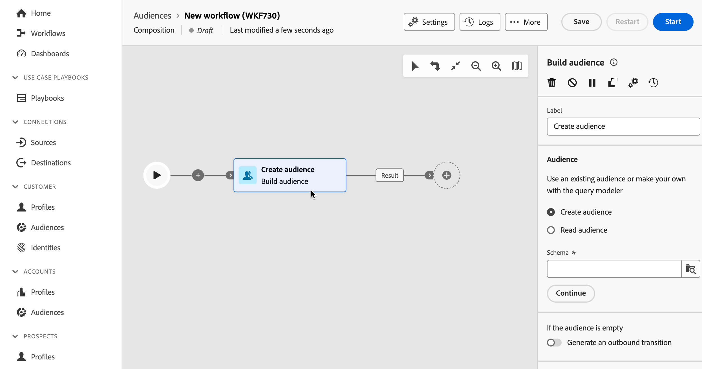

# Orchestrare le attività di composizione {#activities}

Dopo aver creato una composizione, puoi iniziare a orchestrare le diverse attività che eseguirà. A questo scopo, viene fornita un’area di lavoro visiva che consente di creare il diagramma di composizione del pubblico. All’interno di questo diagramma, puoi aggiungere varie attività e collegarle in ordine sequenziale.

## Aggiungere attività {#add}

In questa fase della configurazione, il diagramma viene visualizzato con un&#39;icona iniziale che rappresenta l&#39;inizio della composizione. Per aggiungere la prima attività, fare clic sul pulsante **+** connesso all&#39;icona Start.

Viene visualizzato un elenco di attività che possono essere aggiunte al diagramma. Le attività disponibili dipendono dalla posizione all’interno del diagramma di composizione. Ad esempio, quando aggiungi la prima attività, puoi avviare la composizione eseguendo il targeting di un pubblico, suddividendo il percorso della composizione, impostando un modulo di pianificazione per ritardare l&#39;esecuzione della composizione o impostando un&#39;attività **Attendi** per ritardare l&#39;esecuzione della composizione. Al contrario, dopo un&#39;attività di **Generazione pubblico**, puoi perfezionare la destinazione con le attività di targeting o organizzare il processo di composizione con le attività di controllo del flusso.

Una volta aggiunta un’attività al diagramma, viene visualizzato un riquadro a destra che consente di configurare l’attività appena aggiunta con impostazioni specifiche. Informazioni dettagliate su come configurare ogni attività sono disponibili in [questa sezione](activities/about-activities.md).

Ripetete questo processo per aggiungere tutte le attività desiderate, a seconda delle attività che desiderate eseguire nella composizione. Puoi anche inserire una nuova attività tra due attività. A tale scopo, fare clic sul pulsante **+** sulla transizione tra le attività, selezionare l&#39;attività desiderata e configurarla nel riquadro di destra.

>[!TIP]
>
>Hai la possibilità di personalizzare il nome delle transizioni tra ciascuna attività. A questo scopo, seleziona la transizione e modifica la relativa etichetta nel riquadro a destra.

## Barra degli strumenti dell’area di lavoro {#toolbar}

La barra degli strumenti situata nell’angolo superiore destro dell’area di lavoro offre opzioni per manipolare facilmente le attività e navigare nell’area di lavoro.

Le azioni disponibili sono:

* **[!UICONTROL Selezione multipla]**: selezionare più attività per eliminarle tutte contemporaneamente oppure copiarle e incollarle. Consulta [questa sezione](#copy).
* **[!UICONTROL Ruota]**: cambia l&#39;area di lavoro verticalmente.
* **[!UICONTROL Adatta allo schermo]**: adatta il livello di zoom dell&#39;area di lavoro allo schermo.
* **[!UICONTROL Zoom indietro]** / **[!UICONTROL Zoom avanti]**: Zoom indietro o nell&#39;area di lavoro.
* **[!UICONTROL Mappa di visualizzazione]**: apre uno snapshot dell&#39;area di lavoro che mostra che ci si trova.

## Gestire le attività {#manage}

Quando si aggiungono attività, nel riquadro delle proprietà sono disponibili pulsanti di azione che consentono di eseguire più operazioni.

Puoi eseguire le seguenti operazioni:

* **[!UICONTROL Elimina]** l’attività dall’area di lavoro.
* **[!UICONTROL Disabilita]/[!UICONTROL Abilita]** l&#39;attività. Quando la composizione viene eseguita, le attività disabilitate e le attività seguenti sullo stesso percorso non vengono eseguite e la composizione viene interrotta.
* **[!UICONTROL Pausa]/[!UICONTROL Riprendi]** l&#39;attività. Quando la composizione viene eseguita, viene messa in pausa in corrispondenza dell’attività in pausa. L’attività corrispondente e tutte quelle che la seguono nello stesso percorso non vengono eseguite.
* **[!UICONTROL Copia]** l&#39;attività per incollarla in un&#39;altra posizione nella composizione. A tale scopo, fare clic sul pulsante **+** su una transizione e selezionare **[!UICONTROL Incolla attività X]**. <!-- cannot copy multiple activities ? cannot paste in another composition?-->
* Configura **[!UICONTROL Opzioni di esecuzione]** per l&#39;attività selezionata. Espandi la sezione seguente per ulteriori informazioni sulle opzioni disponibili.

  +++Opzioni di esecuzione disponibili

  La sezione **[!UICONTROL Proprietà]** consente di configurare le impostazioni generiche relative all&#39;esecuzione dell&#39;attività:

   * **[!UICONTROL Esecuzione]**: definisci l&#39;azione da eseguire all&#39;avvio dell&#39;esecuzione.
   * **[!UICONTROL Durata massima esecuzione]**: specificare una durata, ad esempio &quot;30s&quot; o &quot;1h&quot;. Se l’attività non viene completata dopo la scadenza della durata specificata, viene attivato un avviso. Questo non ha alcun impatto sul funzionamento della composizione.
   * **[!UICONTROL Fuso orario]**: selezionare il fuso orario dell&#39;attività. La Federated Audience Composition consente di gestire le differenze di tempo tra più paesi nella stessa istanza. L’impostazione applicata viene configurata al momento della creazione dell’istanza.
   * **[!UICONTROL Affinità]**: forza l&#39;esecuzione dell&#39;attività di composizione su un computer specifico. A questo scopo, devi specificare una o più affinità per l’attività in questione.
   * **[!UICONTROL Comportamento]**: definire la procedura da seguire se vengono utilizzate attività asincrone.

  La sezione **[!UICONTROL Gestione degli errori]** consente di specificare l&#39;azione da eseguire in caso di errore dell&#39;attività.

  La sezione **[!UICONTROL Script di inizializzazione]** consente di inizializzare le variabili o modificare le proprietà dell&#39;attività. Fare clic sul pulsante **[!UICONTROL Modifica codice]** e digitare il frammento di codice da eseguire. Lo script viene chiamato durante l’esecuzione dell’attività.

+++

* Accedi a **Registri e attività**.
