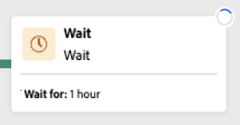
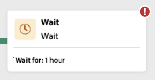
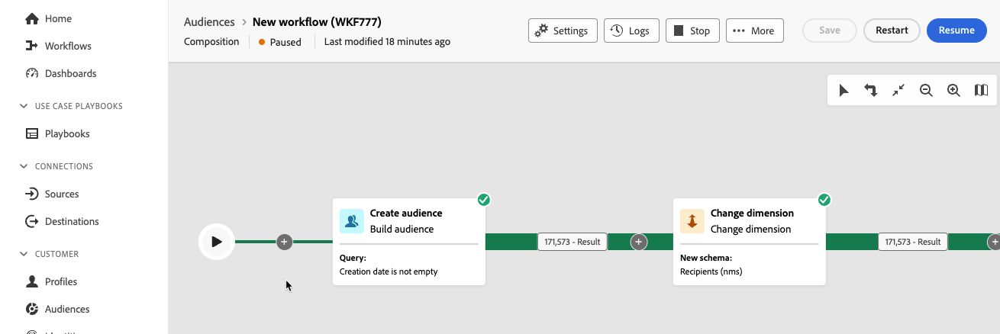

# Avviare e monitorare la composizione {#start-monitor}

Dopo aver creato la composizione e progettato le attività da eseguire nell’area di lavoro, puoi avviarla e monitorarne l’esecuzione.

## Avvia la composizione {#start}

Per avviare una composizione, fate clic su **[!UICONTROL Inizio]** nell&#39;angolo superiore destro dello schermo. Quando la composizione è in esecuzione, ogni attività nell’area di lavoro viene eseguita in ordine sequenziale, fino al raggiungimento della fine della composizione.

Puoi monitorare l’avanzamento dei profili target in tempo reale utilizzando un flusso visivo. Questo consente di identificare rapidamente lo stato di ciascuna attività e il numero di profili che passano da un’attività all’altra.

## Transizioni composizione {#transitions}

Nelle composizioni, i dati trasportati da un’attività all’altra tramite transizioni vengono memorizzati in una tabella di lavoro temporanea. Questi dati possono essere visualizzati per ogni transizione. A questo scopo, seleziona una transizione per aprirne le proprietà sul lato destro dello schermo.

* Fai clic su **[!UICONTROL Anteprima schema]** per visualizzare lo schema della tabella di lavoro.
* Fai clic su **[!UICONTROL Anteprima risultati]** per visualizzare i dati trasportati nella transizione selezionata.

## Monitorare l’esecuzione dell’attività {#activities}

Gli indicatori visivi nell’angolo superiore a destra di ciascuna casella di attività ti consentono di controllarne l’esecuzione:

| Indicatore visivo | Descrizione |
|-----|------------|
| {zoomable="yes"}{width="70%"} | L’attività è attualmente in esecuzione. |
| {zoomable="yes"}{width="70%"} | L’attività richiede la tua attenzione. Ciò potrebbe implicare la conferma dell’invio di una consegna o l’adozione di un’azione necessaria. |
| {zoomable="yes"}{width="70%"} | L’attività ha rilevato un errore. Per risolvere il problema, apri i registri della composizione per ulteriori informazioni. |
| {zoomable="yes"}{width="70%"} | L’attività è stata eseguita correttamente. |

## Monitorare i registri e le attività {#logs-tasks}

Monitorare i registri e le attività di composizione è un passaggio chiave per analizzare le composizioni e assicurarti che vengano eseguite correttamente. Sono accessibili dalla sezione **[!UICONTROL Registri]** disponibile nella barra degli strumenti delle azioni e nel riquadro delle proprietà di ogni attività.

Il **[!UICONTROL Registri di composizione e attività]** fornisce una cronologia dell’esecuzione della composizione, registrando tutte le azioni dell’utente e gli errori riscontrati.

<!-- à confirmer, pas trouvé dans les options = The workflow history is saved for the duration specified in the workflow execution options. During this duration, all the messages are therefore saved, even after a restart. If you do not want to save the messages from a previous execution, you have to purge the history by clicking the  button.-->

La cronologia è organizzata in diverse schede, descritte di seguito:

* Il **[!UICONTROL Log]** contiene la cronologia di esecuzione di tutte le attività di composizione. Questi registri indicizzano in ordine cronologico le operazioni effettuate e gli errori di esecuzione.
* Il **[!UICONTROL Attività]** La scheda descrive la sequenza di esecuzione delle attività. Il pulsante che si trova alla fine di ogni attività ti consente di elencare le variabili evento passate attraverso l’attività.
* Il **[!UICONTROL Variabili]** La scheda elenca tutte le variabili passate nella composizione. È disponibile quando si accede ai registri e alle attività solo dall’area di lavoro della composizione. È ora disponibile quando accedi ai registri dal riquadro delle proprietà di un’attività.  <!-- à confirmer-->

In tutte le schede è possibile scegliere le colonne visualizzate e il relativo ordine, applicare filtri e utilizzare il campo di ricerca per trovare rapidamente le informazioni desiderate.

## Comandi esecuzione composizione {#execution-commands}

La barra delle azioni nell&#39;angolo superiore destro fornisce i comandi che consentono di gestire l&#39;esecuzione della composizione.

Le azioni disponibili sono:

* **Inizio**: avvia l’esecuzione della composizione, che assume quindi la **In corso** stato. La composizione viene avviata e le attività iniziali vengono attivate.

* **[!UICONTROL Riprendi]**: riprende l’esecuzione della composizione messa in pausa. La composizione assume la forma **In corso** stato.

* **[!UICONTROL Pausa]** l&#39;esecuzione della composizione, che assume poi la **In pausa** stato. Non verranno attivate nuove attività finché non viene ripresa, ma le operazioni in corso non vengono sospese.

* **[!UICONTROL Interrompi]** una composizione in esecuzione, che assumerà il **Completato** stato. Se possibile, le operazioni in corso vengono interrotte. Non è possibile riprendere la composizione dalla stessa posizione in cui è stata interrotta.

* **Riavvia**: interrompe e riavvia una composizione. Nella maggior parte dei casi, questo consente di riavviare il sistema più rapidamente, in quanto l&#39;arresto richiede un certo tempo e **Inizio** è disponibile solo quando l&#39;interruzione è effettiva.
