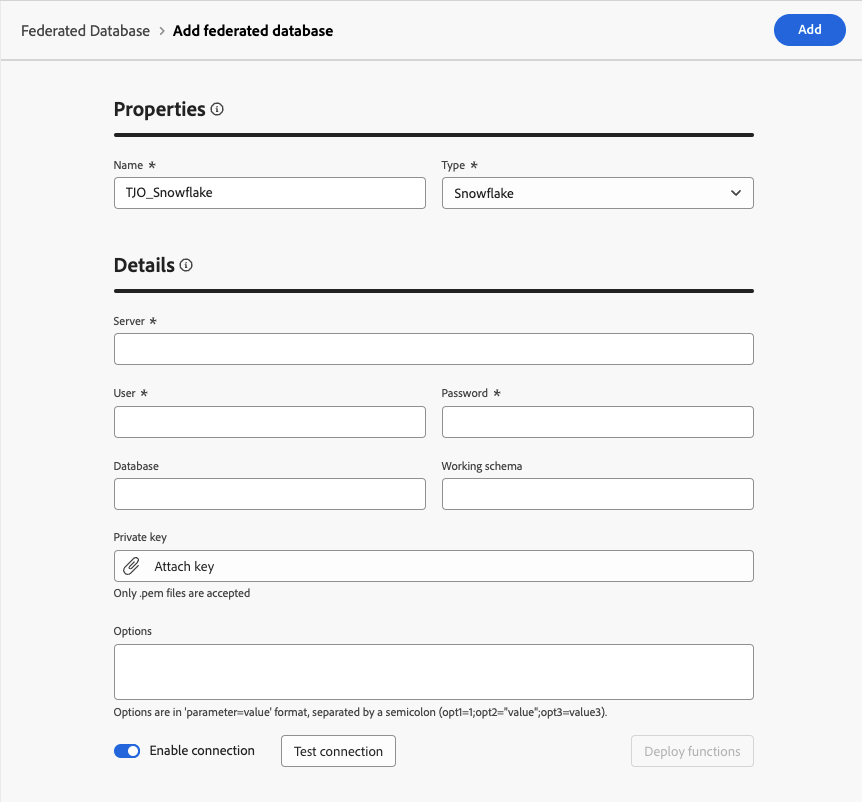

# Creare connessioni {#connections-fdb}

Experience Platform Federated Audience Composition consente al cliente di creare e arricchire i tipi di pubblico dai data warehouse di terze parti e di importare i tipi di pubblico in Adobe Experience Platform. I data warehouse supportati sono elencati in [questa sezione](../start/access-prerequisites.md#supported-systems).

Per utilizzare il database federato e Adobe Experience Platform, è innanzitutto necessario stabilire una connessione. Questa connessione viene impostata in un’interfaccia utente dedicata disponibile nell’interfaccia utente di Adobe Experience Platform, come descritto in questa pagina.

Per impostare una connessione al database, eseguire la procedura seguente:

1. Passa alla sezione **[!UICONTROL FEDERATED DATA]** nella barra a sinistra.

1. Nel collegamento **[!UICONTROL Database federati]**, fare clic sul pulsante **[!UICONTROL Aggiungi database federato]**.

   {zoomable="yes"}

1. Imposta la connessione **[!UICONTROL Proprietà]**, con il nome e il tipo del database.

   {zoomable="yes"}

   Selezionandone il tipo puoi accedere ad altre proprietà da compilare. Ulteriori informazioni sui database supportati in [questa pagina](federated-db.md).

   {zoomable="yes"}

   Le impostazioni di configurazione dipendono dal tipo di database. Sfoglia i collegamenti di seguito per accedere ai dettagli necessari per configurare la connessione:

   * [Amazon Redshift](federated-db.md#amazon-redshift)
   * [Azure Synapse](federated-db.md#azure-synapse-redshift)
   * [Databricks](federated-db.md#databricks)
   * [Google BigQuery](federated-db.md#google-big-query)
   * [Snowflake](federated-db.md#snowflake)
   * [Vertica Analytics](federated-db.md#vertica-analytics)

1. Per ogni database supportato, selezionare il pulsante **[!UICONTROL Server IP]**. Viene visualizzato l’elenco di tutti gli IP associati alle istanze Federated Audience Composition.

   {zoomable="yes"}

   Selezionare un IP dall&#39;elenco per copiarlo nel sistema e autorizzare l&#39;IP a connettersi al database.

   >[!NOTE]
   >
   >Per utilizzare Federated Audience Composition per un dato database, è necessario eseguire l’elenco consentiti di tutti gli indirizzi IP associati a tale database.

1. Dopo aver compilato i dettagli, fare clic sul pulsante **[!UICONTROL Verifica connessione]** e sul pulsante **[!UICONTROL Distribuisci funzioni]**.

   {zoomable="yes"}

1. Completa la creazione della connessione facendo clic sul pulsante **[!UICONTROL Salva]**.

   È disponibile una panoramica della connessione al database federato, come illustrato di seguito:

   {zoomable="yes"}
