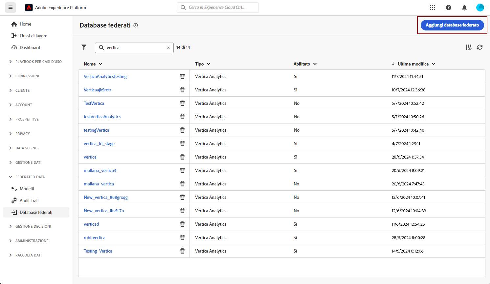
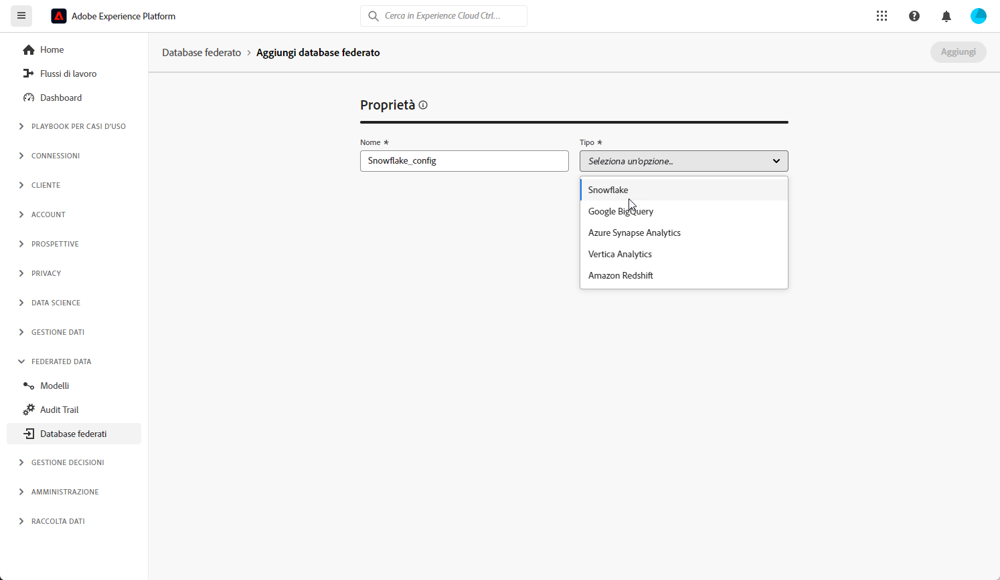
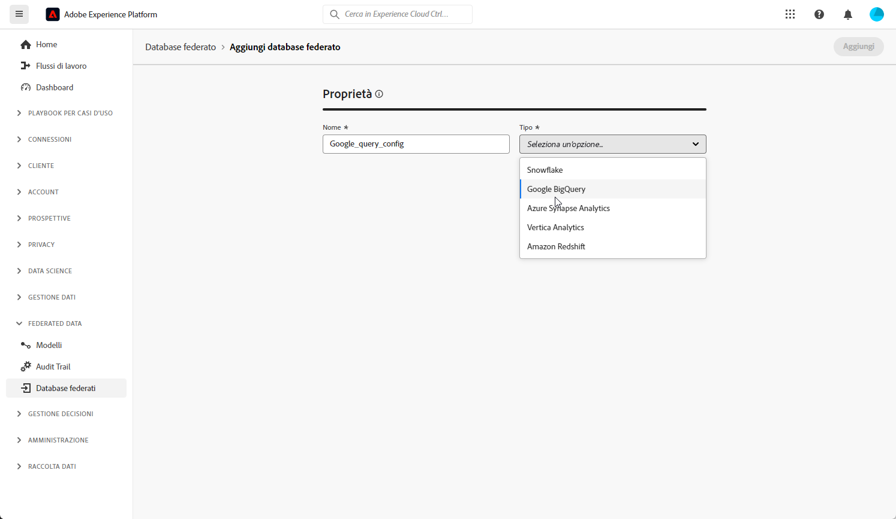
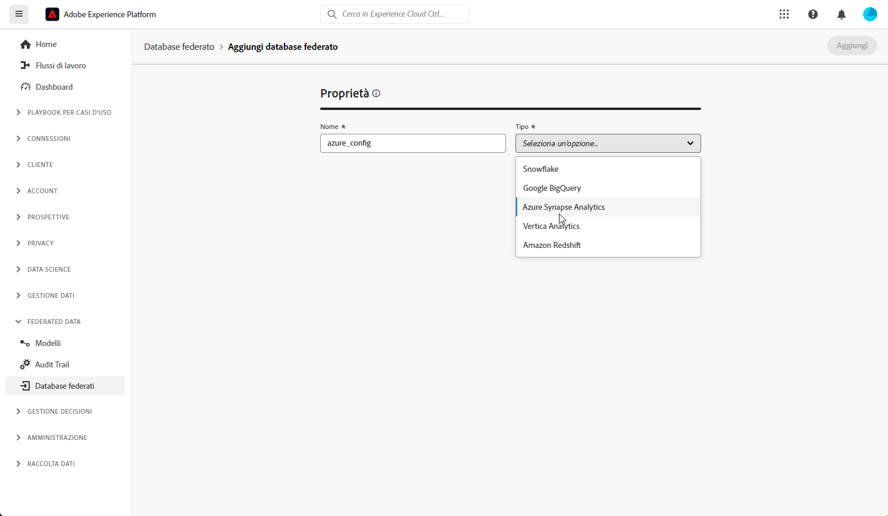
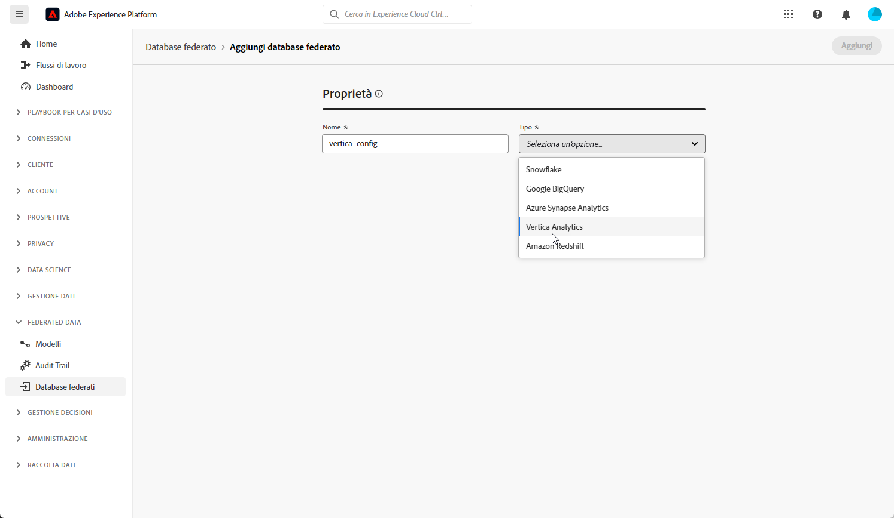
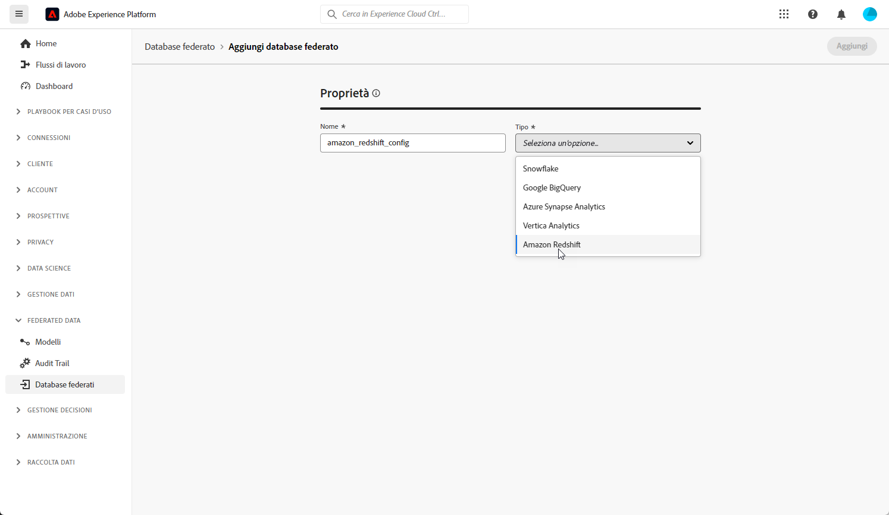

# Introduzione ai Database federati {#federated-db}

>[!CONTEXTUALHELP]
>id="dc_connection_federated_database_menu"
>title="Database federati"
>abstract="In questa schermata sono elencate le connessioni esistenti ai database federati. Per creare una nuova connessione, fai clic sul pulsante **[!UICONTROL Aggiungi database federato]**."

>[!CONTEXTUALHELP]
>id="dc_connection_federated_database_properties"
>title="Proprietà del Database federato"
>abstract="Immetti il nome del nuovo Database federato e selezionane il tipo."

>[!CONTEXTUALHELP]
>id="dc_connection_federated_database_details"
>title="Dettagli del database federato"
>abstract="Immetti le impostazioni per la connessione al nuovo Database federato. Utilizza il pulsante **[!UICONTROL Verifica connessione]** per convalidare la configurazione."

Creare, configurare, verificare e salvare la connessione a un database esterno.

Database esterni supportati:

* Snowflake
* Google BigQuery
* Azure synapse
* Vertica Analytics
*  Amazon Redshift

## Snowflake {#snowflake}

Utilizzare Federated Database per elaborare le informazioni memorizzate in un database esterno. Segui i passaggi seguenti per configurare l’accesso al Snowflake.

1. Nel menu **[!UICONTROL Dati federati]**, selezionare **[!UICONTROL Database federati]**.

1. Fare clic su **[!UICONTROL Aggiungi database federato]**.

   

1. Immetti un **[!UICONTROL Nome]** nel database Federate.

1. Dal menu a discesa **[!UICONTROL Tipo]**, seleziona Snowflake.

   

1. Configurare le impostazioni di autenticazione del Snowflake:

   * **[!UICONTROL Server]**: immettere il nome del server.

   * **[!UICONTROL Utente]**: Inserisci il tuo nome utente.

   * **[!UICONTROL Password]**: immetti la password del tuo account.

   * **[!UICONTROL Database]** (facoltativo): immettere il nome del database se non specificato nel DSN.

   * **[!UICONTROL Schema di lavoro]** (facoltativo): immetti il nome dello schema di lavoro.

   * **[!UICONTROL Chiave privata]**: fai clic sul campo **[!UICONTROL Chiave privata]** per selezionare i file con estensione pem dalla cartella locale.

   * **[!UICONTROL Opzioni]**: il connettore supporta le opzioni descritte nella tabella seguente.

1. Selezionare l&#39;opzione **[!UICONTROL Verifica connessione]** per verificare la configurazione.

1. Fare clic sul pulsante **[!UICONTROL Distribuisci funzioni]** per creare le funzioni.

1. Al termine della configurazione, fai clic su **[!UICONTROL Aggiungi]** per creare il database Federate.

Il connettore supporta le seguenti opzioni:

| Opzione | Descrizione |
|---|---|
| schema di lavoro | Schema di database da utilizzare per le tabelle di lavoro |
| data warehouse | Nome del magazzino predefinito da utilizzare. Sostituirà l’impostazione predefinita dell’utente. |
| TimeZoneName | Per impostazione predefinita, questo significa che viene utilizzato il fuso orario del server app di Campaign Classic. L’opzione può essere utilizzata per forzare il parametro di sessione TIMEZONE.  Per ulteriori informazioni, consulta [questa pagina](https://docs.snowflake.net/manuals/sql-reference/parameters.html#timezone). |
| WeekStart | Parametro di sessione WEEK_START. Per impostazione predefinita, è impostato su 0.  Per ulteriori informazioni, consulta [questa pagina](https://docs.snowflake.com/en/sql-reference/parameters.html#week-start). |
| UseCachedResult | Parametro di sessione USE_CACHED_RESULTS. Per impostazione predefinita, è impostato su TRUE. Questa opzione può essere utilizzata per disabilitare i risultati del Snowflake memorizzati nella cache.  Per ulteriori informazioni, consulta [questa pagina](https://docs.snowflake.net/manuals/user-guide/querying-persisted-results.html). |
| bulkThreads | Numero di thread da utilizzare per il caricatore di massa di Snowflake; un numero maggiore di thread indica prestazioni migliori per caricamenti di massa di maggiori dimensioni. Per impostazione predefinita, è impostato su 1. Il numero può essere regolato, a seconda del numero di thread della macchina. |
| chunkSize | Determina la dimensione del file del blocco di caricamento bulk. Per impostazione predefinita, è impostato su 128 MB. Può essere modificata per ottenere prestazioni migliori se utilizzata con bulkThreads. Un numero maggiore di thread attivi contemporaneamente garantisce prestazioni migliori.  Per ulteriori informazioni, consulta la [documentazione del Snowflake](https://docs.snowflake.net/manuals/sql-reference/sql/put.html). |
| NomeFase | Nome della fase interna di preprovisioning. Verrà utilizzato in modalità bulk load anziché creare una nuova fase temporanea. |

## Google BigQuery {#google-big-query}

Utilizzare Federated Database per elaborare le informazioni memorizzate in un database esterno. Segui i passaggi seguenti per configurare l’accesso a Google Big Query.

1. Nel menu **[!UICONTROL Dati federati]**, selezionare **[!UICONTROL Database federati]**.

1. Fare clic su **[!UICONTROL Aggiungi database federato]**.

   

1. Immetti un **[!UICONTROL Nome]** nel database Federate.

1. Dal menu a discesa **[!UICONTROL Tipo]**, seleziona Google Big Query.

   

1. Configura le impostazioni di autenticazione di Google Big Query:

   * **[!UICONTROL Account di servizio]**: immetti l&#39;indirizzo e-mail del tuo **[!UICONTROL Account di servizio]**. Per ulteriori informazioni, consulta [Documentazione di Google Cloud](https://cloud.google.com/iam/docs/creating-managing-service-accounts).

   * **[!UICONTROL Progetto]**: immetti il nome del **[!UICONTROL Progetto]**. Per ulteriori informazioni, consulta [Documentazione di Google Cloud](https://cloud.google.com/resource-manager/docs/creating-managing-projects).

   * **[!UICONTROL Set di dati]**: immettere il nome del **[!UICONTROL Set di dati]**. Per ulteriori informazioni, consulta [Documentazione di Google Cloud](https://cloud.google.com/bigquery/docs/datasets-intro).

   * **[!UICONTROL Percorso file chiave]**: carica il file chiave nel server. Sono accettati solo i file .json.

   * **[!UICONTROL Opzioni]**: il connettore supporta le opzioni descritte nella tabella seguente.

1. Selezionare l&#39;opzione **[!UICONTROL Verifica connessione]** per verificare la configurazione.

1. Fare clic sul pulsante **[!UICONTROL Distribuisci funzioni]** per creare le funzioni.

1. Al termine della configurazione, fai clic su **[!UICONTROL Aggiungi]** per creare il database Federate.

| Opzione | Descrizione |
|:-:|:-:|
| ProxyType | Tipo di proxy utilizzato per connettersi a BigQuery tramite connettori ODBC e SDK. Sono attualmente supportati  HTTP (impostazione predefinita), http_no_tunnel, socks4 e socks5. |
| ProxyHost | Nome host o indirizzo IP in cui è possibile raggiungere il proxy. |
| ProxyPort | Numero di porta su cui è in esecuzione il proxy, ad esempio 8080 |
| ProxyUid | Nome utente utilizzato per il proxy autenticato |
| ProxyPwd | Password ProxyUid |
| bqpath | Tieni presente che questo è applicabile solo per lo strumento di caricamento in blocco (SDK per cloud).   Per evitare di utilizzare la variabile PATH o se la directory google-cloud-sdk deve essere spostata in un&#39;altra posizione, è possibile specificare con questa opzione il percorso esatto della directory bin dell&#39;SDK cloud sul server. |
| GCloudConfigName | Tieni presente che questo è applicabile a partire dalla versione 7.3.4 e solo per lo strumento di caricamento in massa (Cloud SDK).  L&#39;SDK di Google Cloud utilizza le configurazioni per caricare i dati nelle tabelle BigQuery. La configurazione denominata `accfda` memorizza i parametri per il caricamento dei dati. Tuttavia, questa opzione consente agli utenti di specificare un nome diverso per la configurazione. |
| GCloudDefaultConfigName | Tieni presente che questo è applicabile a partire dalla versione 7.3.4 e solo per lo strumento di caricamento in massa (Cloud SDK).  Impossibile eliminare la configurazione SDK di Google Cloud attiva senza prima trasferire il tag attivo in una nuova configurazione. Questa configurazione temporanea è necessaria per ricreare la configurazione principale per il caricamento dei dati. Il nome predefinito per la configurazione temporanea è `default`, che può essere modificato se necessario. |
| GCloudRecreateConfig | Tieni presente che questo è applicabile a partire dalla versione 7.3.4 e solo per lo strumento di caricamento in massa (Cloud SDK).  Se è impostato su `false`, il meccanismo di caricamento in blocco non tenta di ricreare, eliminare o modificare le configurazioni dell&#39;SDK di Google Cloud. Procede invece con il caricamento dei dati utilizzando la configurazione esistente sul computer. Questa funzione è utile quando altre operazioni dipendono dalle configurazioni dell’SDK di Google Cloud.   Se l&#39;utente abilita questa opzione del motore senza una configurazione corretta, il meccanismo di caricamento in massa invierà un messaggio di avviso: `No active configuration found. Please either create it manually or remove the GCloudRecreateConfig option`. Per evitare ulteriori errori, verrà utilizzato il meccanismo di caricamento bulk predefinito per Inserisci array ODBC. |

## Azure synapse Redshift {#azure-synapse-redshift}

Utilizzare Federated Database per elaborare le informazioni memorizzate in un database esterno. Segui i passaggi seguenti per configurare l’accesso all’Azure synapse di Redshift.

1. Nel menu **[!UICONTROL Dati federati]**, selezionare **[!UICONTROL Database federati]**.

1. Fare clic su **[!UICONTROL Aggiungi database federato]**.

   

1. Immetti un **[!UICONTROL Nome]** nel database Federate.

1. Dal menu a discesa **[!UICONTROL Tipo]**, selezionare Azure synapse Redshift.

   

1. Configura le impostazioni di autenticazione Redshift dell&#39;Azure synapse:

   * **[!UICONTROL Server]**: immettere l&#39;URL del server di Azure synapse.

   * **[!UICONTROL Account]**: immetti il nome utente.

   * **[!UICONTROL Password]**: immettere la password dell&#39;account.

   * **[!UICONTROL Database]** (facoltativo): immettere il nome del database se non specificato nel DSN.

   * **[!UICONTROL Opzioni]**: il connettore supporta le opzioni descritte nella tabella seguente.

1. Selezionare l&#39;opzione **[!UICONTROL Verifica connessione]** per verificare la configurazione.

1. Fare clic sul pulsante **[!UICONTROL Distribuisci funzioni]** per creare le funzioni.

1. Al termine della configurazione, fai clic su **[!UICONTROL Aggiungi]** per creare il database Federate.

| Opzione | Descrizione |
|:-:|:-:|
| Autenticazione | Tipo di autenticazione supportato dal connettore. Valore attualmente supportato: ActiveDirectoryMSI. Per ulteriori informazioni, fare riferimento al documento [SQL](https://learn.microsoft.com/en-us/sql/connect/odbc/using-azure-active-directory?view=sql-server-ver15#example-connection-strings) (esempio di stringhe di connessione n°8) |

## Vertica Analytics {#vertica-analytics}

Utilizzare Federated Database per elaborare le informazioni memorizzate in un database esterno. Per configurare l’accesso alle Vertiche analytics, segui la procedura riportata di seguito.

1. Nel menu **[!UICONTROL Dati federati]**, selezionare **[!UICONTROL Database federati]**.

1. Fare clic su **[!UICONTROL Aggiungi database federato]**.

   

1. Immetti un **[!UICONTROL Nome]** nel database Federate.

1. Selezionare Vertiche analytics dal menu a discesa **[!UICONTROL Tipo]**.

   

1. Configurare le impostazioni di autenticazione Vertica analytics:

   * **[!UICONTROL Server]**: aggiungere l&#39;URL del server [!DNL Vertica Analytics].

   * **[!UICONTROL Account]**: aggiungi il nome utente.

   * **[!UICONTROL Password]**: aggiungi la password dell&#39;account.

   * **[!UICONTROL Database]** (facoltativo): immettere il nome del database se non specificato nel DSN.

   * **[!UICONTROL Schema di lavoro]** (facoltativo): immetti il nome dello schema di lavoro.

   * **[!UICONTROL Opzioni]**: il connettore supporta le opzioni descritte nella tabella seguente.

1. Selezionare l&#39;opzione **[!UICONTROL Verifica connessione]** per verificare la configurazione.

1. Fare clic sul pulsante **[!UICONTROL Distribuisci funzioni]** per creare le funzioni.

1. Al termine della configurazione, fai clic su **[!UICONTROL Aggiungi]** per creare il database Federate.

Il connettore supporta le seguenti opzioni:

| Opzione | Descrizione |
|---|---|
| TimeZoneName | Per impostazione predefinita, questo significa che viene utilizzato il fuso orario del server app di Campaign Classic. L’opzione può essere utilizzata per forzare il parametro di sessione TIMEZONE. |

##  Amazon Redshift {#amazon-redshift}

Utilizzare Federated Database per elaborare le informazioni memorizzate in un database esterno. Segui i passaggi seguenti per configurare l’accesso ad Amazon Redshift.

1. Nel menu **[!UICONTROL Dati federati]**, selezionare **[!UICONTROL Database federati]**.

1. Fare clic su **[!UICONTROL Aggiungi database federato]**.

   

1. Immetti un **[!UICONTROL Nome]** nel database Federate.

1. Dal menu a discesa **[!UICONTROL Tipo]**, seleziona Amazon Redshift.

   

1. Configura le impostazioni di autenticazione Amazon Redshift:

   * **[!UICONTROL Server]**: aggiungere il nome del DNS.

   * **[!UICONTROL Account]**: aggiungi il nome utente.

   * **[!UICONTROL Password]**: aggiungi la password dell&#39;account.

   * **[!UICONTROL Database]**: nome del database se non specificato nel DSN. Può essere lasciato vuoto se specificato nel DSN

   * **[!UICONTROL Schema di lavoro]**: nome dello schema di lavoro. [Ulteriori informazioni](https://docs.aws.amazon.com/redshift/latest/dg/r_Schemas_and_tables.html)

1. Selezionare l&#39;opzione **[!UICONTROL Verifica connessione]** per verificare la configurazione.

1. Fare clic sul pulsante **[!UICONTROL Distribuisci funzioni]** per creare le funzioni.

1. Al termine della configurazione, fai clic su **[!UICONTROL Aggiungi]** per creare il database Federate.