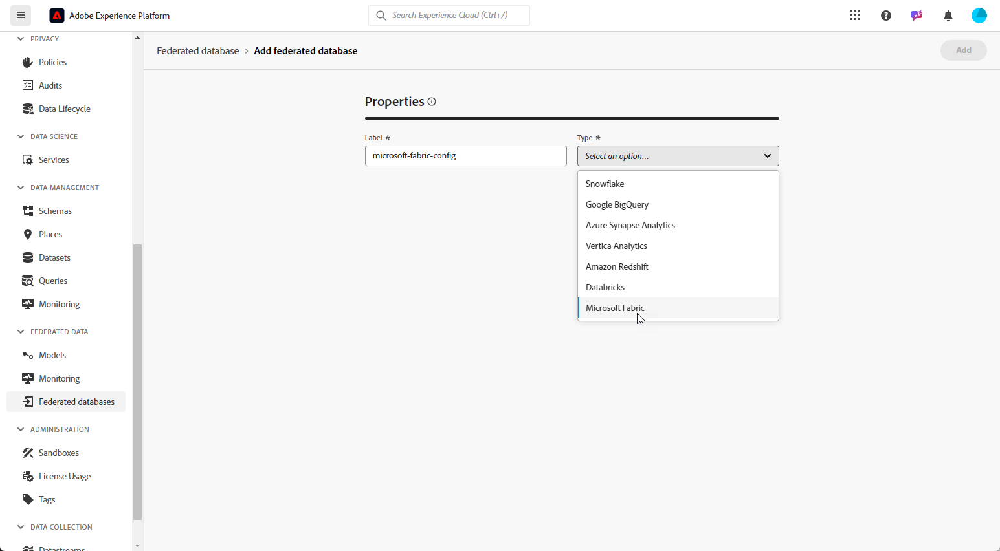

# Configurare i database federati {#federated-db}

>[!CONTEXTUALHELP]
>id="dc_connection_federated_database_menu"
>title="Database federati"
>abstract="In questa schermata sono elencate le connessioni esistenti ai database federati. Per creare una nuova connessione, fai clic sul pulsante **[!UICONTROL Aggiungi database federato]**."

>[!CONTEXTUALHELP]
>id="dc_connection_federated_database_properties"
>title="Proprietà del database federato"
>abstract="Immetti il nome del nuovo database federato e selezionane il tipo."

>[!CONTEXTUALHELP]
>id="dc_connection_federated_database_details"
>title="Dettagli del database federato"
>abstract="Immetti le impostazioni per la connessione al nuovo database federato. Utilizza il pulsante **[!UICONTROL Test di connessione]** per convalidare la configurazione."

La composizione di pubblico federato di Experience Platform consente di creare e arricchire i tipi di pubblico dai data warehouse di terze parti e di importarli in Adobe Experience Platform.

Scopri come creare, configurare, testare e salvare la connessione al database esterno in [questa pagina](connections.md). Di seguito è riportato l’elenco dei database supportati e le impostazioni dettagliate da configurare per ciascuno di essi.

## Database supportati {#supported-db}

Con la composizione di pubblico federato puoi connetterti ai seguenti database. La configurazione di ciascun database è descritta di seguito.

* [Amazon Redshift](#amazon-redshift)
* [Azure Synapse Analytics](#azure-synapse)
* [Google BigQuery](#google-big-query)
* [Snowflake](#snowflake)
* [Vertica Analytics](#vertica-analytics)
* [Databricks](#databricks)

## Amazon Redshift {#amazon-redshift}

Utilizza i database federati per elaborare le informazioni archiviate in un database esterno. Segui i passaggi seguenti per configurare l’accesso ad Amazon Redshift.

1. Nel menu **[!UICONTROL Dati federati]**, seleziona **[!UICONTROL Database federati]**.

1. Fai clic su **[!UICONTROL Aggiungi database federato]**.

   

1. Immetti un **[!UICONTROL Nome]** nel database federato.

1. Dal menu a discesa **[!UICONTROL Tipo]**, seleziona Amazon Redshift.

   

1. Configura le impostazioni di autenticazione Amazon Redshift:

   * **[!UICONTROL Server]**: aggiungi il nome del DNS.

   * **[!UICONTROL Account]**: aggiungi il nome utente.

   * **[!UICONTROL Password]**: aggiungi la password dell’account.

   * **[!UICONTROL Database]**: nome del database se non specificato nel DSN. Se specificato nel DSN, questo campo può essere lasciato vuoto.

   * **[!UICONTROL Schema di lavoro]**: nome dello schema del database da utilizzare per le tabelle di lavoro. Ulteriori informazioni sono disponibili nella sezione della [documentazione di Amazon](https://docs.aws.amazon.com/redshift/latest/dg/r_Schemas_and_tables.html){target="_blank"}

     >[!NOTE]
     >
     >È possibile utilizzare qualsiasi schema del database, inclusi gli schemi utilizzati per l’elaborazione dati temporanea, purché si disponga dell’autorizzazione necessaria per connettersi a tale schema.
     >
     >È necessario utilizzare **schemi di lavoro distinti** per connettere più sandbox con lo stesso database.

1. Seleziona l’opzione **[!UICONTROL Verifica la connessione]** per verificare la configurazione.

1. Fai clic sul pulsante **[!UICONTROL Distribuisci funzioni]** per creare le funzioni.

1. Al termine della configurazione, fai clic su **[!UICONTROL Aggiungi]** per creare il database federato.

## Azure Synapse Analytics {#azure-synapse}

Utilizza i database federati per elaborare le informazioni archiviate in un database esterno. Segui i passaggi seguenti per configurare l’accesso ad Azure Synapse Analytics.

1. Nel menu **[!UICONTROL Dati federati]**, seleziona **[!UICONTROL Database federati]**.

1. Fai clic su **[!UICONTROL Aggiungi database federato]**.

   

1. Immetti un **[!UICONTROL Nome]** nel database federato.

1. Dal menu a discesa **[!UICONTROL Tipo]**, seleziona Azure Synapse Analytics.

   

1. Configura le impostazioni di autenticazione di Azure Synapse Analytics:

   * **[!UICONTROL Server]**: immetti l’URL del server di Azure Synapse.

   * **[!UICONTROL Account]**: immetti il nome utente.

   * **[!UICONTROL Password]**: immetti la password dell’account.

   * **[!UICONTROL Database]** (facoltativo): immetti il nome del database se non specificato nel DSN.

   * **[!UICONTROL Opzioni]**: il connettore supporta le opzioni descritte nella tabella seguente.

1. Seleziona l’opzione **[!UICONTROL Verifica la connessione]** per verificare la configurazione.

1. Fai clic sul pulsante **[!UICONTROL Distribuisci funzioni]** per creare le funzioni.

1. Al termine della configurazione, fai clic su **[!UICONTROL Aggiungi]** per creare il database federato.

| Opzione | Descrizione |
|---|---|
| Autenticazione | Tipo di autenticazione supportato dal connettore. Valore attualmente supportato: ActiveDirectoryMSI. Per ulteriori informazioni, fai riferimento alla [documentazione SQL di Microsoft](https://learn.microsoft.com/it-IT/sql/connect/odbc/using-azure-active-directory?view=sql-server-ver15#example-connection-strings){target="_blank"} (esempio di stringhe di connessione n. 8) |

## Google BigQuery {#google-big-query}

Utilizza i database federati per elaborare le informazioni archiviate in un database esterno. Segui i passaggi seguenti per configurare l’accesso a Google BigQuery.

1. Nel menu **[!UICONTROL Dati federati]**, seleziona **[!UICONTROL Database federati]**.

1. Fai clic su **[!UICONTROL Aggiungi database federato]**.

   

1. Immetti un **[!UICONTROL Nome]** nel database federato.

1. Dal menu a discesa **[!UICONTROL Tipo]**, seleziona Google BigQuery.

   

1. Configura le impostazioni di autenticazione di Google BigQuery:

   * **[!UICONTROL Account di servizio]**: immetti l’indirizzo e-mail del tuo **[!UICONTROL Account di servizio]**. Per ulteriori informazioni, consulta la [documentazione di Google Cloud](https://cloud.google.com/iam/docs/creating-managing-service-accounts){target="_blank"}.

   * **[!UICONTROL Progetto]**: immetti l’ID del **[!UICONTROL Progetto]**. Per ulteriori informazioni, consulta la [documentazione di Google Cloud](https://cloud.google.com/resource-manager/docs/creating-managing-projects){target="_blank"}.

   * **[!UICONTROL Set di dati]**: immetti il nome del **[!UICONTROL Set di dati]**. Per ulteriori informazioni, consulta la [documentazione di Google Cloud](https://cloud.google.com/bigquery/docs/datasets-intro){target="_blank"}.

   * **[!UICONTROL Percorso file della chiave]**: carica il file della chiave nel server. Sono accettati solo i file .JSON.

   * **[!UICONTROL Opzioni]**: il connettore supporta le opzioni descritte nella tabella seguente.

1. Seleziona l’opzione **[!UICONTROL Verifica la connessione]** per verificare la configurazione.

1. Fai clic sul pulsante **[!UICONTROL Distribuisci funzioni]** per creare le funzioni.

1. Al termine della configurazione, fai clic su **[!UICONTROL Aggiungi]** per creare il database federato.

| Opzione | Descrizione |
|---|---|
| ProxyType | Tipo di proxy utilizzato per connettersi a BigQuery tramite connettori ODBC e SDK. Sono attualmente supportati  HTTP (impostazione predefinita), http_no_tunnel, socks4 e socks5. |
| ProxyHost | Nome host o indirizzo IP in cui è possibile raggiungere il proxy. |
| ProxyPort | Numero di porta su cui è in esecuzione il proxy, ad esempio 8080 |
| ProxyUid | Nome utente utilizzato per il proxy autenticato |
| ProxyPwd | Password ProxyUid |
| bqpath | Tieni presente che questo è applicabile solo per lo strumento di caricamento in blocco (SDK per cloud).   Per evitare di utilizzare la variabile PATH o se la directory google-cloud-sdk deve essere spostata in un’altra posizione, con questa opzione è possibile specificare il percorso esatto della directory bin SDK cloud sul server. |
| GCloudConfigName | Tieni presente che questo è applicabile a partire dalla versione 7.3.4 e solo per lo strumento di caricamento in blocco (Cloud SDK).  L’SDK di Google Cloud utilizza le configurazioni per caricare i dati nelle tabelle BigQuery. La configurazione denominata `accfda` memorizza i parametri per il caricamento dei dati. Tuttavia, questa opzione consente agli utenti di specificare un nome diverso per la configurazione. |
| GCloudDefaultConfigName | Tieni presente che questo è applicabile a partire dalla versione 7.3.4 e solo per lo strumento di caricamento in blocco (Cloud SDK).  Impossibile eliminare la configurazione SDK di Google Cloud attiva senza prima trasferire il tag attivo in una nuova configurazione. Questa configurazione temporanea è necessaria per ricreare la configurazione principale per il caricamento dei dati. Il nome predefinito per la configurazione temporanea è `default`, che, in base alle necessità, può essere modificato. |
| GCloudRecreateConfig | Tieni presente che questo è applicabile a partire dalla versione 7.3.4 e solo per lo strumento di caricamento in blocco (Cloud SDK).  Se è impostato su `false`, il meccanismo di caricamento in blocco non tenta di ricreare, eliminare o modificare le configurazioni dell’SDK di Google Cloud. Procede invece con il caricamento dei dati utilizzando la configurazione esistente sul computer. Questa funzione è utile quando altre operazioni dipendono dalle configurazioni dell’SDK di Google Cloud.   Se l’utente abilita questa opzione del motore senza una configurazione corretta, il meccanismo di caricamento in blocco invierà un messaggio di avviso: `No active configuration found. Please either create it manually or remove the GCloudRecreateConfig option`. Per evitare ulteriori errori, verrà utilizzato il meccanismo di caricamento in blocco predefinito per Inserisci array ODBC. |

## Snowflake {#snowflake}

>[!NOTE]
>
>È supportato l’accesso sicuro al data warehouse esterno di Snowflake tramite collegamento privato. Il tuo account di Snowflake deve essere ospitato su Amazon Web Services (AWS) e situato nella stessa area geografica dell’ambiente di composizione di pubblico federato. Contatta il tuo rappresentante Adobe per assistenza nella configurazione dell’accesso sicuro all’account Snowflake.
>

Utilizza i database federati per elaborare le informazioni archiviate in un database esterno. Segui i passaggi seguenti per configurare l’accesso a Snowflake.

1. Nel menu **[!UICONTROL Dati federati]**, seleziona **[!UICONTROL Database federati]**.

1. Fai clic su **[!UICONTROL Aggiungi database federato]**.

   

1. Immetti un **[!UICONTROL Nome]** nel database federato.

1. Dal menu a discesa **[!UICONTROL Tipo]**, seleziona Snowflake.

   

1. Configura le impostazioni dell’autenticazione di Snowflake:

   * **[!UICONTROL Server]**: immetti il nome del server.

   * **[!UICONTROL Utente]**: inserisci il tuo nome utente.

   * **[!UICONTROL Password]**: immetti la password del tuo account.

   * **[!UICONTROL Database]** (facoltativo): immetti il nome del database se non specificato nel DSN.

   * **[!UICONTROL Schema di lavoro]** (facoltativo): immettere il nome dello schema del database da utilizzare per le tabelle di lavoro.

     >[!NOTE]
     >
     >È possibile utilizzare qualsiasi schema del database, inclusi gli schemi utilizzati per l’elaborazione dati temporanea, purché si disponga dell’autorizzazione necessaria per connettersi a tale schema.
     >
     >È necessario utilizzare utilizzare **schemi di lavoro distinti** per connettere più sandbox con lo stesso database.

   * **[!UICONTROL Chiave privata]**: fai clic sul campo **[!UICONTROL Chiave privata]** per selezionare i file con estensione .pem dalla cartella locale.

   * **[!UICONTROL Opzioni]**: il connettore supporta le opzioni descritte nella tabella seguente.

1. Seleziona l’opzione **[!UICONTROL Verifica la connessione]** per verificare la configurazione.

1. Fai clic sul pulsante **[!UICONTROL Distribuisci funzioni]** per creare le funzioni.

1. Al termine della configurazione, fai clic su **[!UICONTROL Aggiungi]** per creare il database federato.

Il connettore supporta le seguenti opzioni:

| Opzione | Descrizione |
|---|---|
| schema di lavoro | Schema di database da utilizzare per le tabelle di lavoro |
| data warehouse | Nome del data warehouse predefinito da utilizzare. Sostituirà l’impostazione predefinita dell’utente. |
| TimeZoneName | Per impostazione predefinita, questo significa che viene utilizzato il fuso orario del server dell’app. L’opzione può essere utilizzata per forzare il parametro di sessione TIMEZONE.  Per ulteriori informazioni, consulta [questa pagina](https://docs.snowflake.net/manuals/sql-reference/parameters.html#timezone){target="_blank"}. |
| WeekStart | Parametro di sessione WEEK_START. Per impostazione predefinita, è impostato su 0.  Per ulteriori informazioni, consulta [questa pagina](https://docs.snowflake.com/en/sql-reference/parameters.html#week-start){target="_blank"}. |
| UseCachedResult | Parametro di sessione USE_CACHED_RESULTS. Per impostazione predefinita, è impostato su TRUE. Questa opzione può essere utilizzata per disabilitare i risultati di Snowflake memorizzati nella cache.  Per ulteriori informazioni, consulta [questa pagina](https://docs.snowflake.net/manuals/user-guide/querying-persisted-results.html){target="_blank"}. |
| bulkThreads | Numero di thread da utilizzare per il caricamento in blocco di Snowflake; un numero maggiore di thread indica prestazioni migliori per caricamenti in blocco di maggiori dimensioni. Per impostazione predefinita, è impostato su 1. Il numero può essere regolato, a seconda del conteggio di thread automatico. |
| chunkSize | Determina la dimensione del file di un blocco del caricamento in blocco. Per impostazione predefinita, è impostata su 128 MB. Può essere modificata per ottenere prestazioni migliori se utilizzata con bulkThreads. Un numero maggiore di thread attivi contemporaneamente garantisce prestazioni migliori.  Per ulteriori informazioni, consulta la [documentazione Snowflake](https://docs.snowflake.net/manuals/sql-reference/sql/put.html){target="_blank"}. |
| StageName | Nome della fase interna di pre-provisioning. Verrà utilizzato nel caricamento in blocco anziché creare una nuova fase temporanea. |

## Vertica Analytics {#vertica-analytics}

Utilizza i database federati per elaborare le informazioni archiviate in un database esterno. Per configurare l’accesso a Vertica Analytics, segui la procedura riportata di seguito.

1. Nel menu **[!UICONTROL Dati federati]**, seleziona **[!UICONTROL Database federati]**.

1. Fai clic su **[!UICONTROL Aggiungi database federato]**.

   

1. Immetti un **[!UICONTROL Nome]** nel database federato.

1. Seleziona Vertica Analytics dal menu a discesa **[!UICONTROL Tipo]**.

   

1. Configura le impostazioni di autenticazione Vertica Analytics:

   * **[!UICONTROL Server]**: aggiungi l’URL del server [!DNL Vertica Analytics].

   * **[!UICONTROL Account]**: aggiungi il nome utente.

   * **[!UICONTROL Password]**: aggiungi la password dell’account.

   * **[!UICONTROL Database]** (facoltativo): immetti il nome del database se non specificato nel DSN.

   * **[!UICONTROL Schema di lavoro]** (facoltativo): immettere il nome dello schema del database da utilizzare per le tabelle di lavoro.

     >[!NOTE]
     >
     >È possibile utilizzare qualsiasi schema del database, inclusi gli schemi utilizzati per l’elaborazione dati temporanea, purché si disponga dell’autorizzazione necessaria per connettersi a tale schema.
     >
     >È necessario utilizzare **schemi di lavoro distinti** per connettere più sandbox con lo stesso database.

   * **[!UICONTROL Opzioni]**: il connettore supporta le opzioni descritte nella tabella seguente.

1. Seleziona l’opzione **[!UICONTROL Verifica la connessione]** per verificare la configurazione.

1. Fai clic sul pulsante **[!UICONTROL Distribuisci funzioni]** per creare le funzioni.

1. Al termine della configurazione, fai clic su **[!UICONTROL Aggiungi]** per creare il database federato.

Il connettore supporta la seguente opzione:

| Opzione | Descrizione |
|---|---|
| TimeZoneName | Per impostazione predefinita, questo significa che viene utilizzato il fuso orario del server dell’app. L’opzione può essere utilizzata per forzare il parametro di sessione TIMEZONE. |

## Databricks {#databricks}

Utilizza i database federati per elaborare le informazioni archiviate in un database esterno. Segui i passaggi seguenti per configurare l’accesso a Databricks.

1. Nel menu **[!UICONTROL Dati federati]**, seleziona **[!UICONTROL Database federati]**.

1. Fai clic su **[!UICONTROL Aggiungi database federato]**.

   

1. Immetti un **[!UICONTROL Nome]** nel database federato.

1. Dal menu a discesa **[!UICONTROL Tipo]**, seleziona Databricks.

   

1. Configura le impostazioni di autenticazione di Databricks:

   * **[!UICONTROL Server]**: aggiungi il nome del server Databricks.

   * **[!UICONTROL Percorso HTTP]**: aggiungi il percorso al cluster o al data warehouse. [Ulteriori informazioni](https://docs.databricks.com/en/integrations/compute-details.html){target="_blank"}

   * **[!UICONTROL Password]**: aggiungi il token di accesso dell’account. [Ulteriori informazioni](https://docs.databricks.com/en/dev-tools/auth/pat.html){target="_blank"}

   * **[!UICONTROL Catalogo]**: aggiungi il campo per il catalogo Databricks.

   * **[!UICONTROL Schema di lavoro]**: nome dello schema del database da utilizzare per le tabelle di lavoro.

     >[!NOTE]
     >
     >È possibile utilizzare qualsiasi schema del database, inclusi gli schemi utilizzati per l’elaborazione dati temporanea, purché si disponga dell’autorizzazione necessaria per connettersi a tale schema.
     >
     >È necessario utilizzare **schemi di lavoro distinti** per connettere più sandbox con lo stesso database.

   * **[!UICONTROL Opzioni]**: il connettore supporta le opzioni descritte nella tabella seguente.

1. Seleziona l’opzione **[!UICONTROL Verifica la connessione]** per verificare la configurazione.

1. Fai clic sul pulsante **[!UICONTROL Distribuisci funzioni]** per creare le funzioni.

1. Al termine della configurazione, fai clic su **[!UICONTROL Aggiungi]** per creare il database federato.

Il connettore supporta le seguenti opzioni:

| Opzione | Descrizione |
|---|---|
| TimeZoneName | Per impostazione predefinita, questo significa che viene utilizzato il fuso orario del server dell’app. L’opzione può essere utilizzata per forzare il parametro di sessione TIMEZONE. |

<!--Not for October release

## Microsoft Fabric (LA){#microsoft-fabric}

>[!AVAILABILITY]
>
>Microsoft Fabric is currently only available for a set of organizations (Limited Availability).

Use Federated databases to process information stored in an external database. Follow the steps below to configure access to Microsoft Fabric.

1. Under the **[!UICONTROL Federated data]** menu, select **[!UICONTROL Federated databases]**.

1. Click **[!UICONTROL Add federated database]**.

    

1. Enter a **[!UICONTROL Name]** to your Federate database.

1. From the **[!UICONTROL Type]** drop-down, select Microsoft Fabric.

    

1. Configure the Microsoft Fabric authentication settings:

    * **[!UICONTROL Server]**: Enter the URL of the Microsoft Fabric server.

    * **[!UICONTROL Application ID]**: Enter your Microsoft Fabric Application ID.

    * **[!UICONTROL Client secret]**: Enter your Client secret.

    * **[!UICONTROL Options]**: The connector supports the options detailed in the table below.

1. Select the **[!UICONTROL Test the connection]** option to verify your configuration.

1. Click **[!UICONTROL Deploy functions]** button to create the functions.

1. Once your configuration is done, click **[!UICONTROL Add]** to create your Federate database.

| Option   |  Description |
|---|---|
| Authentication | Type of authentication supported by the connector. Current supported value: ActiveDirectoryMSI. For more information, refer to [Microsoft SQL documentation](https://learn.microsoft.com/en-us/sql/connect/odbc/using-azure-active-directory?view=sql-server-ver15#example-connection-strings){target="_blank"}  (Example connection strings n°8) |
-->
