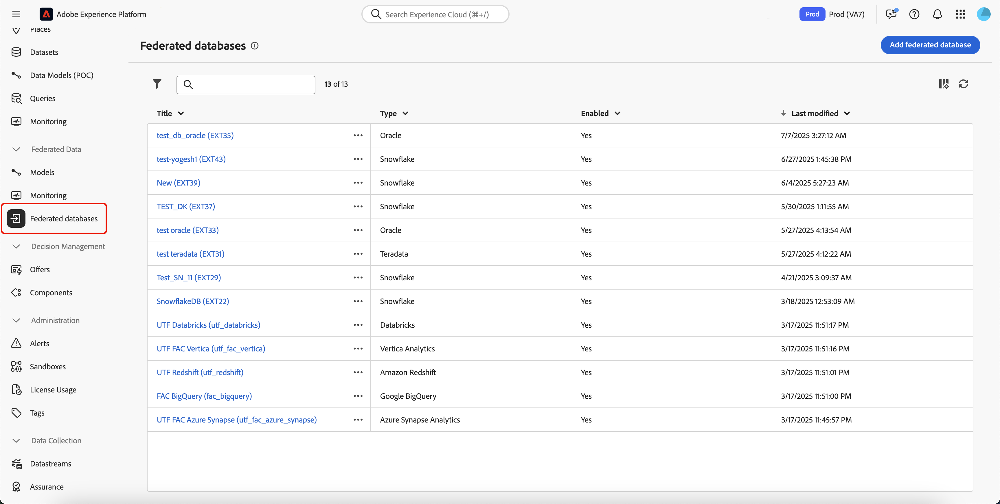

# Creare connessioni {#connections-fdb}

>[!AVAILABILITY]
>
>Per accedere alle connessioni, è necessario disporre di una delle seguenti autorizzazioni:
>
>-**Gestisci database federato-** Visualizza database federato **
>
>Per ulteriori informazioni sulle autorizzazioni richieste, consulta la [Guida al controllo degli accessi](/help/governance-privacy-security/access-control.md).

La Federated Audience Composition di Experience Platform consente di creare e arricchire i tipi di pubblico dai data warehouse di terze parti e di importarli in Adobe Experience Platform.

## Database supportati {#supported-databases}

Per utilizzare il database federato e Adobe Experience Platform, è innanzitutto necessario stabilire una connessione tra le due origini. Federated Audience Composition consente di connettersi ai seguenti database.

- Amazon Redshift
- Azure Synapse Analytics
- Databricks
- Google BigQuery
- Microsoft Fabric
- Oracle
- Snowflake
- Teradata
- Vertica Analytics

## Crea connessione {#create}

Per creare una connessione, selezionare **[!UICONTROL Database federati]** nella sezione Dati federati.

{zoomable="yes" width="70%" align="center"}

Viene visualizzata la sezione Database federati. Selezionare **[!UICONTROL Aggiungi database federato]** per creare una connessione.

{zoomable="yes" width="70%" align="center"}

>[!NOTE]
>
>Per richiedere la connettività protetta tramite collegamento privato o VPN, **è necessario** disporre della licenza Privacy and Security Shield o Healthcare Shield.

Viene visualizzato il popover delle proprietà di connessione. È possibile assegnare un nome alla connessione e selezionare il tipo di database da creare.

{zoomable="yes" width="70%" align="center"}

Dopo aver selezionato un tipo, viene visualizzata la sezione **[!UICONTROL Dettagli]**. Questa sezione varia in base al tipo di database scelto in precedenza.

>[!BEGINTABS]

>[!TAB Amazon Redshift]

>[!AVAILABILITY]
>
>Sono supportati solo Amazon Redshift AWS, Amazon Redshift Spectrum e Amazon Redshift Serverless.
>
>È inoltre supportato l&#39;accesso sicuro al data warehouse Amazon Redshift esterno tramite collegamento privato.

Dopo aver selezionato Amazon Redshift, puoi aggiungere i seguenti dettagli:

| Campo | Descrizione |
| ----- | ----------- |
| Server | Nome dell&#39;origine dati. |
| Account | Il nome utente dell’account. |
| Password | La password dell&#39;account. |
| Database | Nome del database. Se è specificato nel nome del server, questo campo può essere lasciato vuoto. |
| Schema di lavoro | Nome dello schema del database da utilizzare per le tabelle di lavoro. Ulteriori informazioni su questa funzione sono disponibili nella [documentazione sugli schemi di Amazon](https://docs.aws.amazon.com/redshift/latest/dg/r_Schemas_and_tables.html){target="_blank"}.  **Nota:** È possibile utilizzare qualsiasi schema del database, inclusi gli schemi utilizzati per l&#39;elaborazione dati temporanea, purché si disponga delle autorizzazioni necessarie per connettersi a questo schema. Tuttavia, **devi** utilizzare schemi di lavoro distinti per collegare più sandbox allo stesso database. |

>[!TAB Azure Synapse Analytics]

>[!NOTE]
>
>Se desideri creare una connessione sicura utilizzando Azure Synapse Analytics, contatta il rappresentante dell’Assistenza clienti di Adobe.

Dopo aver selezionato Azure Synapse Analytics, puoi aggiungere i seguenti dettagli:

| Campo | Descrizione |
| ----- | ----------- |
| Server | URL del server Azure Synapse. |
| Account | ID applicazione (**ID client**) della registrazione dell&#39;app Azure. |
| Password | Il valore **Segreto client** dell&#39;applicazione Azure. |
| Database | Nome del database. Se è specificato nel nome del server, questo campo può essere lasciato vuoto. |
| Opzioni | Opzioni aggiuntive per la connessione. Per Azure Synapse Analytics puoi specificare il tipo di autenticazione supportato dal connettore. Attualmente, Federated Audience Composition supporta `ActiveDirectoryMSI`. Per ulteriori informazioni sulle stringhe di connessione, leggere la sezione [esempi di stringhe di connessione nella documentazione di Microsoft](https://learn.microsoft.com/it-IT/sql/connect/odbc/using-azure-active-directory?view=sql-server-ver15#example-connection-strings){target="_blank"} . |

In alternativa, puoi configurare in modo sicuro la connessione Azure Synapse Analytics utilizzando l’autenticazione Service Principal. È consigliabile utilizzare l’autenticazione Service Principal per le integrazioni di livello produzione e per gli scenari di automazione.

+++ Prerequisiti

Prima di configurare l’autenticazione dell’entità servizio, tieni presente i seguenti prerequisiti:

- Un abbonamento Azure con accesso a Microsoft Entra ID
- Un’area di lavoro e un database di Azure Synapse
- Autorizzazione per creare la registrazione dell’app
- Autorizzazione per la gestione dei ruoli del database di Azure Synapse
- Autorizzazione per aggiornare le configurazioni di Federated Database

+++

All’interno del portale Azure, devi innanzitutto creare una nuova registrazione dell’app. Seleziona **Registra** dopo aver assegnato all&#39;applicazione un nome univoco. Viene visualizzata la pagina **Panoramica**. Accertati di prendere nota dell&#39;**ID applicazione (client)** e dei valori **ID directory (tenant)**.

Nell&#39;applicazione appena registrata, selezionare **Certificati e segreti**. Da qui, seleziona **Nuovo segreto client** nella sezione **Segreti client** per creare un nuovo segreto client. Dopo aver fornito una descrizione e la scadenza, selezionare **Aggiungi** per generare il segreto client.

>[!IMPORTANT]
>
>Dopo aver generato il segreto client, copia e archivia in modo sicuro **Valore segreto client**. Questo valore **non** sarà nuovamente visibile.

Dopo aver generato il segreto client, è necessario assicurarsi di aver concesso l&#39;identità **Entità servizio** alla risorsa.

Per ulteriori informazioni sull&#39;assegnazione di identità alle risorse, leggere la [Guida alle identità gestite per Azure Synapse Analytics](https://learn.microsoft.com/en-us/azure/synapse-analytics/synapse-service-identity).

Poiché hai completato tutte le configurazioni lato Azure, ora puoi impostare le configurazioni lato Federated-Audience-Composition.

All’interno della connessione Azure Synapse, imposta i seguenti dettagli di configurazione:

| Campo | Descrizione |
| ----- | ----------- |
| Server | URL del server Azure Synapse. |
| Account | ID applicazione (**ID client**) della registrazione dell&#39;app Azure. |
| Password | Il valore **Segreto client** dell&#39;applicazione Azure. |
| Database | Nome del database. Se è specificato nel nome del server, questo campo può essere lasciato vuoto. |
| Opzioni | Opzioni aggiuntive per la connessione. Per utilizzare l&#39;autenticazione dell&#39;entità servizio, è necessario impostare `Authentication="ActiveDirectoryServicePrincipal"`. |

>[!TAB Database]

>[!NOTE]
>
>È supportato l’accesso sicuro al data warehouse esterno Databricks tramite collegamento privato. Ciò include connessioni sicure ai database Databricks ospitati su Amazon Web Services (AWS) tramite collegamento privato e a quelli ospitati su Microsoft Azure tramite VPN. Contatta il rappresentante Adobe per assistenza nella configurazione dell’accesso sicuro.

Dopo aver selezionato Database, puoi scegliere con il metodo di autenticazione da utilizzare per la connessione a Federated Audience Composition.

Se si seleziona **Autenticazione account/password**, è possibile aggiungere i seguenti dettagli di accesso:

| Campo | Descrizione |
| ----- | ----------- |
| Server | Il nome del server di database. |
| Password | Token di accesso per il server DatabaseKit. Per ulteriori informazioni su questo valore, leggere la [documentazione sui token di accesso personali](https://docs.databricks.com/aws/en/dev-tools/auth/pat){target="_blank"}. |

Se si seleziona **Autenticazione entità servizio**, è possibile aggiungere i dettagli seguenti:

| Campo | Descrizione |
| ----- | ----------- |
| Server | Il nome del server di database. |
| ID client | L’ID client dal server Databricks. Questo campo funziona come un nome utente per il progetto. |
| Segreto client | Il segreto client dal server Database. Questo campo funziona come una password per il progetto. |

Se si seleziona **OAuth 2.0**, è possibile aggiungere i seguenti dettagli:

| Campo | Descrizione |
| ----- | ----------- |
| Server | Il nome del server di database. |
| ID client | L’ID client dal server Databricks. Questo campo viene utilizzato per identificare l’applicazione durante l’autenticazione OAuth 2.0 e si comporta come un nome utente per il progetto. |
| Segreto client | Il segreto client dal server Database. Queste credenziali riservate vengono rilasciate con l&#39;ID cliente e fungono da password per il progetto. |
| Ambito di accesso | Informazioni precompilate che elencano gli ambiti per i quali il token OAuth è autorizzato nel server Databricks. |

Dopo aver inserito i dettagli di accesso, puoi aggiungere le seguenti informazioni:

| Campo | Descrizione |
| ----- | ----------- |
| Percorso HTTP | Percorso del cluster o della warehouse. Per ulteriori informazioni sul percorso, leggere la [documentazione dei database sui dettagli della connessione](https://docs.databricks.com/aws/en/integrations/compute-details){target="_blank"}. |
| Catalogo | Nome del catalogo dei database. Per ulteriori informazioni sui cataloghi in Databricks, leggere la [documentazione Databricks sui cataloghi](https://docs.databricks.com/aws/en/catalogs/){target="_blank"} |
| Schema di lavoro | Nome dello schema di database da utilizzare per le tabelle di lavoro.   **Nota:** puoi utilizzare lo schema **any** dal database, inclusi gli schemi utilizzati per l&#39;elaborazione dati temporanea, purché tu disponga delle autorizzazioni necessarie per connettersi a questo schema. Tuttavia, **devi** utilizzare schemi di lavoro distinti per collegare più sandbox allo stesso database. |
| Opzioni | Opzioni aggiuntive per la connessione. Le opzioni disponibili sono elencate nella tabella seguente. |

Per i database, è possibile impostare le seguenti opzioni aggiuntive:

| Opzioni | Descrizione |
| ------- | ----------- |
| TimeZoneName | Nome del fuso orario da utilizzare. Questo valore rappresenta il parametro di sessione `TIMEZONE`. Per ulteriori informazioni sui fusi orari, leggere la [documentazione relativa ai databrick sui fusi orari](https://docs.databricks.com/aws/en/sql/language-manual/parameters/timezone#:~:text=The%20system%20default%20is%20UTC%20.){target="_blank"}. |

>[!TAB Google BigQuery]

>[!NOTE]
>
>È supportato l’accesso sicuro al data warehouse esterno Google BigQuery tramite VPN.

Dopo aver selezionato Google BigQuery, puoi scegliere il metodo di autenticazione da utilizzare per la connessione con Federated Audience Composition.

Se si seleziona **[!UICONTROL Autenticazione account/password]**, è possibile aggiungere le seguenti informazioni di accesso:

| Campo | Descrizione |
| ----- | ----------- |
| Account del servizio | L’indirizzo e-mail dell’account di servizio. Per ulteriori informazioni, leggere la [documentazione dell&#39;account del servizio cloud Google](https://cloud.google.com/iam/docs/service-accounts-create){target="_blank"}. |

Se si seleziona **[!UICONTROL OAuth 2.0]**, è possibile aggiungere le seguenti informazioni di accesso:

>[!NOTE]
>
>Prima di connetterti a Google BigQuery con OAuth 2.0, devi configurare l’URL di reindirizzamento nel progetto Google Cloud. Aggiungi l&#39;URL di reindirizzamento `https://fac-oauth.adobe.io/oauth` al progetto Google Cloud nella configurazione dell&#39;ID client OAuth 2.0.

| Campo | Descrizione |
| ----- | ----------- |
| ID client | L’ID client del progetto BigQuery Google. Questo campo funziona come un nome utente per il progetto. |
| Segreto client | Il segreto client del progetto BigQuery Google. Questo campo funziona come una password per il progetto. |
| Ambito di accesso | Informazioni precompilate che elencano gli ambiti per i quali il token OAuth è autorizzato nelle risorse Google Cloud. |

Seleziona **[!UICONTROL Accedi]** per completare l&#39;autenticazione.

Se selezioni **[!UICONTROL WIF]**, **non** devi fornire informazioni di accesso. Tuttavia, **devi** aggiungere la configurazione della libreria client come **[!UICONTROL percorso file chiave]**. Per ulteriori informazioni sulla configurazione della libreria client, leggere la sezione di configurazione [Google BigQuery (Workload Identity Federation)](#wif-configuration).

Dopo aver inserito i dettagli di accesso, puoi aggiungere i seguenti dettagli:

| Campo | Descrizione |
| ----- | ----------- |
| Progetto | ID del progetto. Per ulteriori informazioni, leggere la [documentazione del progetto Google Cloud](https://cloud.google.com/resource-manager/docs/creating-managing-projects){target="_blank"}. |
| Set di dati | Nome del set di dati. Per ulteriori informazioni, leggere la [documentazione del set di dati di Google Cloud](https://cloud.google.com/bigquery/docs/datasets-intro){target="_blank"}. |
| Percorso file chiave | File di chiave del server. Sono supportati solo `json` file. |
| Percorso bucket Google | Posizione del bucket di Google. È necessario aggiungere questo campo solo se si utilizza l&#39;attività **Modifica dimensione** nella composizione. Per ulteriori informazioni, consulta la [documentazione sulle posizioni dei bucket di Google Cloud](https://docs.cloud.google.com/storage/docs/locations){target="_blank"}. |
| Usa connettore API REST | Un interruttore che consente di utilizzare il connettore API REST. Questa opzione è disponibile **solo** se si utilizza l&#39;autenticazione account/password. |
| Opzioni | Opzioni aggiuntive per la connessione. Le opzioni disponibili sono elencate nella tabella seguente. |

Per Google BigQuery, puoi impostare le seguenti opzioni aggiuntive:

| Opzioni | Descrizione |
| ------- | ----------- |
| ProxyType | Tipo di proxy utilizzato per connettersi a BigQuery. I valori supportati sono `HTTP`, `http_no_tunnel`, `socks4` e `socks5`. |
| ProxyHost | Il nome host o l’indirizzo IP in cui è possibile raggiungere il proxy. |
| ProxyUid | Numero di porta su cui è in esecuzione il proxy. |
| ProxyPwd | Password per il proxy. |
| bgpath | **Nota:** applicabile solo per lo strumento **bulk-load** (Cloud SDK).    Percorso della directory bin di Cloud SDK sul server. È necessario impostare questa opzione solo se la directory `google-cloud-sdk` è stata spostata in un&#39;altra posizione o se si desidera evitare di utilizzare la variabile PATH. |
| GCloudConfigName | **Nota:** applicabile solo per lo strumento **bulk-load** (Cloud SDK) precedente alla versione 7.3.4.    Il nome della configurazione che memorizza i parametri per il caricamento dei dati. Per impostazione predefinita, questo valore è `accfda`. |
| GCloudDefaultConfigName | **Nota:** applicabile solo per lo strumento **bulk-load** (Cloud SDK) precedente alla versione 7.3.4.    Nome della configurazione temporanea per ricreare la configurazione principale per il caricamento dei dati. Per impostazione predefinita, questo valore è `default`. |
| GCloudRecreateConfig | **Nota:** applicabile solo per lo strumento **bulk-load** (Cloud SDK) precedente alla versione 7.3.4.    Valore booleano che consente di decidere se il meccanismo di caricamento in blocco deve ricreare, eliminare o modificare automaticamente le configurazioni di Google Cloud SDK. Se questo valore è impostato su `false`, il meccanismo di caricamento collettivo carica i dati utilizzando una configurazione esistente nel computer. Se questo valore è impostato su `true`, assicurati che la configurazione sia configurata correttamente. In caso contrario, verrà visualizzato l&#39;errore `No active configuration found. Please either create it manually or remove the GCloudRecreateConfig option` e il meccanismo di caricamento tornerà al meccanismo di caricamento predefinito. |
| **restEndpoint** | Endpoint per il proxy dell&#39;utente Apigee. Devi utilizzarlo solo se utilizzi il connettore REST-API con il proxy Apigee. Se utilizzi il proxy Apigee, abilita l&#39;impostazione **Usa connettore API REST**. Per ulteriori informazioni sull&#39;installazione, leggere la sezione [Supporto del gateway dell&#39;utente BigQuery Google](#apigee). |

>[!TAB Microsoft Fabric]

Dopo aver selezionato Microsoft Fabric, è possibile aggiungere i seguenti dettagli:

| Campo | Descrizione |
| ----- | ----------- |
| Server | URL del server Microsoft Fabric. |
| ID applicazione | ID applicazione per Microsoft Fabric. Per ulteriori informazioni sull&#39;ID applicazione, leggere la [documentazione di Microsoft Fabric sulla configurazione dell&#39;applicazione](https://learn.microsoft.com/en-us/fabric/workload-development-kit/create-entra-id-app){target="_blank"}. |
| Segreto client | Segreto client per l&#39;applicazione. Per ulteriori informazioni sul segreto client, leggere la [documentazione di Microsoft Fabric sulla configurazione dell&#39;applicazione](https://learn.microsoft.com/en-us/fabric/workload-development-kit/create-entra-id-app#step-8-generate-a-secret-for-your-application){target="_blank"}. |
| Opzioni | Opzioni aggiuntive per la connessione. Le opzioni disponibili sono elencate nella tabella seguente. |

Per Microsoft Fabric, è possibile impostare le seguenti opzioni aggiuntive:

| Opzione | Descrizione |
| ------ | ----------- |
| Autenticazione | Tipo di autenticazione utilizzato dal connettore. I valori supportati includono: `ActiveDirectoryMSI`. Per ulteriori informazioni, leggere la [documentazione di Microsoft sulla connettività di magazzino](https://learn.microsoft.com/en-us/fabric/data-warehouse/connectivity){target="_blank"}. |

>[!TAB Oracle]

>[!NOTE]
>
>Federated Audience Composition supporta la configurazione di connessioni federate con i database di Oracle nella versione 11g o successiva e in hosting su AWS, Azure, Exadata o un cloud privato (purché sia accessibile da una rete esterna). Per ulteriori domande relative alla configurazione del database di Oracle o se devi creare una connessione sicura ad Oracle, contatta il rappresentante dell’Assistenza clienti di Adobe.

Dopo aver selezionato Oracle, puoi aggiungere i seguenti dettagli:

| Campo | Descrizione |
| ----- | ----------- |
| Server | L’URL del server Oracle. |
| Account | Il nome utente dell’account. |
| Password | La password dell’account. |

>[!TAB Snowflake]

>[!NOTE]
>
>È supportato l’accesso sicuro al data warehouse esterno di Snowflake tramite collegamento privato. Il tuo account di Snowflake deve essere ospitato su Amazon Web Services (AWS) o su Azure e situato nella stessa area geografica dell’ambiente di composizione di pubblico federato. Contatta il tuo rappresentante Adobe per assistenza nella configurazione dell’accesso sicuro all’account Snowflake.

Dopo aver selezionato Snowflake, puoi scegliere il metodo di autenticazione da utilizzare per la connessione con Federated Audience Composition.

Se si seleziona **[!UICONTROL Autenticazione account/password]**, è possibile aggiungere le seguenti informazioni di accesso:

| Campo | Descrizione |
| ----- | ----------- |
| Server | Nome del server. |
| Utente | Il nome utente dell’account. |
| Password | La password dell’account. |

In alternativa, è possibile fornire una chiave privata invece di una password. Se aggiungi una chiave privata, devi fornire le seguenti informazioni:

| Campo | Descrizione |
| ----- | ----------- |
| Server | Nome del server. |
| Utente | Il nome utente dell’account. |
| Chiave privata | La chiave privata dell’account. Sono supportati solo `.pem` file. |
| Password | (Facoltativo) La password dell’account. |

Se si seleziona **[!UICONTROL OAuth 2.0]**, è possibile aggiungere le seguenti informazioni di accesso:

>[!NOTE]
>
>Prima di connetterti a Snowflake utilizzando OAuth 2.0, devi configurare l’URL di reindirizzamento nell’oggetto di integrazione Snowflake OAuth. Aggiungi l&#39;URL di reindirizzamento `https://fac-oauth.adobe.io/oauth` alla configurazione dell&#39;integrazione Snowflake OAuth.

| Campo | Descrizione |
| ----- | ----------- |
| Server | Nome del server. |
| ID client | L’ID client del progetto Snowflake. Questo campo funziona come un nome utente per il progetto. |
| Segreto client | Il segreto client del progetto Snowflake. Questo campo funziona come una password per il progetto. |

Seleziona **[!UICONTROL Accedi]** per completare l&#39;autenticazione.

Dopo aver inserito i dettagli di accesso, puoi aggiungere i seguenti dettagli:

| Campo | Descrizione |
| ----- | ----------- |
| Database | Nome del database. Se è specificato nel nome del server, questo campo può essere lasciato vuoto. |
| Schema di lavoro | Nome dello schema di database da utilizzare per le tabelle di lavoro.   **Nota:** puoi utilizzare lo schema **any** dal database, inclusi gli schemi utilizzati per l&#39;elaborazione dati temporanea, purché tu disponga delle autorizzazioni necessarie per connettersi a questo schema. Tuttavia, **devi** utilizzare schemi di lavoro distinti per collegare più sandbox allo stesso database. |
| Chiave privata | La chiave privata per la connessione al database. È possibile caricare un file `.pem` dal sistema locale. |
| Opzioni | Opzioni aggiuntive per la connessione. Le opzioni disponibili sono elencate nella tabella seguente. |

Per Snowflake, puoi impostare le seguenti opzioni aggiuntive:

| Opzioni | Descrizione |
| ------- | ----------- |
| schema di lavoro | Nome dello schema di database da utilizzare per le tabelle di lavoro. |
| TimeZoneName | Nome del fuso orario da utilizzare. Questo valore rappresenta il parametro di sessione `TIMEZONE`. Per impostazione predefinita, viene utilizzato il fuso orario del sistema. Per ulteriori informazioni sui fusi orari, leggere la [documentazione di Snowflake sui fusi orari](https://docs.snowflake.com/en/sql-reference/parameters#timezone){target="_blank"}. |
| WeekStart | Il giorno in cui vuoi far iniziare la settimana. Questo valore rappresenta il parametro di sessione `WEEK_START`. Per ulteriori informazioni sull&#39;inizio della settimana, leggere la [documentazione di Snowflake sul parametro di inizio settimana](https://docs.snowflake.com/en/sql-reference/parameters#week-start){target="_blank"} |
| UseCachedResult | Valore booleano che determina se verranno utilizzati i risultati di Snowflake memorizzati nella cache. Questo valore rappresenta il parametro di sessione `USE_CACHED_RESULTS`. Per impostazione predefinita, questo valore è impostato su true. Per ulteriori informazioni su questo parametro, leggere la [documentazione di Snowflake sui risultati persistenti](https://docs.snowflake.com/en/user-guide/querying-persisted-results){target="_blank"}. |
| bulkThreads | Il numero di thread da utilizzare per il caricatore in blocco di Snowflake. Maggiore è il numero di thread aggiunti, migliori saranno le prestazioni per carichi di massa più grandi. Per impostazione predefinita, questo valore è impostato su 1. |
| chunkSize | Dimensione del file del blocco di ogni caricatore bulk. Se utilizzato contemporaneamente a più thread, puoi migliorare le prestazioni dei carichi in blocco. Per impostazione predefinita, questo valore è impostato su 128 MB. Per ulteriori informazioni sulle dimensioni dei blocchi, leggere la [documentazione di Snowflake sulla preparazione dei file di dati](https://docs.snowflake.com/en/user-guide/data-load-considerations-prepare){target="_blank"}. |
| StageName | Il nome di un ambiente di staging interno con preprovisioning. Questo può essere utilizzato in carichi di massa invece di creare una nuova fase temporanea. |

>[!TAB Teradata]

>[!NOTE]
>
>Per connettersi a Teradata, è **necessario** completare vari prerequisiti, inclusa l&#39;installazione dei driver di database. Per ulteriori informazioni, contatta il rappresentante dell’Assistenza clienti di Adobe.

Dopo aver selezionato Teradata, puoi aggiungere i seguenti dettagli:

| Campo | Descrizione |
| ----- | ----------- |
| Server | URL del server Teradata. |
| Account | Il nome utente utilizzato dal database per la sessione ODBC (Open Database Connectivity). |
| Password | Password utilizzata per connettersi alla sessione ODBC. |
| Database | Nome del database. |
| Opzioni | Opzioni aggiuntive per la connessione. Per Teradata, entrambe le opzioni elencate sono **obbligatorie** da aggiungere. Le opzioni disponibili sono elencate nella tabella seguente. |

Per Teradata, puoi impostare le seguenti opzioni aggiuntive:

| Opzioni | Descrizione |
| ------- | ----------- |
| `workTableSchema` | Nome dello schema per le tabelle di lavoro. |
| `ODBCLib` | La posizione della libreria ODBC del sistema, che è possibile utilizzare se si sta combinando Teradata con un altro ODBC. |

>[!TAB Vertica Analytics]

Dopo aver selezionato Vertica Analytics, puoi aggiungere i seguenti dettagli:

| Campo | Descrizione |
| ----- | ----------- |
| Server | URL del server Vertica Analytics. |
| Account | Il nome utente dell’account. |
| Password | La password dell’account. |
| Database | Nome del database. Se è specificato nel nome del server, questo campo può essere lasciato vuoto. |
| Schema di lavoro | Nome dello schema di database da utilizzare per le tabelle di lavoro.   **Nota:** puoi utilizzare lo schema **any** dal database, inclusi gli schemi utilizzati per l&#39;elaborazione dati temporanea, purché tu disponga delle autorizzazioni necessarie per connettersi a questo schema. Tuttavia, **devi** utilizzare schemi di lavoro distinti per collegare più sandbox allo stesso database. |
| Opzioni | Opzioni aggiuntive per la connessione. Le opzioni disponibili sono elencate nella tabella seguente. |

Per Vertica Analytics, puoi impostare le seguenti opzioni aggiuntive:

| Opzioni | Descrizione |
| ------- | ----------- |
| TimeZoneName | Nome del fuso orario da utilizzare. Questo valore rappresenta il parametro di sessione `TIMEZONE`. Per ulteriori informazioni sui fusi orari, consulta la [documentazione di Vertica Analytics sui fusi orari](https://docs.vertica.com/24.1.x/en/admin/configuring-db/config-procedure/using-time-zones-with/){target="_blank"} |

>[!ENDTABS]

Dopo aver aggiunto i dettagli della connessione, tieni presente le seguenti impostazioni aggiuntive:

>[!NOTE]
>
>Per utilizzare Federated Audience Composition per un database specifico, è necessario eseguire l&#39;elenco consentiti di **tutti** gli indirizzi IP associati a tale database.

| Impostazioni | Dettagli |
| -------- | ------- |
| Attiva connessione | Interruttore booleano che determina se la connessione verrà abilitata automaticamente. |
| IP server | Un popover che visualizza gli indirizzi IP che devono essere inseriti nell&#39;elenco Consentiti per connettersi al database. |
| Verifica connessione | Consente di verificare i dettagli di configurazione. |

È ora possibile selezionare **[!UICONTROL Distribuisci funzioni]**, seguito da **[!UICONTROL Aggiungi]** per finalizzare la connessione tra il database federato e Experience Platform.

## Appendice {#appendix}

L’appendice seguente descrive come impostare le connessioni sul lato dell’account esterno.

### Configurazione di Google BigQuery (Workload Identity Federation) {#wif-configuration}

Prima di configurare la configurazione di Google Cloud Platform, è necessario disporre dei seguenti valori:

- ID account AWS
   - Per ottenere questo valore, contatta il rappresentante Adobe.
- Nome ruolo AWS IAM
   - Il nome del ruolo IAM di AWS segue il formato seguente: `arn:aws:iam::<ADOBE_AWS_ACCOUNT_ID>:role/fac-<CUSTOMER_IMS_ORG_ID>`

Nella console di Google Cloud, crea un **pool di identità del carico di lavoro** nella **sezione IAM &amp; Admin**. Questo consente di organizzare e gestire le identità esterne.

Selezionare **Aggiungi provider** per creare un provider di identità. Questo configura un trust unidirezionale tra il provider di identità in Google Cloud e il pool di identità di lavoro fornendo i metadati rilevanti sul provider.

Quando crei un provider, devi fornire le seguenti informazioni:

| Campo | Descrizione |
| ----- | ----------- |
| Nome | Nome del provider del pool di identità del carico di lavoro. |
| ID | L’ID del provider viene generato automaticamente. |
| ID account AWS | L’ID account AWS fornito in precedenza. |
| Provider abilitato | Valore booleano che determina il provider abilitato o disabilitato. |
| Mappatura attributi | Mappature da associare ai ruoli. Queste informazioni sono già presenti. |

Dopo aver creato il provider, è necessario creare un criterio IAM per consentire alle identità del pool di identità del carico di lavoro di rappresentare l&#39;account del servizio. Seleziona **Concedi l&#39;accesso** per aprire la finestra di dialogo Concedi l&#39;accesso all&#39;account del servizio.

Nella finestra di dialogo, seleziona **Concedi l&#39;accesso utilizzando la rappresentazione dell&#39;account del servizio**. Nella sezione **Seleziona entità** è necessario creare le mappature degli attributi.

Seleziona **aws_role** e aggiungi `arn:aws:sts::AWSAccountID:assumed-role/AWSRoleName` come valore, sostituendo `AWSAccountID` e `AWSRoleName` con i valori precedentemente forniti.

Dopo aver concesso l’accesso all’account del servizio, scarica la configurazione della libreria client.

Dopo aver scaricato la configurazione della libreria client, ora puoi impostare una connessione WIF con Federated Audience Configuration.

### Supporto del gateway [!DNL Apigee] BigQuery Google {#apigee}

Puoi utilizzare [!DNL Apigee], la piattaforma di gestione API nativa di Google Cloud, per inoltrare le chiamate API a Google BigQuery.

È innanzitutto necessario creare un proxy nell&#39;interfaccia utente di [!DNL Apigee]. In Google Cloud, vai a **Apigee** seguito da **Sviluppo proxy**, **Proxy API** e **Crea** per visualizzare il pannello **Crea un proxy**. Nel pannello, puoi inserire i seguenti dettagli:

| Dettagli | Descrizione |
| ------- | ----------- |
| Modello proxy | Tipo di proxy da creare. Per questo caso d&#39;uso, selezionare **Proxy inverso (più comune)**. |
| Nome proxy | Nome del proxy. Questo valore può **solo** includere caratteri alfanumerici, trattini (`-`) o trattini bassi (`_`). |
| Percorso base | Frammento URI che mostra l’indirizzo host per il proxy API. Questo percorso di base è basato sul nome proxy e **deve** essere univoco. |
| Descrizione | Descrizione facoltativa per il proxy API. |
| Target | L’URL (che include HTTP o HTTPS) del servizio back-end richiamato dal proxy API. |

Per Federated Audience Composition, crea una regola di endpoint proxy per **ogni** endpoint utilizzato dal connettore BigQuery di Google, come elencato di seguito:

| Percorso base | Endpoint di destinazione | Descrizione |
| --------- | --------------- | ----------- |
| `/bigquery` | `https://bigquery.googleapis.com/bigquery` | Endpoint principale per Google BigQuery. Questo endpoint viene utilizzato per ottenere dati quali query e tabelle elenco. |
| `/token` | `https://oauth2.googleapis.com/token` | Questo endpoint viene utilizzato per l&#39;autenticazione dell&#39;account del servizio. |
| `/storage` | `https://storage.googleapis.com/storage` | Questo endpoint di archiviazione viene utilizzato per eliminare i file di caricamento bulk temporanei. |
| `/upload` | `https://storage.googleapis.com/upload` | Questo endpoint di archiviazione viene utilizzato per il caricamento in blocco dei file. |
| `/v1/token` | `https://sts.googleapis.com/v1/token` | Questo endpoint viene utilizzato per il flusso WIF (Workload Identity Federation) per ottenere il token. |
| `/v1/projects` | `https://iamcredentials.googleapis.com/v1/projects` | Questo endpoint viene utilizzato per rappresentare un account del servizio nel flusso WIF (Workload Identity Federation). |

Dopo aver creato il proxy, puoi utilizzarlo per connettersi con Federated Audience Composition. Dopo aver distribuito il proxy, puoi trovare l&#39;URL completo per il proxy elencato in **Nomi host** quando selezioni **Ambienti** seguito da **Gruppi** nella sezione **Amministratore**.
