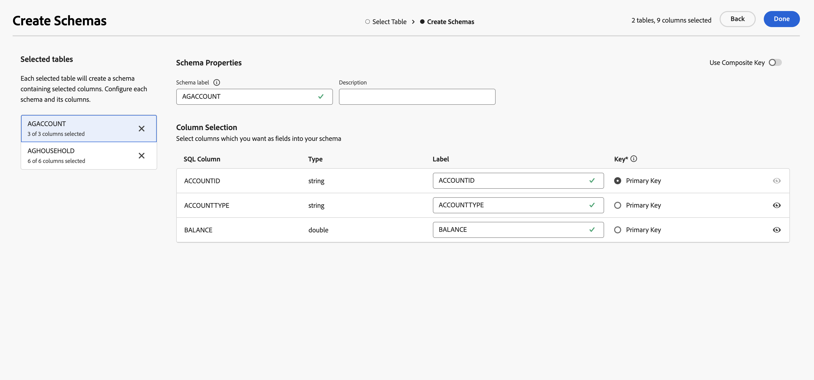

# Introduzione agli schemi {#schemas}

>[!AVAILABILITY]
>
>Per accedere agli schemi, è necessario disporre di una delle seguenti autorizzazioni:
>
>-**Gestisci schema federato**
>&#x200B;>-**Visualizza schema federato**
>
>Per ulteriori informazioni sulle autorizzazioni richieste, consulta la [Guida al controllo degli accessi](/help/governance-privacy-security/access-control.md).

>[!CONTEXTUALHELP]
>id="dc_schema_create_select_tables"
>title="Selezionare tabelle"
>abstract="Seleziona le tabelle da aggiungere per il modello dati."

>[!CONTEXTUALHELP]
>id="dc_schema_create_key"
>title="Chiave"
>abstract="Seleziona una chiave per la riconciliazione dei dati."

>[!CONTEXTUALHELP]
>id="dc_schema_create_schema_name"
>title="Nome dello schema"
>abstract="Immetti il nome dello schema."

>[!CONTEXTUALHELP]
>id="dc_schema_edit_description"
>title="Descrizione dello schema"
>abstract="Nella descrizione dello schema sono elencate le colonne, i tipi e le etichette. Puoi anche verificare la chiave di riconciliazione per lo schema. Per aggiornare la definizione dello schema, fai clic sull’icona a forma di matita."

>[!CONTEXTUALHELP]
>id="dc_schema_filter_sources"
>title="Selezionare il database di origine da filtrare"
>abstract="Puoi filtrare gli schemi in base alla loro origine. Seleziona uno o più database federati per visualizzarne i relativi schemi."

## Che cos’è uno schema {#schema-start}

Uno schema è una rappresentazione di una tabella del database. Si tratta di un oggetto all&#39;interno dell&#39;applicazione che definisce il modo in cui i dati vengono legati alle tabelle del database.

Creando uno schema, puoi definire una rappresentazione della tabella in Experience Platform Federated Audience Composition:

* Assegna un nome descrittivo e una descrizione per semplificare la comprensione da parte dell’utente
* Decidere la visibilità di ciascun campo in base al suo utilizzo reale
* Selezionare la chiave primaria per collegare gli schemi, in base alle esigenze nel [modello dati](../data-management/gs-models.md#data-model-start)

>[!CAUTION]
>
>Quando connetti più sandbox con lo stesso database, devi utilizzare schemi di lavoro distinti.

## Crea uno schema {#schema-create}

Per creare uno schema in Composizione pubblico federato, seleziona **[!UICONTROL Modelli]** nella sezione **[!UICONTROL Dati federati]**. Nella scheda **[!UICONTROL Schema]**, selezionare **[!UICONTROL Crea schema]**.

{zoomable="yes"}

Viene visualizzato il popover **[!UICONTROL Seleziona database federato]**. In questo popover è possibile selezionare il [database di origine](/help/connections/home.md), seguito da **[!UICONTROL Avanti]**.

{zoomable="yes"}

Viene visualizzato il popover **Seleziona tabella**. In questo popover è possibile selezionare le tabelle da utilizzare per creare lo schema.

{zoomable="yes"}

Ogni tabella selezionata genera uno schema con le colonne selezionate. Per ogni tabella, puoi modificare l’etichetta dello schema, aggiungere una descrizione, rinominare l’etichetta del campo, impostare la visibilità dell’etichetta del campo e selezionare la chiave primaria dello schema.

{zoomable="yes"}

>[!NOTE]
>
>Se si abilita **[!UICONTROL Usa chiave composita]** ma si seleziona una sola chiave da utilizzare, la chiave verrà trattata come una chiave primaria dello schema standard.

Inoltre, puoi creare una chiave composta da più colonne di schema. Attiva **[!UICONTROL Usa chiave composita]** e contrassegna le chiavi da utilizzare come chiave composita.

{zoomable="yes"}

Al termine della configurazione, seleziona **[!UICONTROL Fine]** per completare la creazione dello schema.

## Modificare uno schema {#schema-edit}

Per modificare uno schema, seleziona lo schema creato in precedenza nella pagina **Schemi**.

Viene visualizzata la pagina dei dettagli dello schema. Seleziona l&#39; per modificare lo schema.

{zoomable="yes"}

Nella finestra **[!UICONTROL Modifica schema]**, puoi accedere e configurare le stesse opzioni disponibili durante la [creazione di uno schema](#schema-create).

{zoomable="yes"}

## Visualizzare l’anteprima dei dati in uno schema {#schema-preview}

Per visualizzare in anteprima i dati nella tabella rappresentata dallo schema, passa alla scheda **[!UICONTROL Dati]** come indicato di seguito.

Selezionare il collegamento **[!UICONTROL Calcola]** per visualizzare in anteprima il numero totale di registrazioni.

{zoomable="yes"}

Selezionare il pulsante **[!UICONTROL Configura colonne]** per modificare la visualizzazione dei dati.

{zoomable="yes"}

## Aggiornare uno schema {#schema-refresh}

È possibile aggiornare, aggiungere o rimuovere tabelle in un database federato. In questi casi, è necessario aggiornare lo schema in Adobe Experience Platform per allinearlo alle modifiche più recenti. Per eseguire questa operazione, seleziona l&#39;icona  accanto al nome dello schema seguito da **[!UICONTROL Aggiorna schema]**.

È inoltre possibile aggiornare la definizione dello schema durante la modifica.

{zoomable="yes"}

## Eliminare uno schema {#schema-delete}

Per eliminare uno schema, seleziona l&#39;icona , seguita da **[!UICONTROL Elimina]**.

{zoomable="yes"}
