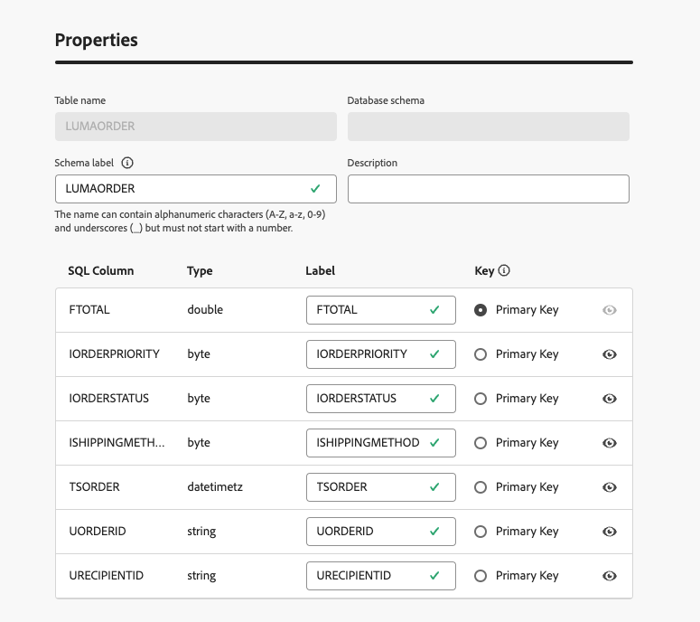
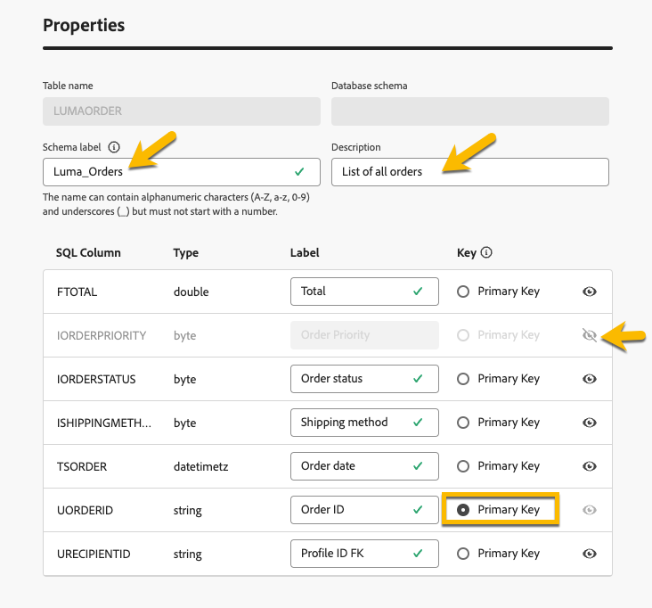

# Introduzione agli schemi {#schemas}

>[!CONTEXTUALHELP]
>id="dc_schema_create_select_tables"
>title="Selezionare tabelle"
>abstract="Seleziona le tabelle da aggiungere per il modello dati."

>[!CONTEXTUALHELP]
>id="dc_schema_create_key"
>title="Chiave"
>abstract="Seleziona una chiave per la riconciliazione dei dati."

>[!CONTEXTUALHELP]
>id="dc_schema_create_schema_name"
>title="Nome dello schema"
>abstract="Immetti il nome dello schema."

>[!CONTEXTUALHELP]
>id="dc_schema_edit_description"
>title="Descrizione dello schema"
>abstract="Nella descrizione dello schema sono elencate le colonne, i tipi e le etichette. Puoi anche verificare la chiave di riconciliazione per lo schema. Per aggiornare la definizione dello schema, fai clic sull’icona a forma di matita."

>[!CONTEXTUALHELP]
>id="dc_schema_filter_sources"
>title="Selezionare il database di origine da filtrare"
>abstract="Puoi filtrare gli schemi in base alla loro origine. Seleziona uno o più database federati per visualizzarne i relativi schemi."

## Che cos’è uno schema? {#schema-start}

Uno schema è una rappresentazione di una tabella del database. Si tratta di un oggetto all&#39;interno dell&#39;applicazione che definisce il modo in cui i dati vengono legati alle tabelle del database.

Creando uno schema, potrai manipolare una rappresentazione della tabella in FAC:

- Assegna un nome descrittivo e una descrizione per semplificare la comprensione da parte dell’utente
- Decidere la visibilità di ciascun campo in base al suo uso reale
- Selezionare la chiave primaria per collegare gli schemi, in base alle esigenze nel [modello dati](../data-management/gs-models.md#data-model-start)

## Crea uno schema {#schema-create}

Per creare schemi in FAC, effettua le seguenti operazioni:
Nella sezione **[!UICONTROL FEDERATED DATA]**, vai al collegamento **[!UICONTROL Models]**. Troverai la scheda **[!UICONTROL Schema]**.
Fai clic sul pulsante **[!UICONTROL Crea schema]**.

{zoomable="yes"}

Potrai accedere a una nuova interfaccia con un elenco a discesa in cui troverai
tutti i database connessi all&#39;applicazione. Ulteriori informazioni sulla [connessione al database](../connections/connections.md#connections-fdb).
Seleziona il database di origine nell&#39;elenco e fai clic sulla scheda **[!UICONTROL Aggiungi tabelle]**

{zoomable="yes"}

Sarà possibile accedere all&#39;elenco di tutte le tabelle del database.

Aggiungendo le tabelle, per le quali desideri creare lo schema, potrai accedere ai relativi campi come indicato di seguito.

{zoomable="yes"}

Per ogni tabella è possibile:

- rinomina l’etichetta dello schema specificata
- aggiungi una descrizione
- rinomina tutti i campi e decidi la loro visibilità.
- seleziona la chiave primaria dello schema

Ad esempio, ecco una tabella importata, subito dopo l’aggiunta:

{zoomable="yes"}

Lo schema può essere definito come segue:

{zoomable="yes"}

## Modificare uno schema {#schema-edit}

Per modificare uno schema, fai clic sul nome dello schema nella cartella degli schemi. Accedi alla pagina seguente.
Fai clic sul pulsante **[!UICONTROL Modifica]**.

{zoomable="yes"}

Avrai accesso alla stessa possibilità di quando crei lo schema:

- rinomina l’etichetta dello schema specificata
- aggiungi una descrizione
- rinomina tutti i campi e decidi la loro visibilità.
- seleziona la chiave primaria dello schema

{zoomable="yes"}

## Visualizzare l’anteprima dei dati in uno schema {#schema-preview}

Per visualizzare in anteprima i dati nella tabella rappresentata dallo schema, passa alla scheda **[!UICONTROL Dati]** come indicato di seguito.
Per ottenere il numero totale di registrazioni, fare clic sul collegamento **[!UICONTROL Calcola]**.

{zoomable="yes"}

È possibile modificare la panoramica dei dati facendo clic sul pulsante **[!UICONTROL Configura colonne]**.

{zoomable="yes"}

## Eliminare uno schema {#schema-delete}

Per eliminare uno schema, fai clic sul pulsante **[!UICONTROL Altro]**, quindi su **[!UICONTROL Elimina]**.

{zoomable="yes"}
