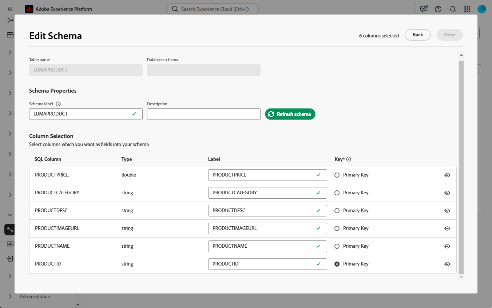
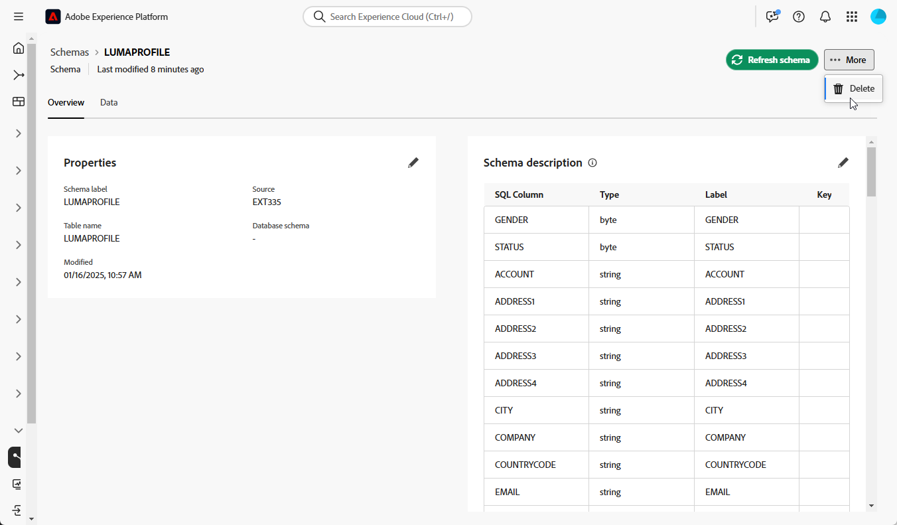

# Introduzione agli schemi {#schemas}

>[!CONTEXTUALHELP]
>id="dc_schema_create_select_tables"
>title="Selezionare tabelle"
>abstract="Seleziona le tabelle da aggiungere per il modello dati."

>[!CONTEXTUALHELP]
>id="dc_schema_create_key"
>title="Chiave"
>abstract="Seleziona una chiave per la riconciliazione dei dati."

>[!CONTEXTUALHELP]
>id="dc_schema_create_schema_name"
>title="Nome dello schema"
>abstract="Immetti il nome dello schema."

>[!CONTEXTUALHELP]
>id="dc_schema_edit_description"
>title="Descrizione dello schema"
>abstract="Nella descrizione dello schema sono elencate le colonne, i tipi e le etichette. Puoi anche verificare la chiave di riconciliazione per lo schema. Per aggiornare la definizione dello schema, fai clic sull’icona a forma di matita."

>[!CONTEXTUALHELP]
>id="dc_schema_filter_sources"
>title="Selezionare il database di origine da filtrare"
>abstract="Puoi filtrare gli schemi in base alla loro origine. Seleziona uno o più database federati per visualizzarne i relativi schemi."

## Che cos’è uno schema {#schema-start}

Uno schema è una rappresentazione di una tabella del database. Si tratta di un oggetto all&#39;interno dell&#39;applicazione che definisce il modo in cui i dati vengono legati alle tabelle del database.

Creando uno schema, puoi definire una rappresentazione della tabella in Experience Platform Federated Audience Composition:

* Assegna un nome descrittivo e una descrizione per semplificare la comprensione da parte dell’utente
* Decidere la visibilità di ciascun campo in base al suo utilizzo reale
* Selezionare la chiave primaria per collegare gli schemi, in base alle esigenze nel [modello dati](../data-management/gs-models.md#data-model-start)

>[!CAUTION]
>
>Quando connetti più sandbox con lo stesso database, devi utilizzare schemi di lavoro distinti.
>

## Crea uno schema {#schema-create}

Per creare schemi in Federated Audience Composition, segui i passaggi seguenti:

1. Nella sezione **[!UICONTROL Federated Data]**, accedi al menu **[!UICONTROL Models]**. Passare alla scheda **[!UICONTROL Schema]** e fare clic su **[!UICONTROL Crea schema]**.

   {zoomable="yes"}

   Questo passaggio consente di accedere a una nuova schermata con un elenco a discesa in cui è possibile trovare i database connessi all’ambiente. Ulteriori informazioni sulla connessione al database in [questa sezione](../connections/connections.md#connections-fdb).

1. Selezionare il database di origine nell&#39;elenco e fare clic su **[!UICONTROL Avanti]**.

   {zoomable="yes"}

   Viene quindi visualizzato l&#39;elenco di tutte le tabelle del database.

1. Selezionare le tabelle per le quali si desidera creare lo schema.

1. Ogni tabella selezionata genera uno schema con le colonne selezionate. Configura lo schema e le relative colonne in base alle esigenze.

   {zoomable="yes"}

   Per ogni tabella è possibile:

   * modificare l’etichetta dello schema
   * aggiungi una descrizione
   * rinominare tutte le etichette dei campi e impostarne la visibilità
   * seleziona la chiave primaria dello schema

   Lo schema può essere definito come segue:

   

1. Dopo aver completato la configurazione, fai clic su **[!UICONTROL Fine]**.

## Modificare uno schema {#schema-edit}

Per modificare uno schema, effettua le seguenti operazioni:

1. Accedi allo schema creato in precedenza.

1. Fai clic sul pulsante **[!UICONTROL Modifica]**.

   {zoomable="yes"}

1. Dalla finestra **[!UICONTROL Modifica schema]**, puoi accedere e configurare le stesse opzioni disponibili per [la creazione di uno schema](#schema-create).

   {zoomable="yes"}

## Visualizzare l’anteprima dei dati in uno schema {#schema-preview}

Per visualizzare in anteprima i dati nella tabella rappresentata dallo schema, passa alla scheda **[!UICONTROL Dati]** come indicato di seguito.

Fai clic sul collegamento **[!UICONTROL Calcola]** per visualizzare in anteprima il numero totale di registrazioni.

{zoomable="yes"}

Fai clic sul pulsante **[!UICONTROL Configura colonne]** per modificare la visualizzazione dei dati.

{zoomable="yes"}

## Aggiornare uno schema {#schema-refresh}

È possibile aggiornare, aggiungere o rimuovere tabelle in un database federato. In questi casi, è necessario aggiornare lo schema in Adobe Experience Platform per allinearlo alle modifiche più recenti. Per eseguire questa operazione, fare clic sui tre punti accanto al nome dello schema da aggiornare e selezionare **Aggiorna schema**.

È inoltre possibile aggiornare la definizione dello schema durante la modifica.

{zoomable="yes"}

## Eliminare uno schema {#schema-delete}

Per eliminare uno schema, fai clic sul pulsante **[!UICONTROL Altro]**, quindi scegli **[!UICONTROL Elimina]**.

{zoomable="yes"}
