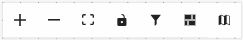

# Introduzione ai modelli di dati {#data-model-beta}

>[!AVAILABILITY]
>
>Per accedere ai modelli di dati, è necessario disporre di una delle seguenti autorizzazioni:
>
>-**Gestisci Federated Data Model**
>>-**Visualizza Federated Data Model**
>
>Per ulteriori informazioni sulle autorizzazioni richieste, consulta la [Guida al controllo degli accessi](/help/governance-privacy-security/access-control.md).

## Che cos’è un modello dati {#data-model-start}

Un modello dati è un set di schemi, tipi di pubblico e i collegamenti tra di essi. Viene utilizzato per federare i tipi di pubblico con i dati dei database.

In Federated Audience Composition, puoi creare e gestire modelli di dati direttamente nella vista Area di lavoro. Ciò include l’aggiunta di schemi e tipi di pubblico, nonché la definizione dei collegamenti tra di essi in base al caso d’uso.

Ulteriori informazioni su [schemi](../customer/schemas.md#schema-start) e [tipi di pubblico](../start/audiences.md).

Di seguito è riportata una rappresentazione di un modello dati, ad esempio le tabelle con il nome e i collegamenti tra di esse.

{zoomable="yes"}

## Creare un modello dati {#data-model-create}

Per creare un modello dati, effettua le seguenti operazioni:

1. Nella sezione **[!UICONTROL Federated Data]**, accedi al menu **[!UICONTROL Models]** e passa alla scheda **[!UICONTROL Data model]**.

   Selezionare il pulsante **[!UICONTROL Crea modello dati]**.

   {zoomable="yes"}

2. Definisci il nome del modello dati e seleziona il pulsante **[!UICONTROL Crea]**.

3. Dal dashboard del modello dati, seleziona **[!UICONTROL Aggiungi schemi]** per scegliere lo schema associato al modello dati.

   {zoomable="yes"}

4. Inoltre, puoi aggiungere tipi di pubblico al modello di dati. Seleziona **[!UICONTROL Aggiungi pubblico]** per definire i gruppi target.

   {zoomable="yes"}

5. Stabilisci connessioni tra tabelle nel modello dati per garantire relazioni di dati accurate. Per ulteriori informazioni, leggere la [sezione creazione collegamenti](#data-model-links).

6. Al termine della configurazione, seleziona **[!UICONTROL Salva]** per applicare le modifiche.

## Crea collegamenti {#data-model-links}

>[!NOTE]
>
>Se stai creando un collegamento con più join, puoi utilizzare la stessa combinazione di schemi di origine e di destinazione una sola volta.

>[!BEGINTABS]

>[!TAB Vista tabella]

Per creare collegamenti tra tabelle del modello dati dalla scheda Vista tabella, effettua le seguenti operazioni:

1. Seleziona l&#39;icona  seguita da **[!UICONTROL Crea collegamento]** accanto a una tabella oppure seleziona **[!UICONTROL Crea collegamenti]** nella sezione **[!UICONTROL Collegamenti]**:

   {zoomable="yes"}

2. Compila il modulo specificato per definire il collegamento.

   {zoomable="yes"}

   **Cardinalità**

   * **1-N**: un’occorrenza della tabella di origine può avere diverse occorrenze corrispondenti della tabella target, ma un’occorrenza della tabella target può avere al massimo un’occorrenza corrispondente della tabella di origine.

   * **N-1**: un’occorrenza della tabella di origine può avere diverse occorrenze corrispondenti della tabella target, ma un’occorrenza della tabella target può avere al massimo un’occorrenza corrispondente della tabella di origine.

   * **1-1**: un’occorrenza della tabella di origine può avere al massimo un’occorrenza corrispondente della tabella target.

   Per creare un collegamento di join multiplo, seleziona l’icona più. Ora puoi creare più join tra i campi dello schema.

   {zoomable="yes"}

Di seguito sono elencati tutti i collegamenti definiti per il modello dati:

{zoomable="yes"}

>[!TAB Visualizzazione area di lavoro]

Per creare collegamenti tra tabelle del modello dati dalla scheda Visualizzazione area di lavoro, eseguire la procedura seguente:

1. Accedi alla vista Area di lavoro del modello dati e scegli le due tabelle da collegare

2. Seleziona il pulsante  accanto a Source Join, quindi trascina e guida la freccia verso Target Join per stabilire la connessione.

   {zoomable="yes"}

3. Compila il modulo specificato per definire il collegamento e seleziona **[!UICONTROL Applica]** una volta configurato.

   {zoomable="yes"}

   **Cardinalità**

   * **1-N**: un’occorrenza della tabella di origine può avere diverse occorrenze corrispondenti della tabella target, ma un’occorrenza della tabella target può avere al massimo un’occorrenza corrispondente della tabella di origine.

   * **N-1**: un’occorrenza della tabella di origine può avere diverse occorrenze corrispondenti della tabella target, ma un’occorrenza della tabella target può avere al massimo un’occorrenza corrispondente della tabella di origine.

   * **1-1**: un’occorrenza della tabella di origine può avere al massimo un’occorrenza corrispondente della tabella target.

4. Tutti i collegamenti definiti nel modello dati sono rappresentati da frecce nella vista area di lavoro. Selezionare una freccia tra due tabelle per visualizzare i dettagli, apportare modifiche o rimuovere il collegamento in base alle esigenze.

   {zoomable="yes"}

5. Utilizza la barra degli strumenti per personalizzare e regolare l’area di lavoro.

   

   * **[!UICONTROL Ingrandisci]**: ingrandisci l’area di lavoro per visualizzare più chiaramente i dettagli del modello dati.
   * **[!UICONTROL Riduci]**: riduci le dimensioni dell’area di lavoro per una visualizzazione più ampia del modello dati.
   * **[!UICONTROL Adatta visualizzazione]**: regola lo zoom per adattarlo a tutti gli schemi e/o i tipi di pubblico all&#39;interno dell&#39;area visibile.
   * **[!UICONTROL Attiva/disattiva interattività]**: attiva/disattiva l&#39;interazione dell&#39;utente con l&#39;area di lavoro.
   * **[!UICONTROL Filtro]**: scegli lo schema da visualizzare nell’area di lavoro.
   * **[!UICONTROL Forza layout automatico]**: disponi automaticamente schemi e/o tipi di pubblico per una migliore organizzazione.

>[!ENDTABS]

## Video introduttivo {#data-model-video}

Scopri come creare un modello dati in questo video:

>[!VIDEO](https://video.tv.adobe.com/v/3432020)
