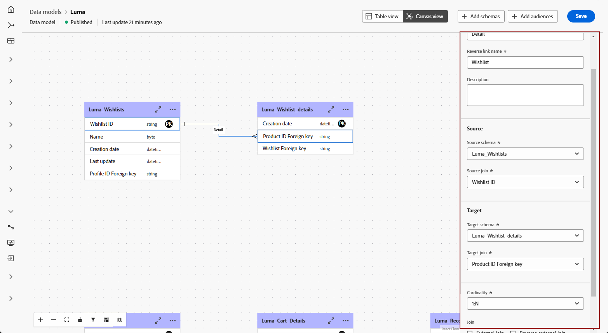

# Introduzione ai modelli di dati {#data-model-beta}

>[!AVAILABILITY]
>
>Il modello dati con vista Area di lavoro è attualmente disponibile come versione beta solo per alcuni utenti.

## Che cos’è un modello dati {#data-model-start}

Un modello dati è un set di schemi, tipi di pubblico e i collegamenti tra di essi. Viene utilizzato per federare i tipi di pubblico con i dati dei database.

In Federated Audience Composition, puoi creare e gestire modelli di dati direttamente nella vista Area di lavoro. Ciò include l’aggiunta di schemi e tipi di pubblico, nonché la definizione dei collegamenti tra di essi in base al caso d’uso.

Ulteriori informazioni su [schemi](../customer/schemas.md#schema-start) e [tipi di pubblico](../start/audiences.md).

Di seguito è riportata una rappresentazione di un modello dati, ad esempio le tabelle con il nome e i collegamenti tra di esse.

{zoomable="yes"}

## Creare un modello dati {#data-model-create}

Per creare un modello dati, effettua le seguenti operazioni:

1. Nella sezione **[!UICONTROL Federated Data]**, accedi al menu **[!UICONTROL Models]** e passa alla scheda **[!UICONTROL Data model]**.

   Fare clic sul pulsante **[!UICONTROL Crea modello dati]**.

   {zoomable="yes"}

1. Definisci il nome del modello dati e fai clic sul pulsante **[!UICONTROL Crea]**.

1. Dal dashboard del modello dati, fai clic su **[!UICONTROL Aggiungi schemi]** per scegliere lo schema associato al modello dati.

   {zoomable="yes"}

1. Fai clic su **[!UICONTROL Aggiungi pubblico]** per definire i gruppi target.

1. Stabilisci connessioni tra tabelle nel modello dati per garantire relazioni di dati accurate. [Ulteriori informazioni](#data-model-links)

1. Dopo aver completato la configurazione, fai clic su **[!UICONTROL Salva]** per applicare le modifiche.

## Crea collegamenti {#data-model-links}

>[!BEGINTABS]

>[!TAB Vista tabella]

Per creare collegamenti tra tabelle del modello dati dalla scheda Vista tabella, effettuare le seguenti operazioni:

1. Fai clic sul menu **[!UICONTROL Crea collegamento]** di una delle tabelle oppure fai clic sul pulsante **[!UICONTROL Crea collegamenti]** e scegli le due tabelle:

   {zoomable="yes"}

1. Compila il modulo specificato per definire il collegamento.

   {zoomable="yes"}

   **Cardinalità**

   * **1-N**: una occorrenza della tabella di origine può avere diverse occorrenze corrispondenti della tabella di destinazione, ma una occorrenza della tabella di destinazione può avere al massimo una occorrenza corrispondente della tabella di origine.

   * **N-1**: una occorrenza della tabella di destinazione può avere diverse occorrenze corrispondenti della tabella di origine, ma una occorrenza della tabella di origine può avere al massimo una occorrenza corrispondente della tabella di destinazione.

   * **1-1**: una occorrenza della tabella di origine può avere al massimo una occorrenza corrispondente della tabella di destinazione.

Di seguito sono elencati tutti i collegamenti definiti per il modello dati:

{zoomable="yes"}

>[!TAB Visualizzazione area di lavoro]

Per creare collegamenti tra tabelle del modello dati dalla scheda della vista Area di lavoro, effettua le seguenti operazioni:

1. Accedi alla vista Area di lavoro del modello dati e scegli le due tabelle da collegare

1. Fai clic sul pulsante  accanto a Source Join, quindi trascina e guida la freccia verso Target Join per stabilire la connessione.

   {zoomable="yes"}

1. Compila il modulo specificato per definire il collegamento e fai clic su **[!UICONTROL Applica]** una volta configurato.

   {zoomable="yes"}

   **Cardinalità**

   * **1-N**: una occorrenza della tabella di origine può avere diverse occorrenze corrispondenti della tabella di destinazione, ma una occorrenza della tabella di destinazione può avere al massimo una occorrenza corrispondente della tabella di origine.

   * **N-1**: una occorrenza della tabella di destinazione può avere diverse occorrenze corrispondenti della tabella di origine, ma una occorrenza della tabella di origine può avere al massimo una occorrenza corrispondente della tabella di destinazione.

   * **1-1**: una occorrenza della tabella di origine può avere al massimo una occorrenza corrispondente della tabella di destinazione.

1. Tutti i collegamenti definiti nel modello dati sono rappresentati da frecce nella vista area di lavoro. Fai clic su una freccia tra due tabelle per visualizzare i dettagli, apportare modifiche o rimuovere il collegamento in base alle esigenze.

   {zoomable="yes"}

1. Utilizza la barra degli strumenti per personalizzare e regolare l’area di lavoro.

   

   * **[!UICONTROL Zoom in]**: ingrandisci l&#39;area di lavoro per visualizzare più chiaramente i dettagli del modello dati.
   * **[!UICONTROL Zoom indietro]**: riduci le dimensioni dell&#39;area di lavoro per una visualizzazione più ampia del modello dati.
   * **[!UICONTROL Adatta visualizzazione]**: regola lo zoom per adattarlo a tutti gli schemi e/o i tipi di pubblico all&#39;interno dell&#39;area visibile.
   * **[!UICONTROL Attiva/disattiva interattività]**: attiva/disattiva l&#39;interazione dell&#39;utente con l&#39;area di lavoro.
   * **[!UICONTROL Filtro]**: scegliere lo schema da visualizzare nell&#39;area di lavoro.
   * **[!UICONTROL Forza layout automatico]**: disponi automaticamente schemi e/o tipi di pubblico per una migliore organizzazione.

>[!ENDTABS]

## Video introduttivo {#data-model-video}

Scopri come creare un modello dati in questo video:

>[!VIDEO](https://video.tv.adobe.com/v/3432020)
