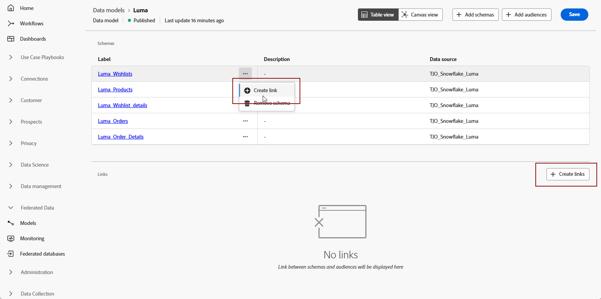

# Introduzione ai modelli di dati {#data-model}

>[!CONTEXTUALHELP]
>id="dc_model_menu"
>title="Utilizzare i modelli"
>abstract="In questa schermata sono elencati gli schemi e i modelli di dati. Puoi creare schemi e modelli di dati dal pulsante **Crea**."

>[!CONTEXTUALHELP]
>id="dc_datamodel_add_schema"
>title="Selezionare gli schemi"
>abstract="Seleziona gli schemi per il modello dati."

>[!CONTEXTUALHELP]
>id="dc_datamodel_add_audience"
>title="Selezionare un pubblico"
>abstract="Seleziona il pubblico per il modello dati."

>[!CONTEXTUALHELP]
>id="dc_datamodel_properties"
>title="Proprietà del modello dati"
>abstract="Immetti l’etichetta del modello dati."

## Che cos’è un modello dati? {#data-model-start}

Un modello dati è un set di schemi, tipi di pubblico e i collegamenti tra di essi.

Ulteriori informazioni su [schemi](../customer/schemas.md#schema-start).

Ulteriori informazioni su [tipi di pubblico](../start/audiences.md).

## Creare un modello dati {#data-model-create}

Per creare un modello dati, effettua le seguenti operazioni:

1. Nella sezione **[!UICONTROL FEDERATED DATA]**, vai al collegamento **[!UICONTROL Models]** e passa alla scheda **[!UICONTROL Data model]**.

   {zoomable="yes"}

1. Fai clic sul pulsante **[!UICONTROL Crea modello dati]** per definire il nome del modello dati, quindi fai clic sul pulsante **[!UICONTROL Crea]**.

   {zoomable="yes"}

1. Quindi aggiungi gli schemi, i tipi di pubblico e i collegamenti del modello di dati.

   {zoomable="yes"}

### Crea collegamenti {#data-model-links}

Per creare collegamenti tra tabelle del modello dati, effettua le seguenti operazioni:

1. Fai clic sul menu **[!UICONTROL Crea collegamento]** di una delle tabelle oppure fai clic sul pulsante **[!UICONTROL Crea collegamenti]** e scegli le due tabelle:

   {zoomable="yes"}

1. Compila il modulo specificato per definire il collegamento.

   {zoomable="yes"}

   Di seguito sono elencati tutti i collegamenti definiti per il modello dati:

   {zoomable="yes"}

## Video introduttivo {#data-model-video}

Scopri come creare un modello dati in questo video:

>[!VIDEO](https://video.tv.adobe.com/v/3432020)
