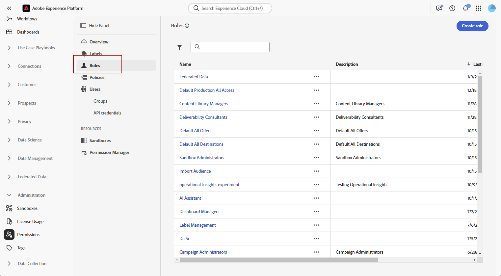
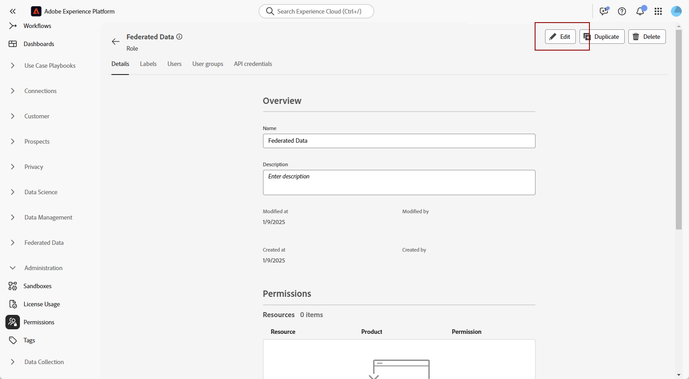

# Controllo degli accessi in Federated Audience Composition

Puoi utilizzare il controllo degli accessi per fornire accesso basato sui ruoli alle sandbox e alla Federated Audience Composition.

## Gestire l’accesso alle sandbox {#access-sandboxes}

Quando acquisti la funzionalità Composizione di pubblico federato di Adobe Experience Platform, viene creato un profilo di prodotto per ogni sandbox attiva in quel momento. Questo profilo di prodotto viene creato in Admin Console nella scheda prodotto di **Adobe Experience Platform** e segue questa convenzione di denominazione: `ACP_FAC - <<SandboxName>> - admin.` per accedere alla composizione di pubblico federato per una sandbox specifica, è necessario aggiungere gli utenti al profilo di prodotto creato per tale sandbox.

Ad esempio, se viene attivata una nuova sandbox denominata “fac-test”, viene creato il profilo di prodotto corrispondente “ACP_FAC - fac-test - admin”. Per accedere alle composizione di pubblico federato con questa sandbox, gli utenti devono essere aggiunti a questo profilo di prodotto.

## Gestire l’accesso alla Composizione di pubblico federato

Puoi gestire l’accesso assegnando le autorizzazioni necessarie per accedere a diversi aspetti di Federated Audience Composition. Queste autorizzazioni vengono assegnate tramite ruoli agli utenti che hanno bisogno di accedere a **Federated Audience Composition**.

>[!NOTE]
>
>Solo gli amministratori possono assegnare le autorizzazioni ad altri utenti.

1. Passa al menu **[!UICONTROL Autorizzazioni]**.
1. Dal menu **[!UICONTROL Ruoli]**, seleziona il **[!UICONTROL Ruolo]** che desideri aggiornare.

   

1. Seleziona **[!UICONTROL Modifica]** per modificare le autorizzazioni del ruolo.

   

1. Aggiungi le autorizzazioni richieste per l’utente. Per accedere alla Composizione di pubblico federato, puoi aggiungere le seguenti autorizzazioni:

   | Autorizzazione | Descrizione |
   | ---------- | ----------- |
   | Gestione dati federati | Utilizza questa autorizzazione per gestire tutti gli aspetti della Composizione di pubblico federato. Questa autorizzazione include: Gestione database federato, Gestione schema federato, Gestione modello dati federato e Gestione composizioni federate. |
   | Gestione database federato | Utilizza questa autorizzazione per aggiungere, visualizzare, aggiornare ed eliminare le connessioni ai database federati. |
   | Visualizzazione database federato | Utilizza questa autorizzazione per visualizzare le connessioni ai database federati. |
   | Gestione schema federato | Utilizza questa autorizzazione per creare, visualizzare, aggiornare, eliminare e aggiornare schemi. |
   | Visualizzazione dati schema federato | Utilizza questa autorizzazione per visualizzare la scheda dati all’interno della sezione dello schema. |
   | Visualizzazione schema federato | Utilizza questa autorizzazione per visualizzare le tabelle dello schema. |
   | Gestione modello dati federato | Utilizza questa autorizzazione per creare, visualizzare, aggiornare ed eliminare modelli di dati. |
   | Visualizzazione modello dati federato | Utilizza questa autorizzazione per visualizzare i modelli di dati. |
   | Visualizzazione audit trail della federazione | Utilizza questa autorizzazione per visualizzare l’audit trail per la Composizione di pubblico federato. |
   | Gestione composizioni federate | Utilizza questa autorizzazione per creare, visualizzare, aggiornare ed eliminare composizioni federate. |
   | Visualizzazione composizioni federate | Utilizza questa autorizzazione per visualizzare le composizioni federate. |

   

1. Dopo aver apportato le modifiche necessarie, seleziona **[!UICONTROL Salva]**.

Tutti gli utenti già assegnati a questo ruolo avranno le autorizzazioni aggiornate automaticamente e l’accesso alla Composizione di pubblico federato.

Per assegnare questo ruolo ai nuovi utenti:

1. Passa alla scheda **[!UICONTROL Utenti]** nella dashboard dei ruoli e seleziona **[!UICONTROL Aggiungi utenti]**.

   

1. Inserisci il nome o l’indirizzo e-mail dell’utente oppure selezionalo dall’elenco disponibile. Al termine, seleziona **[!UICONTROL Salva]**.

In alternativa, puoi assegnare agli utenti uno dei ruoli preesistenti, a seconda delle autorizzazioni di cui hanno bisogno. Per ulteriori informazioni sull’assegnazione di ruoli preesistenti a un utente, consulta la [Guida alla gestione degli utenti per un profilo di prodotto](https://experienceleague.adobe.com/it/docs/experience-platform/access-control/ui/users).

| Nome ruolo | Autorizzazioni |
| --------- | ----------- |
| Manager dati FAC | <ul><li>Gestione composizioni federate</li><li>Visualizzazione database federati</li><li>Visualizzazione schemi federati</li><li>Visualizzazione dati schema federato</li><li>Visualizzazione modelli dati federati</li></ul> |
| Manager composizione FAC | <ul><li>Gestione composizioni federate</li></ul> |
| Amministratori FAC | <ul><li>Gestione dati federati</li></ul> |

L’utente riceverà quindi un’e-mail con istruzioni per accedere all’istanza. Se l’utente non è già stato creato in precedenza, consulta [questa documentazione](https://experienceleague.adobe.com/it/docs/experience-platform/access-control/abac/permissions-ui/users).

## Gestire l’accesso a composizioni specifiche

Puoi gestire l’accesso a una composizione specifica applicando le etichette di accesso.

Per ulteriori informazioni sull&#39;applicazione delle etichette di accesso a una composizione, leggere la sezione [Applica etichette di accesso](/help/compositions/gs-compositions.md#access-labels) della guida alle composizioni.
