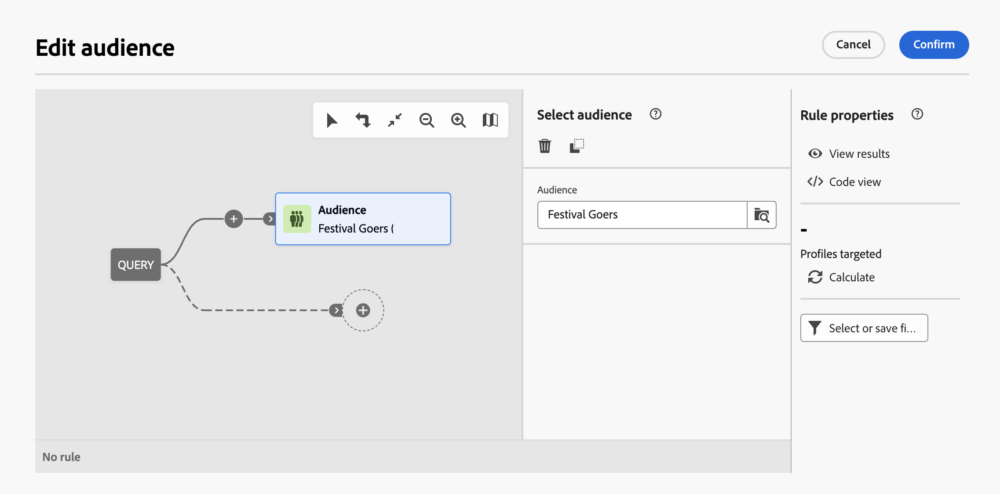

# Creare la prima query {#build-query}

Per iniziare a creare una query, accedi al query modeler dalla posizione desiderata, a seconda dell’azione da eseguire. Verrà visualizzato il query modeler con un’area di lavoro vuota. Selezionare il pulsante **+** per configurare il primo nodo della query.

Puoi aggiungere due tipi di elementi:

* **I componenti di filtro** (condizione personalizzata, Seleziona pubblico) ti consentono di creare regole personalizzate o di selezionare un pubblico per perfezionare la query. Vengono aggiunte all’inizio della query e nelle transizioni punteggiate. [Scopri come utilizzare i componenti per il filtro](#filtering)

  Esempio: *Destinatari abbonati alla newsletter &quot;Sport&quot;*. *Destinatari che vivono a New York*, *Destinatari che vivono a San Francisco*

  {zoomable="yes"}

* **Gli operatori di gruppo** (AND, OR, EXCEPT) consentono di raggruppare i componenti di filtro nel diagramma. Vengono aggiunte alle transizioni esistenti prima di un componente di filtro. [Scopri come utilizzare gli operatori](#filtering)

  Esempio: *Destinatari abbonati alla newsletter &quot;Sport&quot;**AND**che vivono a New York **OR**San Francisco*.

  {zoomable="yes"}

## Aggiungere i componenti per il filtro {#filtering}

I componenti per il filtro consentono di perfezionare la query utilizzando:

* **[Condizioni personalizzate](#custom-condition)**: per filtrare la query creando la tua condizione personalizzata con gli attributi dal database e le espressioni avanzate.
* **[Tipi di pubblico](#audiences)**: per filtrare la query utilizzando un pubblico esistente.

### Configurare una condizione personalizzata {#custom-condition}

>[!CONTEXTUALHELP]
>id="dc_orchestration_querymodeler_customcondition"
>title="Condizione personalizzata"
>abstract="Le condizioni personalizzate sono componenti di filtraggio che consentono di filtrare la query creando la propria condizione con attributi provenienti dal database ed espressioni avanzate."

Per filtrare la query utilizzando una condizione personalizzata, effettua le seguenti operazioni:

1. Selezionare il pulsante **+** sul nodo desiderato, seguito da **[!UICONTROL Condizione personalizzata]**. Il pannello delle proprietà della condizione personalizzata viene visualizzato sul lato destro.

2. Nel campo **[!UICONTROL Attributo]**, seleziona l’attributo dal database che desideri sfruttare per creare la condizione. L&#39;elenco degli attributi include tutti gli attributi del database, inclusi quelli delle tabelle collegate.

   {zoomable="yes"}

   >[!NOTE]
   >
   >Il pulsante **[!UICONTROL Modifica espressione]** consente di sfruttare l&#39;editor espressioni per definire manualmente un&#39;espressione utilizzando i campi delle funzioni di supporto e del database. [Scopri come modificare le espressioni](expression-editor.md)

3. Seleziona l’operatore da applicare dall’elenco a discesa. Sono disponibili diversi operatori da utilizzare. Gli operatori disponibili nell’elenco a discesa dipendono dal tipo di dati dell’attributo.

   +++Elenco degli operatori disponibili

   | Operatore | Scopo | Esempio |
   |  ---  |  ---  |  ---  |
   | Uguale a | Restituisce un risultato identico ai dati immessi nella seconda colonna Valore. | Cognome (@lastName) uguale a “Jones”, restituirà solo i destinatari il cui cognome è Jones. |
   | Non uguale a | Restituisce tutti i valori non identici al valore inserito. | Lingua (@language) uguale a “Inglese” |
   | Maggiore di | Restituisce un valore maggiore del valore immesso. | Età (@age) maggiore di 50 anni</strong>, restituirà tutti i valori maggiori di “50”, ovvero “51”, “52”, ecc. |
   | Minore di | Restituisce un valore minore del valore immesso. | Data di creazione (@created) prima di “DaysAgo(100)”</strong>, restituirà tutti i destinatari creati meno di 100 giorni fa. |
   | Maggiore o uguale a | Restituisce tutti i valori uguali o maggiori del valore immesso. | Età (@age) maggiore o uguale a “30”</strong>, restituirà tutti i destinatari con un’età pari o superiore ai 30 anni. |
   | Minore o uguale a | Restituisce tutti i valori uguali o inferiori al valore immesso. | Età (@age) minore o uguale a “60”</strong>, restituirà tutti i destinatari di età uguale o inferiore ai 60 anni. |
   | Incluso in | Restituisce i risultati inclusi nei valori indicati. Questi valori devono essere separati da una virgola. | La data di nascita (@birthDate) inclusa in “10/12/1979,10/12/1984” restituirà i destinatari nati nell’intervallo tra queste date. |
   | Non in | Funziona come l’operatore Incluso in. In questo caso, desideriamo escludere i destinatari in base ai valori immessi. | La data di nascita (@birthDate) non è inclusa in “10/12/1979,10/12/1984”. A differenza dell’esempio precedente, i destinatari nati in questo intervallo di date non verranno restituiti. |
   | È vuoto | In questo caso, il risultato che stiamo cercando corrisponde a un valore vuoto nella seconda colonna Valore. | Cellulare (@mobilePhone) è vuoto restituisce tutti i destinatari che non hanno un numero di cellulare. |
   | Non è vuoto | Funziona in modo inverso rispetto all’operatore È vuoto. Non è necessario immettere dati nella seconda colonna Valore. | Il campo E-mail (@email) non è vuoto. |
   | Inizia con | Restituisce i risultati a partire dal valore immesso. | Account # (@account) inizia con “32010”. |
   | Non inizia con | Restituisce i risultati che non iniziano con il valore immesso | Account # (@account) non inizia con “20” |
   | Contiene | Restituisce i risultati che contengono almeno il valore immesso. | Il dominio e-mail (@domain) contiene “mail”</strong>, restituirà tutti i nomi di dominio che contengono “mail”. Quindi verrà restituito anche il dominio “gmail.com”. |
   | Non contiene | Restituisce risultati che non contengono il valore immesso. | Il dominio e-mail (@domain) non contiene “vo”</strong>. In questo caso, i nomi di dominio che contengono “vo” non verranno restituiti. Il nome di dominio “voilà.fr” non verrà visualizzato nei risultati. |
   | Simile a | Simile a è identico all’operatore Contiene. Ti consente di inserire un carattere jolly % nel valore. | Cognome (@lastName) simile a “Jon%s”. Qui, il carattere jolly viene usato come un “jolly” per trovare il nome “Jones”, nel caso in cui l’operatore avesse dimenticato la lettera mancante tra la “n” e la “s”. |
   | Diverso da | Simile a è identico all’operatore Contiene. Ti consente di inserire un carattere jolly % nel valore. | Cognome (@lastName) diverso da “Smi%h”. In questo caso, i destinatari con il cognome è “Smi%h” non verranno restituiti. |

   +++

4. Nel campo **[!UICONTROL Valore]**, definisci il valore previsto. Puoi anche sfruttare l’editor espressioni per definire manualmente un’espressione utilizzando i campi delle funzioni di database e helper. A tale scopo, selezionare il pulsante **[!UICONTROL Modifica espressione]**. [Scopri come modificare le espressioni](expression-editor.md)

   *Esempio di query che restituisce tutti i profili di età pari o superiore a 21 anni:*

   {zoomable="yes"}

#### Condizioni personalizzate per tabelle collegate (collegamenti 1-1 e 1-N){#links}

Le condizioni personalizzate consentono di eseguire query sulle tabelle collegate alla tabella attualmente utilizzata dalla regola. Questo include tabelle con un collegamento di cardinalità 1-1 o tabelle di raccolta (collegamento 1-N).

Per un collegamento **1-1**, passa alla tabella collegata, seleziona l’attributo desiderato e definisci il valore previsto.

Puoi anche selezionare direttamente un collegamento alla tabella nel selettore **[!UICONTROL Valore]** e confermare. In tal caso, i valori disponibili per la tabella selezionata devono essere selezionati utilizzando un selettore dedicato, come illustrato nell’esempio seguente.

+++Esempio di query

Qui, la query esegue il targeting dei brand la cui etichetta è “in esecuzione”.

1. Naviga nella tabella **[!UICONTROL Brand]** e seleziona l’attributo **[!UICONTROL Etichetta]**.

   {zoomable="yes"}{width="85%" align="center"}

1. Definisci il valore previsto per l’attributo.

   {zoomable="yes"}{width="85%" align="center"}

Di seguito è riportato un esempio di query in cui è stato selezionato direttamente un collegamento di tabella. I valori disponibili per questa tabella devono essere selezionati da un selettore dedicato.

{zoomable="yes"}{width="85%" align="center"}

+++ 

Per un **collegamento 1-N**, puoi definire le condizioni secondarie per perfezionare la query, come illustrato nell’esempio seguente.

+++Esempio di query

In questo caso, la query ha come targeting destinatari che hanno effettuato acquisti relativi al prodotto BrewMaster, per un importo totale di almeno 100 $.

1. Seleziona la tabella **[!UICONTROL Acquisti]** e conferma.

   {zoomable="yes"}{width="50%" align="center"}

1. Viene aggiunta una transizione in uscita che consente di creare condizioni secondarie.

   {zoomable="yes"}{width="85%" align="center"}

1. Seleziona l&#39;attributo **[!UICONTROL Prezzo]** e esegui acquisti target di almeno 1000$

   {zoomable="yes"}{width="85%" align="center"}

1. Aggiungi condizioni secondarie in base alle tue esigenze. Qui abbiamo aggiunto una condizione per eseguire il targeting dei profili che hanno acquistato un prodotto BrewMaster.

   {zoomable="yes"}{width="85%" align="center"}

+++ 

#### Utilizzare i dati aggregati {#aggregate}

Le condizioni personalizzate consentono di eseguire operazioni di aggregazione. A questo scopo, è necessario selezionare direttamente un attributo da una tabella di raccolta:

1. Spostati all’interno della tabella di raccolta desiderata e seleziona l’attributo sul quale desideri eseguire un’operazione di aggregazione.

   {zoomable="yes"}{width="85%" align="center"}

1. Nel riquadro delle proprietà, attiva l’opzione **[!UICONTROL Aggrega dati]** e seleziona la funzione di aggregazione desiderata.

   {zoomable="yes"}{width="85%" align="center"}

### Selezionare un pubblico {#audiences}

>[!CONTEXTUALHELP]
>id="dc_orchestration_querymodeler_selectaudience"
>title="Selezionare il tipo di pubblico"
>abstract="Utilizzando l’opzione **[!UICONTROL Seleziona pubblico]**, puoi scegliere il pubblico da utilizzare per filtrare la query."

Per filtrare la query utilizzando un pubblico esistente, effettua le seguenti operazioni:

1. Seleziona il pulsante **+** sul nodo desiderato e scegli **[!UICONTROL Seleziona pubblico]**.

1. Il pannello delle proprietà **[!UICONTROL Seleziona pubblico]** si apre sul lato destro. Scegli il pubblico che desideri utilizzare per filtrare la query.

   *Esempio di query che restituisce tutti i profili appartenenti al pubblico “Partecipanti al festival”:*

   {zoomable="yes"}

### Utilizzare un filtro preimpostato {#predefined-filters}

>[!CONTEXTUALHELP]
>id="dc_orchestration_querymodeler_predefinedfilter"
>title="Filtro preimpostato"
>abstract="Con l’opzione **[!UICONTROL Filtro preimpostato]** puoi selezionare un filtro preimpostato dall’elenco dei filtri personalizzati o dai preferiti."

Per filtrare la query utilizzando un filtro preimpostato, effettua le seguenti operazioni:

1. Selezionare il pulsante **+** sul nodo desiderato, seguito da **[!UICONTROL Filtro predefinito]**.

1. Il pannello delle proprietà **[!UICONTROL Filtro preimpostato]** si apre sul lato destro. Seleziona un filtro preimpostato dall’elenco dei filtri personalizzati o dai preferiti.

   *Esempio di query che restituisce tutti i profili corrispondenti al filtro preimpostato “Clienti inattivi”:*

   {zoomable="yes"}

### Copiare e incollare componenti {#copy}

Query Modeler consente di copiare uno o più componenti di filtro e incollarli al termine di una transizione. Questa operazione può essere eseguita nell’area di lavoro query corrente o in qualsiasi area di lavoro all’interno dell’istanza.

>[!NOTE]
>
>La selezione copiata viene mantenuta per tutto il tempo in cui si lavora nell’istanza. Se si disconnette e si effettua nuovamente l&#39;accesso, la selezione non sarà più disponibile per l&#39;incollamento.

Per copiare e incollare i componenti di filtro, effettua le seguenti operazioni:

1. Seleziona il componente filtro da copiare selezionandolo nell’area di lavoro della query. Per selezionare più componenti, utilizza lo strumento per la selezione multipla disponibile nella barra degli strumenti situata nell’angolo superiore destro dell’area di lavoro.

1. Se hai selezionato più componenti, fai clic sul pulsante **[!UICONTROL Copia]** nel riquadro delle proprietà del componente oppure, se hai selezionato più componenti, sulla barra multifunzione blu nella parte inferiore dello schermo.

   | Copiare un singolo componente | Copiare più componenti |
   |  ---  |  ---  |
   | {zoomable="yes"}{width="200" align="center" zoomable="yes"} | {zoomable="yes"}{width="200" align="center" zoomable="yes"} |

1. Per incollare i componenti, seleziona il pulsante + alla fine della transizione desiderata, seguito da **[!UICONTROL Incolla n elementi]**.

   {zoomable="yes"}

## Combinare componenti di filtraggio con operatori {#operators}

>[!CONTEXTUALHELP]
>id="dc_orchestration_querymodeler_group"
>title="Gruppo"
>abstract="In questo riquadro, puoi modificare l’operatore utilizzato per collegare insieme più condizioni di filtro."

Ogni volta che si aggiunge un nuovo componente di filtro alla query, questo viene automaticamente collegato all&#39;altro componente da un operatore **AND**. Ciò significa che i risultati dei due componenti di filtraggio sono combinati.

In questo esempio, è stato aggiunto un nuovo componente di filtraggio per il tipo di pubblico alla seconda transizione. Il componente è collegato alla condizione di filtro predefinita con un operatore **AND**, il che significa che i risultati della query includono destinatari del filtro predefinito &quot;Madridians&quot; E appartenenti al pubblico &quot;Discount hunters&quot;.

{zoomable="yes"}

Per modificare l&#39;operatore utilizzato per collegare insieme le condizioni di filtro, selezionarlo e selezionare l&#39;operatore desiderato nel riquadro **[!UICONTROL Gruppo]** visualizzato sul lato destro.

Gli operatori disponibili sono:

* **AND (intersezione)**: combina i risultati che corrispondono a tutti i componenti di filtraggio nelle transizioni in uscita.
* **OR (Unione)**: include i risultati che corrispondono ad almeno uno dei componenti di filtraggio nelle transizioni in uscita.
* **ECCETTO (esclusione)**: esclude i risultati che corrispondono a tutti i componenti di filtraggio nella transizione in uscita.

{zoomable="yes"}

È inoltre possibile creare gruppi intermedi di componenti selezionando il pulsante **+** in una transizione. Questo consente di aggiungere un operatore in questa posizione specifica per raggruppare più componenti e perfezionare la query.

Nell’esempio seguente, abbiamo creato un gruppo intermedio per includere i risultati del pubblico &quot;VIP to reward&quot; (Da a ricompensare) o &quot;Super VIP&quot; (Super).

{zoomable="yes"}

## Controllare e convalidare la query

>[!CONTEXTUALHELP]
>id="dc_orchestration_querymodeler_ruleproperties"
>title="Proprietà regola"
>abstract="Dopo aver creato la query nell’area di lavoro, puoi verificarla utilizzando il riquadro **[!UICONTROL Proprietà delle regole]** sul lato destro. Questo riquadro consente di visualizzare i dati risultanti, recuperare una versione del codice SQL della query e verificare il numero di record target. Utilizza il pulsante **[!UICONTROL Seleziona o salva il filtro]** per salvare la query come filtro preimpostato o sostituisci il contenuto dell’area di lavoro con un filtro esistente."

Dopo aver creato la query nell’area di lavoro, puoi controllarla utilizzando il pannello **[!UICONTROL Proprietà delle regole]** sul lato destro. Questo riquadro viene visualizzato quando si genera una query per creare un pubblico. Le operazioni disponibili sono:

* **[!UICONTROL Visualizza risultati]:** Visualizza i dati risultanti dalla query.
* **[!UICONTROL Vista codice]**: visualizza una versione della query basata su codice in SQL.
* **[!UICONTROL Calcola]**: aggiorna e visualizza il numero di record interessati dalla query.
* **[!UICONTROL Seleziona o salva il filtro]**: scegli un filtro preimpostato esistente da utilizzare nell’area di lavoro oppure salva la query come filtro preimpostato per riutilizzarla in futuro.

  >[!IMPORTANT]
  >
  >La selezione di un filtro preimpostato dal pannello Proprietà regole sostituisce la query creata nell’area di lavoro con il filtro selezionato.

Quando la query è pronta, seleziona il pulsante **[!UICONTROL Conferma]** nell&#39;angolo superiore destro per salvarla.

Puoi modificare la query in qualsiasi momento aprendola. Tenere presente che all&#39;apertura di una query esistente, questa viene visualizzata in una visualizzazione semplificata senza la visibilità di **+** pulsanti. Per aggiungere nuovi elementi alla query, selezionare un componente o un operatore nell&#39;area di lavoro per visualizzare i pulsanti **+**.

{zoomable="yes"}
