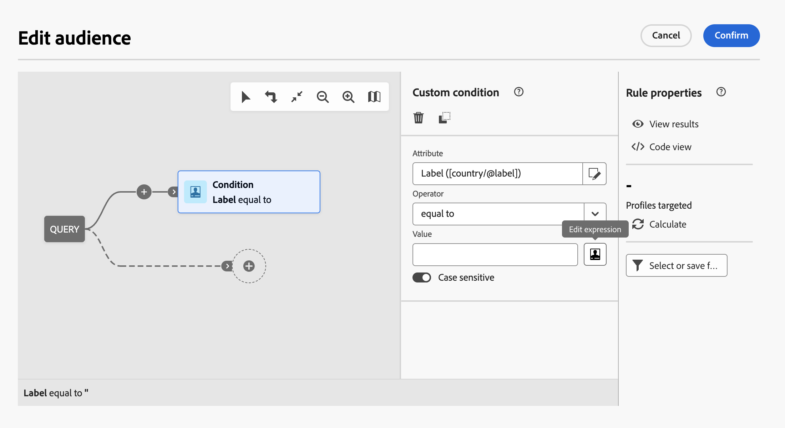
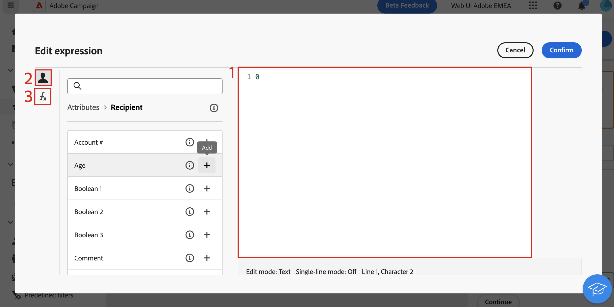

# Panoramica dell’editor espressioni {#expression}

La modifica di un’espressione comporta l’immissione manuale di condizioni per formare una regola. Questa modalità ti consente di utilizzare funzioni avanzate, che ti consentono di manipolare i valori utilizzati per eseguire query specifiche come la manipolazione di date, stringhe, campi numerici, ordinamenti, ecc.

## Utilizzare l’editor di espressioni {#edit}

L&#39;editor espressioni è disponibile dal pulsante **[!UICONTROL Modifica espressione]** del modellatore di query, disponibile per i campi **[!UICONTROL Attributo]** e **[!UICONTROL Valore]** durante la configurazione di una condizione personalizzata.

| Accedere dal campo **[!UICONTROL Attributo]** | Accedere dal campo **[!UICONTROL Valore]** |
|  ---  |  ---  |
| {zoomable="yes"}{width="200" align="center" zoomable="yes"} | {zoomable="yes"}{width="200" align="center" zoomable="yes"} |

L’editor di espressioni mostra:

* Un campo di input **(1)** in cui è definita l&#39;espressione.
* Elenco dei **campi (2)** disponibili che possono essere utilizzati nell&#39;espressione e corrispondenti allo schema della query, noto anche come dimensione di targeting.
* **Funzioni helper (3)**, ordinate per categoria.

Modifica l’espressione immettendo un’espressione direttamente nel campo di input. Per aggiungere un campo o una funzione di supporto, posiziona il cursore nell’espressione nel punto in cui desideri aggiungerlo e seleziona il pulsante +.

{zoomable="yes"}

Quando l&#39;espressione è pronta, selezionare **[!UICONTROL Conferma]**. L’espressione viene visualizzata nel campo selezionato. Per modificarlo, apri l’editor di espressioni e apporta le modifiche desiderate.

L&#39;esempio seguente mostra un&#39;espressione configurata per il campo **[!UICONTROL Value]**. Per modificarlo, è necessario aprire l&#39;editor espressioni utilizzando il pulsante **[!UICONTROL Modifica espressione]**.

{zoomable="yes"}

## Funzioni Helper

Lo strumento di modifica delle query consente di utilizzare funzioni avanzate per eseguire filtri complessi a seconda dei risultati desiderati e dei tipi di dati gestiti. Sono disponibili le seguenti funzioni:

<!-- ### Aggregate

The aggregate functions are used to perform calculations on a set of values.

>[!BEGINTABS]

>[!TAB Google BigQuery]

| Name | Description | Syntax | Example |
| ---- | ----------- | ------ | ------- |
| **StdDev** | Returns the standard deviation of the values given. | StdDev(&lt;VALUE&gt;) | StdDev([0,3,5]) | -->

<!-- 

>[!TAB Databricks]

Aggregate functions are not available.

>[!TAB Fabric]

| Name | Description | Syntax | Example |
| ---- | ----------- | ------ | ------- |
| **StringAgg** | Returns the concatenation of the values of a string type column, separated by the character in the second argument | StringAgg(&lt;Value&gt;, &lt;String&gt;) | StringAgg(column, ",") |

>[!TAB Redshift]

Aggregate functions are not available. -->

<!-- 

>[!TAB Snowflake]

| Name | Description | Syntax | Example |
| ---- | ----------- | ------ | ------- |
| **StringAgg** | Returns the concatenation of the values of a string type column, separated by the character in the second argument | StringAgg(&lt;Value&gt;, &lt;String&gt;) | StringAgg(column, ",") | -->

<!-- 
>[!TAB Vertica]

Aggregate functions are not available. -->

<!-- 
>[!ENDTABS] 
-->

### Data

Le funzioni di data vengono utilizzate per manipolare i valori di data o ora.

>[!BEGINTABS]

>[!TAB Google BigQuery]

| Nome | Descrizione | Sintassi | Esempio |
| ---- | ----------- | ------ | ------- |
| **AddYears** | Aggiunge il numero di anni specificato al datetime specificato. | AddYears(&lt;DATETIME>, &lt;NUMERO>) | AddYears(&quot;2019-12-25 15:30:00&quot;, 3) |
| **AddMonths** | Aggiunge il numero di mesi specificato al datetime specificato. | AddMonths(&lt;DATETIME>, &lt;NUMERO>) | AddMonths(&quot;2019-12-25 15:30:00&quot;, 6) |
| **AddDays** | Aggiunge il numero di giorni specificato al datetime specificato. | AddDays(&lt;DATETIME>, &lt;NUMERO>) | AddDays(&quot;2019-12-25 15:30:00&quot;, 10) |
| **AddHours** | Aggiunge il numero di ore specificato al datetime specificato. | AddHours(&lt;DATETIME>, &lt;NUMERO>) | AddHours(&quot;2019-12-25 15:30:00&quot;, 3) |
| **AddMinutes** | Aggiunge il numero di minuti specificato al datetime specificato. | AddMinutes(&lt;DATETIME>, &lt;NUMERO>) | AddMinutes(&quot;2019-12-25 15:30:00&quot;, 32) |
| **AddSeconds** | Aggiunge il numero di secondi specificato al datetime specificato. | AddSeconds(&lt;DATETIME>, &lt;NUMERO>) | AddSeconds(&quot;2019-12-25 15:30:00&quot;, 37) |
| **SubYears** | Sottrae il numero di anni specificato al datetime specificato. | SubYears(&lt;DATETIME>, &lt;NUMERO>) | SubYears(&quot;2019-12-25 15:30:00&quot;, 3) |
| **SubMonths** | Sottrae il numero di mesi specificato alla data/ora specificata. | SubMonths(&lt;DATETIME>, &lt;NUMERO>) | SubMonths(&quot;2019-12-25 15:30:00&quot;, 6) |
| **SubDays** | Sottrae il numero di giorni specificato al datetime specificato. | SubDays(&lt;DATETIME>, &lt;NUMERO>) | SubDays(&quot;2019-12-25 15:30:00&quot;, 10) |
| **SubHours** | Sottrae il numero di ore specificato al datetime specificato. | SubHours(&lt;DATETIME>, &lt;NUMERO>) | SubHours(&quot;2019-12-25 15:30:00&quot;, 3) |
| **SubMinutes** | Sottrae il numero di minuti specificato al datetime specificato. | SubMinutes(&lt;DATETIME>, &lt;NUMERO>) | SubMinutes(&quot;2019-12-25 15:30:00&quot;, 32) |
| **SubSeconds** | Sottrae il numero di secondi specificato al datetime specificato. | SubSeconds(&lt;DATETIME>, &lt;NUMERO>) | SubSeconds(&quot;2019-12-25 15:30:00&quot;, 37) |
| **Year** | Estrae l&#39;anno dall&#39;oggetto datetime specificato. | Year(&lt;DATETIME>) | Year(&quot;2019-12-15 15:30:00&quot;) |
| **Month** | Estrae il mese dall&#39;oggetto datetime specificato. | Month(&lt;DATAORA>) | Mese(&quot;2019-12-15 15:30:00&quot;) |
| **Day** | Estrae il giorno dall&#39;oggetto datetime specificato. | Day(&lt;DATETIME>) | Day(&quot;2019-12-15 15:30:00&quot;) |
| **DayOfYear** | Estrae il giorno dell&#39;anno dall&#39;oggetto datetime specificato. Ad esempio, se il valore datetime fornito è il 2 febbraio, restituirà 33. | DayOfYear(&lt;DATETIME>) | DayOfYear(&quot;2019-12-15 15:30:00&quot;) |
| **WeekDay** | Estrae il giorno della settimana dall&#39;oggetto datetime specificato, come numero compreso tra 0 e 6, con 0 che rappresenta la domenica. | Year(&lt;DATETIME>) | Year(&quot;2019-12-15 15:30:00&quot;) |
| **Hour** | Estrae il valore dell&#39;ora dall&#39;oggetto datetime specificato. | Year(&lt;DATETIME>) | Year(&quot;2019-12-15 15:30:00&quot;) |
| **Minute** | Estrae il valore del minuto dall&#39;oggetto datetime specificato. | Year(&lt;DATETIME>) | Year(&quot;2019-12-15 15:30:00&quot;) |
| **Second** | Estrae il secondo valore dall&#39;oggetto datetime specificato. | Year(&lt;DATETIME>) | Year(&quot;2019-12-15 15:30:00&quot;) |
| **YearsDiff** | Trova la differenza tra le date specificate, con una granularità di anni. | YearsDiff(&lt;DATETIME>, &lt;DATETIME>) | YearsDiff(&quot;2019-12-25 15:30:00&quot;, &quot;2018-10-14 18:35:27&quot;) |
| **MonthsDiff** | Trova la differenza tra le date specificate, con una granularità di mesi. | MonthsDiff(&lt;DATAORA>, &lt;DATAORA>) | MonthsDiff(&quot;2019-12-25 15:30:00&quot;, &quot;2018-10-14 18:35:27&quot;) |
| **DaysDiff** | Trova la differenza tra le date specificate, con una granularità di giorni. | DaysDiff(&lt;DATETIME>, &lt;DATETIME>) | DaysDiff(&quot;2019-12-25 15:30:00&quot;, &quot;2018-10-14 18:35:27&quot;) |
| **HoursDiff** | Trova la differenza tra le date specificate, con una granularità di ore. | HoursDiff(&lt;DATETIME>, &lt;DATETIME>) | HoursDiff(&quot;2019-12-25 15:30:00&quot;, &quot;2018-10-14 18:35:27&quot;) |
| **MinutesDiff** | Trova la differenza tra le date specificate, con una granularità di minuti. | MinutesDiff(&lt;DATETIME>, &lt;DATETIME>) | MinutesDiff(&quot;2019-12-25 15:30:00&quot;, &quot;2018-10-14 18:35:27&quot;) |
| **SecondsDiff** | Trova la differenza tra le date specificate, con una granularità di secondi. | SecondsDiff(&lt;DATETIME>, &lt;DATETIME>) | SecondsDiff(&quot;2019-12-25 15:30:00&quot;, &quot;2018-10-14 18:35:27&quot;) |
| **YearsOld** | Trova la differenza tra il datetime specificato e il presente, con una granularità di anni. | YearsOld(&lt;DATETIME>) | YearsOld(&quot;2019-12-25 15:30:00&quot;) |
| **MonthsOld** | Trova la differenza tra il dato datetime e il presente, con una granularità di mesi. | MonthsOld(&lt;DATAORA>) | MonthsOld(&quot;2019-12-25 15:30:00&quot;) |
| **DaysOld** | Trova la differenza tra il dato datetime e il presente, con una granularità di giorni. | DaysOld(&lt;DATETIME>) | DaysOld(&quot;2019-12-25 15:30:00&quot;) |
| **GetDate** | Ottiene la data corrente del server. | GetDate() | GetDate() |
| **DateOnly** | Tronca il datetime solo all&#39;anno, al mese e al giorno. | DateOnly(&lt;DATETIME>) | DateOnly(&quot;2019-12-25 15:30:00&quot;) |
| **ToDate** | Converte il campo in un campo data. | ToDate(&lt;DATETIME>) | ToDate(&quot;2019-12-25 15:30:00&quot;) |
| **ToDateTime** | Converte il campo in un campo datetime. | ToDateTime(&lt;DATA>) | ToDateTime(&quot;2019-12-25 15:30:00&quot;) |
| **ATimestamp** | Converte il campo in un campo timestamp. | ToTimestamp(&lt;DATETIME>) | ToTimestamp(&quot;2019-12-25 15:30:00&quot;) |
| **Oldest** | Restituisce la data meno recente tra i due specificati. | Oldest(&lt;DATAORA>, &lt;DATAORA>) | Oldest(&quot;2015-02-13 11:59:59&quot;, &quot;2016-04-13 19:28:14&quot;) |
| **TruncDate** | Tronca il datetime all&#39;unità più vicina, in base al valore numerico specificato. Se il valore numerico è uguale a 60, viene troncato al minuto più vicino. Se il valore numerico è uguale a 3600, viene troncato all&#39;ora più vicina. Se il valore numerico è uguale a 86400, viene troncato al giorno più vicino. In caso contrario, viene troncato al secondo più vicino. | TruncDate(&lt;DATETIME>, &lt;NUMERO>) | TruncDate(&quot;2016-04-13 19:28:14&quot;, 3600) |
| **TruncDateTZ** | Tronca il datetime all&#39;unità più vicina, in base al valore numerico specificato, e imposta il datetime sul fuso orario specificato. Se il valore numerico è uguale a 60, viene troncato al minuto più vicino. Se il valore numerico è uguale a 3600, viene troncato all&#39;ora più vicina. Se il valore numerico è uguale a 86400, viene troncato al giorno più vicino. | TruncDateTZ(&lt;DATETIME>, &lt;NUMERO>, &lt;FUSO ORARIO>) | TruncDateTZ(&quot;2016-04-13 19:28:14&quot;, 3600, &quot;America/Los_Angeles&quot;) |
| **TruncTime** | Imposta il valore datetime su 1 gennaio 2000 e arrotonda il resto del valore datetime all&#39;unità più vicina, in base al valore numerico specificato. Se il valore numerico è uguale a 60, viene troncato al minuto più vicino. Se il valore numerico è uguale a 3600, viene troncato all&#39;ora più vicina. | TruncTime(&lt;DATETIME>, &lt;NUMERO>) | TruncTime(&quot;2016-04-13 19:28:14&quot;, 3600) |
| **TruncQuarter** | Tronca il datetime alla prima data nel trimestre più vicino. | TruncQuarter(&lt;DATETIME>) | TruncQuarter(&quot;2016-04-13 19:28:14&quot;) |
| **TruncYear** | Tronca il datetime alla prima data dell&#39;anno più vicino. | TruncYear(&lt;DATETIME>) | TruncYear(&quot;2016-04-13 19:28:14&quot;) |
| **TruncWeek** | Tronca il datetime alla domenica della settimana più vicina. | TruncWeek(&lt;DATETIME>) | TruncWeek(&quot;2016-04-13 19:28:14&quot;) |

<!-- 
| **YearAndMonth** | Truncates the datetime to just the year and month. | YearAndMonth(&lt;DATETIME&gt;) | YearAndMonth("2019-12-25 15:30:00") | 
-->

<!-- | **DaysAgo** | Calculates the number of days between the current date and the provided timestamp, and returns the value as a datetime. | DaysAgo(&lt;DATETIME&gt;) | DaysAgo("2024-06-24 14:43:49") |
| **DaysAgoInt** | Calculates the number of days between the current date and the provided timestamp, and returns the value as an integer. | DaysAgoInt(&lt;DATETIME&gt;) | DaysAgoInt("2024-06-24 14:43:49") |
| **MonthsAgo** | Calculates the number of months between the current date and the provided timestamp, and returns the value as a datetime. | MonthsAgo(&lt;DATETIME&gt;) | MonthsAgo("2024-06-24 14:43:49") |
| **YearsAgo** | Calculates the number of years between the current date and the provided timestamp, and returns the value as a datetime. | YearsAgo(&lt;DATETIME&gt;) | YearsAgo("2024-06-24 14:43:49") | -->

<!-- 
>[!TAB Databricks]

| Name | Description | Syntax | Example |
| ---- | ----------- | ------ | ------- |
| **AddYears** | Adds the specified number of years to the provided datetime. | AddYears(&lt;DATETIME&gt;, &lt;NUMBER&gt;) | AddYears("2019-12-25 15:30:00", 3) |
| **AddMonths** | Adds the specified number of months to the provided datetime. | AddMonths(&lt;DATETIME&gt;, &lt;NUMBER&gt;) | AddMonths("2019-12-25 15:30:00", 6) |
| **AddDays** | Adds the specified number of days to the provided datetime. | AddDays(&lt;DATETIME&gt;, &lt;NUMBER&gt;) | AddDays("2019-12-25 15:30:00", 10) |
| **AddHours** | Adds the specified number of hours to the provided datetime. | AddHours(&lt;DATETIME&gt;, &lt;NUMBER&gt;) | AddHours("2019-12-25 15:30:00", 3) |
| **AddMinutes** | Adds the specified number of minutes to the provided datetime. | AddMinutes(&lt;DATETIME&gt;, &lt;NUMBER&gt;) | AddMinutes("2019-12-25 15:30:00", 32) |
| **AddSeconds** | Adds the specified number of seconds to the provided datetime. | AddSeconds(&lt;DATETIME&gt;, &lt;NUMBER&gt;) | AddSeconds("2019-12-25 15:30:00", 37) |
| **SubYears** | Subtracts the specified number of years to the provided datetime. | SubYears(&lt;DATETIME&gt;, &lt;NUMBER&gt;) | SubYears("2019-12-25 15:30:00", 3) |
| **SubMonths** | Adds the specified number of months to the provided datetime. | SubMonths(&lt;DATETIME&gt;, &lt;NUMBER&gt;) | SubMonths("2019-12-25 15:30:00", 6) |
| **SubDays** | Adds the specified number of days to the provided datetime. | SubDays(&lt;DATETIME&gt;, &lt;NUMBER&gt;) | SubDays("2019-12-25 15:30:00", 10) |
| **SubHours** | Adds the specified number of hours to the provided datetime. | SubHours(&lt;DATETIME&gt;, &lt;NUMBER&gt;) | SubHours("2019-12-25 15:30:00", 3) |
| **SubMinutes** | Adds the specified number of minutes to the provided datetime. | SubMinutes(&lt;DATETIME&gt;, &lt;NUMBER&gt;) | SubMinutes("2019-12-25 15:30:00", 32) |
| **SubSeconds** | Adds the specified number of seconds to the provided datetime. | SubSeconds(&lt;DATETIME&gt;, &lt;NUMBER&gt;) | SubSeconds("2019-12-25 15:30:00", 37) |
| **Year** | Extracts the year from the given datetime object. | Year(&lt;DATETIME&gt;) | Year("2019-12-15 15:30:00") |
| **Month** | Extracts the month from the given datetime object. | Month(&lt;DATETIME&gt;) | Month("2019-12-15 15:30:00") |
| **Day** | Extracts the day from the given datetime object. | Day(&lt;DATETIME&gt;) | Day("2019-12-15 15:30:00") |
| **DayOfYear** | Extracts the day of year from the given datetime object. For example, if the provided datetime is February 2nd, it would return 33. | DayOfYear(&lt;DATETIME&gt;) | DayOfYear("2019-12-15 15:30:00") |
| **WeekDay** | Extracts the day of the week from the given datetime object, as a number from 1 to 7, with 1 representing Sunday. | Year(&lt;DATETIME&gt;) | Year("2019-12-15 15:30:00") |
| **Hour** | Extracts the hour value from the given datetime object. | Year(&lt;DATETIME&gt;) | Year("2019-12-15 15:30:00") |
| **Minute** | Extracts the minute value from the given datetime object. | Year(&lt;DATETIME&gt;) | Year("2019-12-15 15:30:00") |
| **Second** | Extracts the second value from the given datetime object. | Year(&lt;DATETIME&gt;) | Year("2019-12-15 15:30:00") |
| **YearsDiff** | Finds the difference between the given datetimes, with a granularity of years. | YearsDiff(&lt;DATETIME&gt;, &lt;DATETIME&gt;) | YearsDiff("2019-12-25 15:30:00", "2018-10-14 18:35:27") |
| **MonthsDiff** | Finds the difference between the given datetimes, with a granularity of months. | MonthsDiff(&lt;DATETIME&gt;, &lt;DATETIME&gt;) | MonthsDiff("2019-12-25 15:30:00", "2018-10-14 18:35:27") |
| **DaysDiff** | Finds the difference between the given datetimes, with a granularity of days. | DaysDiff(&lt;DATETIME&gt;, &lt;DATETIME&gt;) | DaysDiff("2019-12-25 15:30:00", "2018-10-14 18:35:27") |
| **HoursDiff** | Finds the difference between the given datetimes, with a granularity of hours. | HoursDiff(&lt;DATETIME&gt;, &lt;DATETIME&gt;) | HoursDiff("2019-12-25 15:30:00", "2018-10-14 18:35:27") |
| **MinutesDiff** | Finds the difference between the given datetimes, with a granularity of minutes. | MinutesDiff(&lt;DATETIME&gt;, &lt;DATETIME&gt;) | MinutesDiff("2019-12-25 15:30:00", "2018-10-14 18:35:27") |
| **SecondsDiff** | Finds the difference between the given datetimes, with a granularity of seconds. | SecondsDiff(&lt;DATETIME&gt;, &lt;DATETIME&gt;) | SecondsDiff("2019-12-25 15:30:00", "2018-10-14 18:35:27") |
| **YearsOld** | Finds the difference between the given datetime and the present, with a granularity of years. | YearsOld(&lt;DATETIME&gt;) | YearsOld("2019-12-25 15:30:00") |
| **MonthsOld** | Finds the difference between the given datetime and the present, with a granularity of months. | MonthsOld(&lt;DATETIME&gt;) | MonthsOld("2019-12-25 15:30:00") |
| **DaysOld** | Finds the difference between the given datetime and the present, with a granularity of days. | DaysOld(&lt;DATETIME&gt;) | DaysOld("2019-12-25 15:30:00") |
| **DaysAgo** | Calculates the number of days between the current date and the provided timestamp, and returns the value as a datetime. | DaysAgo(&lt;DATETIME&gt;) | DaysAgo("2024-06-24 14:43:49") |
| **DaysAgoInt** | Calculates the number of days between the current date and the provided timestamp, and returns the value as an integer. | DaysAgoInt(&lt;DATETIME&gt;) | DaysAgoInt("2024-06-24 14:43:49") |
| **MonthsAgo** | Calculates the number of months between the current date and the provided timestamp, and returns the value as a datetime. | MonthsAgo(&lt;DATETIME&gt;) | MonthsAgo("2024-06-24 14:43:49") |
| **ToDateTime** | Converts the field to a datetime field. | ToDateTime(&lt;DATE&gt;) | ToDateTime("2019-12-25 15:30:00") |
| **ToTimestamp** | Converts the field to a timestamp field. | ToTimestamp(&lt;DATETIME&gt;) | ToTimestamp("2019-12-25 15:30:00") |
| **GetDate** | Get the current date of the server. | GetDate() | GetDate() |
| **DateOnly** | Truncates the datetime to just the year, month, and day. | DateOnly(&lt;DATETIME&gt;) | DateOnly("2019-12-25 15:30:00") |
| **ToDate** | Converts the field to a date field. | ToDate(&lt;DATETIME&gt;) | ToDate("2019-12-25 15:30:00") |
| **YearAndMonth** | Truncates the datetime to just the year and month. | YearAndMonth(&lt;DATETIME&gt;) | YearAndMonth("2019-12-25 15:30:00") |
| **Oldest** | Returns the oldest date between the two provided. | Oldest(&lt;DATETIME&gt;, &lt;DATETIME&gt;) | Oldest("2015-02-13 11:59:59", "2016-04-13 19:28:14") |
| **TruncDate** | Truncates the datetime to the nearest unit, based on the numerical value given. If the numeric value is equal to 60, it truncates to the nearest minute. If the numeric value is equal to 3600, it truncates to the nearest hour. If the numeric value is equal to 86400, it truncates to the nearest day. Otherwise, it truncates to the nearest second. | TruncDate(&lt;DATETIME&gt;, &lt;NUMBER&gt;) | TruncDate("2016-04-13 19:28:14", 3600) |
| **TruncDateTZ** | Truncates the datetime to the nearest unit, based on the numerical value given, and sets the datetime to the specified timezone. If the numeric value is equal to 60, it truncates to the nearest minute. If the numeric value is equal to 3600, it truncates to the nearest hour. If the numeric value is equal to 86400, it truncates to the nearest day. | TruncDateTZ(&lt;DATETIME&gt;, &lt;NUMBER&gt;, &lt;TIMEZONE&gt;) | TruncDateTZ("2016-04-13 19:28:14", 3600, "America/Los_Angeles") |
| **TruncTime** | Sets the datetime to January 1st, 2000 and rounds the rest of the datetime to the nearest unit, based on the numerical value given.If the numeric value is equal to 60, it truncates to the nearest minute. If the numeric value is equal to 3600, it truncates to the nearest hour. | TruncTime(&lt;DATETIME&gt;, &lt;NUMBER&gt;) | TruncTime("2016-04-13 19:28:14", 3600) |
| **TruncQuarter** | Truncates the datetime to the first date in the nearest quarter. | TruncQuarter(&lt;DATETIME&gt;) | TruncQuarter("2016-04-13 19:28:14") |
| **TruncYear** | Truncates the datetime to the first date in the nearest year. | TruncYear(&lt;DATETIME&gt;) | TruncYear("2016-04-13 19:28:14") |
| **TruncWeek** | Truncates the datetime to the Sunday of the nearest week. | TruncWeek(&lt;DATETIME&gt;) | TruncWeek("2016-04-13 19:28:14") |

>[!TAB Fabric]

| Name | Description | Syntax | Example |
| ---- | ----------- | ------ | ------- |
| **AddYears** | Adds the specified number of years to the provided datetime. | AddYears(&lt;DATETIME&gt;, &lt;NUMBER&gt;) | AddYears("2019-12-25 15:30:00", 3) |
| **AddMonths** | Adds the specified number of months to the provided datetime. | AddMonths(&lt;DATETIME&gt;, &lt;NUMBER&gt;) | AddMonths("2019-12-25 15:30:00", 6) |
| **AddDays** | Adds the specified number of days to the provided datetime. | AddDays(&lt;DATETIME&gt;, &lt;NUMBER&gt;) | AddDays("2019-12-25 15:30:00", 10) |
| **AddHours** | Adds the specified number of hours to the provided datetime. | AddHours(&lt;DATETIME&gt;, &lt;NUMBER&gt;) | AddHours("2019-12-25 15:30:00", 3) |
| **AddMinutes** | Adds the specified number of minutes to the provided datetime. | AddMinutes(&lt;DATETIME&gt;, &lt;NUMBER&gt;) | AddMinutes("2019-12-25 15:30:00", 32) |
| **AddSeconds** | Adds the specified number of seconds to the provided datetime. | AddSeconds(&lt;DATETIME&gt;, &lt;NUMBER&gt;) | AddSeconds("2019-12-25 15:30:00", 37) |
| **SubYears** | Subtracts the specified number of years to the provided datetime. | SubYears(&lt;DATETIME&gt;, &lt;NUMBER&gt;) | SubYears("2019-12-25 15:30:00", 3) |
| **SubMonths** | Adds the specified number of months to the provided datetime. | SubMonths(&lt;DATETIME&gt;, &lt;NUMBER&gt;) | SubMonths("2019-12-25 15:30:00", 6) |
| **SubDays** | Adds the specified number of days to the provided datetime. | SubDays(&lt;DATETIME&gt;, &lt;NUMBER&gt;) | SubDays("2019-12-25 15:30:00", 10) |
| **SubHours** | Adds the specified number of hours to the provided datetime. | SubHours(&lt;DATETIME&gt;, &lt;NUMBER&gt;) | SubHours("2019-12-25 15:30:00", 3) |
| **SubMinutes** | Adds the specified number of minutes to the provided datetime. | SubMinutes(&lt;DATETIME&gt;, &lt;NUMBER&gt;) | SubMinutes("2019-12-25 15:30:00", 32) |
| **SubSeconds** | Adds the specified number of seconds to the provided datetime. | SubSeconds(&lt;DATETIME&gt;, &lt;NUMBER&gt;) | SubSeconds("2019-12-25 15:30:00", 37) |
| **DayOfYear** | Extracts the day of year from the given datetime object. For example, if the provided datetime is February 2nd, it would return 33. | DayOfYear(&lt;DATETIME&gt;) | DayOfYear("2019-12-15 15:30:00") |
| **DateOnly** | Truncates the datetime to just the year, month, and day. | DateOnly(&lt;DATETIME&gt;) | DateOnly("2019-12-25 15:30:00") |
| **YearsOld** | Finds the difference between the given datetime and the present, with a granularity of years. | YearsOld(&lt;DATETIME&gt;) | YearsOld("2019-12-25 15:30:00") |
| **YearsDiff** | Finds the difference between the given datetimes, with a granularity of years. | YearsDiff(&lt;DATETIME&gt;, &lt;DATETIME&gt;) | YearsDiff("2019-12-25 15:30:00", "2018-10-14 18:35:27") |
| **MonthsDiff** | Finds the difference between the given datetimes, with a granularity of months. | MonthsDiff(&lt;DATETIME&gt;, &lt;DATETIME&gt;) | MonthsDiff("2019-12-25 15:30:00", "2018-10-14 18:35:27") |
| **DaysDiff** | Finds the difference between the given datetimes, with a granularity of days. | DaysDiff(&lt;DATETIME&gt;, &lt;DATETIME&gt;) | DaysDiff("2019-12-25 15:30:00", "2018-10-14 18:35:27") |
| **HoursDiff** | Finds the difference between the given datetimes, with a granularity of hours. | HoursDiff(&lt;DATETIME&gt;, &lt;DATETIME&gt;) | HoursDiff("2019-12-25 15:30:00", "2018-10-14 18:35:27") |
| **MinutesDiff** | Finds the difference between the given datetimes, with a granularity of minutes. | MinutesDiff(&lt;DATETIME&gt;, &lt;DATETIME&gt;) | MinutesDiff("2019-12-25 15:30:00", "2018-10-14 18:35:27") |
| **SecondsDiff** | Finds the difference between the given datetimes, with a granularity of seconds. | SecondsDiff(&lt;DATETIME&gt;, &lt;DATETIME&gt;) | SecondsDiff("2019-12-25 15:30:00", "2018-10-14 18:35:27") |
| **WeekDay** | Extracts the day of the week from the given datetime object, as a number from 1 to 7, with 1 representing Sunday. | Year(&lt;DATETIME&gt;) | Year("2019-12-15 15:30:00") |
| **Hour** | Extracts the hour value from the given datetime object. | Year(&lt;DATETIME&gt;) | Year("2019-12-15 15:30:00") |
| **Minute** | Extracts the minute value from the given datetime object. | Year(&lt;DATETIME&gt;) | Year("2019-12-15 15:30:00") |
| **Second** | Extracts the second value from the given datetime object. | Year(&lt;DATETIME&gt;) | Year("2019-12-15 15:30:00") |
| **Oldest** | Returns the oldest date between the two provided. | Oldest(&lt;DATETIME&gt;, &lt;DATETIME&gt;) | Oldest("2015-02-13 11:59:59", "2016-04-13 19:28:14") |
| **YearAndMonth** | Truncates the datetime to just the year and month. | YearAndMonth(&lt;DATETIME&gt;) | YearAndMonth("2019-12-25 15:30:00") |
| **ToDate** | Converts the field to a date field. | ToDate(&lt;DATETIME&gt;) | ToDate("2019-12-25 15:30:00") |
| **TruncDate** | Truncates the datetime to the nearest unit, based on the numerical value given. If the numeric value is equal to 60, it truncates to the nearest minute. If the numeric value is equal to 3600, it truncates to the nearest hour. If the numeric value is equal to 86400, it truncates to the nearest day. Otherwise, it truncates to the nearest second. | TruncDate(&lt;DATETIME&gt;, &lt;NUMBER&gt;) | TruncDate("2016-04-13 19:28:14", 3600) |
| **TruncTime** | Sets the datetime to January 1st, 2000 and rounds the rest of the datetime to the nearest unit, based on the numerical value given.If the numeric value is equal to 60, it truncates to the nearest minute. If the numeric value is equal to 3600, it truncates to the nearest hour. | TruncTime(&lt;DATETIME&gt;, &lt;NUMBER&gt;) | TruncTime("2016-04-13 19:28:14", 3600) |
| **TruncQuarter** | Truncates the datetime to the first date in the nearest quarter. | TruncQuarter(&lt;DATETIME&gt;) | TruncQuarter("2016-04-13 19:28:14") |
| **TruncYear** | Truncates the datetime to the first date in the nearest year. | TruncYear(&lt;DATETIME&gt;) | TruncYear("2016-04-13 19:28:14") |
| **TruncWeek** | Truncates the datetime to the Sunday of the nearest week. | TruncWeek(&lt;DATETIME&gt;) | TruncWeek("2016-04-13 19:28:14") |
| **ToTimestamp** | Converts the field to a timestamp field. | ToTimestamp(&lt;DATETIME&gt;) | ToTimestamp("2019-12-25 15:30:00") |

>[!TAB Redshift]

| Name | Description | Syntax | Example |
| ---- | ----------- | ------ | ------- |
| **ConvertTimezone** | Converts the datetime from its timezone to the timezone of the external account. | ConvertTimezone(&lt;DATETIME&gt;) | ConvertTimezone("2019-12-25 15:30:00") |

 -->

>[!TAB Snowflake]

| Nome | Descrizione | Sintassi | Esempio |
| ---- | ----------- | ------ | ------- |
| **AddYears** | Aggiunge il numero di anni specificato al datetime specificato. | AddYears(&lt;DATETIME>, &lt;NUMERO>) | AddYears(&quot;2019-12-25 15:30:00&quot;, 3) |
| **AddMonths** | Aggiunge il numero di mesi specificato al datetime specificato. | AddMonths(&lt;DATETIME>, &lt;NUMERO>) | AddMonths(&quot;2019-12-25 15:30:00&quot;, 6) |
| **AddDays** | Aggiunge il numero di giorni specificato al datetime specificato. | AddDays(&lt;DATETIME>, &lt;NUMERO>) | AddDays(&quot;2019-12-25 15:30:00&quot;, 10) |
| **AddHours** | Aggiunge il numero di ore specificato al datetime specificato. | AddHours(&lt;DATETIME>, &lt;NUMERO>) | AddHours(&quot;2019-12-25 15:30:00&quot;, 3) |
| **AddMinutes** | Aggiunge il numero di minuti specificato al datetime specificato. | AddMinutes(&lt;DATETIME>, &lt;NUMERO>) | AddMinutes(&quot;2019-12-25 15:30:00&quot;, 32) |
| **AddSeconds** | Aggiunge il numero di secondi specificato al datetime specificato. | AddSeconds(&lt;DATETIME>, &lt;NUMERO>) | AddSeconds(&quot;2019-12-25 15:30:00&quot;, 37) |
| **SubYears** | Sottrae il numero di anni specificato al datetime specificato. | SubYears(&lt;DATETIME>, &lt;NUMERO>) | SubYears(&quot;2019-12-25 15:30:00&quot;, 3) |
| **SubMonths** | Sottrae il numero di mesi specificato alla data/ora specificata. | SubMonths(&lt;DATETIME>, &lt;NUMERO>) | SubMonths(&quot;2019-12-25 15:30:00&quot;, 6) |
| **SubDays** | Sottrae il numero di giorni specificato al datetime specificato. | SubDays(&lt;DATETIME>, &lt;NUMERO>) | SubDays(&quot;2019-12-25 15:30:00&quot;, 10) |
| **SubHours** | Sottrae il numero di ore specificato al datetime specificato. | SubHours(&lt;DATETIME>, &lt;NUMERO>) | SubHours(&quot;2019-12-25 15:30:00&quot;, 3) |
| **SubMinutes** | Sottrae il numero di minuti specificato al datetime specificato. | SubMinutes(&lt;DATETIME>, &lt;NUMERO>) | SubMinutes(&quot;2019-12-25 15:30:00&quot;, 32) |
| **SubSeconds** | AdSottrae il numero di secondi specificato al valore datetime specificato. | SubSeconds(&lt;DATETIME>, &lt;NUMERO>) | SubSeconds(&quot;2019-12-25 15:30:00&quot;, 37) |
| **Year** | Estrae l&#39;anno dall&#39;oggetto datetime specificato. | Year(&lt;DATETIME>) | Year(&quot;2019-12-15 15:30:00&quot;) |
| **Month** | Estrae il mese dall&#39;oggetto datetime specificato. | Month(&lt;DATAORA>) | Mese(&quot;2019-12-15 15:30:00&quot;) |
| **Day** | Estrae il giorno dall&#39;oggetto datetime specificato. | Day(&lt;DATETIME>) | Day(&quot;2019-12-15 15:30:00&quot;) |
| **DayOfYear** | Estrae il giorno dell&#39;anno dall&#39;oggetto datetime specificato. Ad esempio, se il valore datetime fornito è il 2 febbraio, restituirà 33. | DayOfYear(&lt;DATETIME>) | DayOfYear(&quot;2019-12-15 15:30:00&quot;) |
| **WeekDay** | Estrae il giorno della settimana dall&#39;oggetto datetime specificato, come numero compreso tra 1 e 7, con 1 che rappresenta la domenica. | Year(&lt;DATETIME>) | Year(&quot;2019-12-15 15:30:00&quot;) |
| **Hour** | Estrae il valore dell&#39;ora dall&#39;oggetto datetime specificato. | Year(&lt;DATETIME>) | Year(&quot;2019-12-15 15:30:00&quot;) |
| **Minute** | Estrae il valore del minuto dall&#39;oggetto datetime specificato. | Year(&lt;DATETIME>) | Year(&quot;2019-12-15 15:30:00&quot;) |
| **Second** | Estrae il secondo valore dall&#39;oggetto datetime specificato. | Year(&lt;DATETIME>) | Year(&quot;2019-12-15 15:30:00&quot;) |
| **YearsDiff** | Trova la differenza tra le date specificate, con una granularità di anni. | YearsDiff(&lt;DATETIME>, &lt;DATETIME>) | YearsDiff(&quot;2019-12-25 15:30:00&quot;, &quot;2018-10-14 18:35:27&quot;) |
| **MonthsDiff** | Trova la differenza tra le date specificate, con una granularità di mesi. | MonthsDiff(&lt;DATAORA>, &lt;DATAORA>) | MonthsDiff(&quot;2019-12-25 15:30:00&quot;, &quot;2018-10-14 18:35:27&quot;) |
| **DaysDiff** | Trova la differenza tra le date specificate, con una granularità di giorni. | DaysDiff(&lt;DATETIME>, &lt;DATETIME>) | DaysDiff(&quot;2019-12-25 15:30:00&quot;, &quot;2018-10-14 18:35:27&quot;) |
| **HoursDiff** | Trova la differenza tra le date specificate, con una granularità di ore. | HoursDiff(&lt;DATETIME>, &lt;DATETIME>) | HoursDiff(&quot;2019-12-25 15:30:00&quot;, &quot;2018-10-14 18:35:27&quot;) |
| **MinutesDiff** | Trova la differenza tra le date specificate, con una granularità di minuti. | MinutesDiff(&lt;DATETIME>, &lt;DATETIME>) | MinutesDiff(&quot;2019-12-25 15:30:00&quot;, &quot;2018-10-14 18:35:27&quot;) |
| **SecondsDiff** | Trova la differenza tra le date specificate, con una granularità di secondi. | SecondsDiff(&lt;DATETIME>, &lt;DATETIME>) | SecondsDiff(&quot;2019-12-25 15:30:00&quot;, &quot;2018-10-14 18:35:27&quot;) |
| **MonthsOld** | Trova la differenza tra il dato datetime e il presente, con una granularità di mesi. | MonthsOld(&lt;DATAORA>) | MonthsOld(&quot;2019-12-25 15:30:00&quot;) |
| **DaysOld** | Trova la differenza tra il dato datetime e il presente, con una granularità di giorni. | DaysOld(&lt;DATETIME>) | DaysOld(&quot;2019-12-25 15:30:00&quot;) |
| **GetDate** | Ottiene la data corrente del server. | GetDate() | GetDate() |
| **DateOnly** | Tronca il datetime solo all&#39;anno, al mese e al giorno. | DateOnly(&lt;DATETIME>) | DateOnly(&quot;2019-12-25 15:30:00&quot;) |
| **ToDate** | Converte il campo in un campo data. | ToDate(&lt;DATETIME>) | ToDate(&quot;2019-12-25 15:30:00&quot;) |
| **ToDateTime** | Converte il campo in un campo datetime. | ToDateTime(&lt;DATA>) | ToDateTime(&quot;2019-12-25 15:30:00&quot;) |
| **ATimestamp** | Converte il campo in un campo timestamp. | ToTimestamp(&lt;DATETIME>) | ToTimestamp(&quot;2019-12-25 15:30:00&quot;) |
| **Oldest** | Restituisce la data meno recente tra i due specificati. | Oldest(&lt;DATAORA>, &lt;DATAORA>) | Oldest(&quot;2015-02-13 11:59:59&quot;, &quot;2016-04-13 19:28:14&quot;) |
| **TruncDate** | Tronca il datetime all&#39;unità più vicina, in base al valore numerico specificato. Se il valore numerico è uguale a 60, viene troncato al minuto più vicino. Se il valore numerico è uguale a 3600, viene troncato all&#39;ora più vicina. Se il valore numerico è uguale a 86400, viene troncato al giorno più vicino. In caso contrario, viene troncato al secondo più vicino. | TruncDate(&lt;DATETIME>, &lt;NUMERO>) | TruncDate(&quot;2016-04-13 19:28:14&quot;, 3600) |
| **TruncDateTZ** | Tronca il datetime all&#39;unità più vicina, in base al valore numerico specificato, e imposta il datetime sul fuso orario specificato. Se il valore numerico è uguale a 60, viene troncato al minuto più vicino. Se il valore numerico è uguale a 3600, viene troncato all&#39;ora più vicina. Se il valore numerico è uguale a 86400, viene troncato al giorno più vicino. | TruncDateTZ(&lt;DATETIME>, &lt;NUMERO>, &lt;FUSO ORARIO>) | TruncDateTZ(&quot;2016-04-13 19:28:14&quot;, 3600, &quot;America/Los_Angeles&quot;) |
| **TruncTime** | Imposta il valore datetime su 1 gennaio 2000 e arrotonda il resto del valore datetime all&#39;unità più vicina, in base al valore numerico specificato. Se il valore numerico è uguale a 60, viene troncato al minuto più vicino. Se il valore numerico è uguale a 3600, viene troncato all&#39;ora più vicina. | TruncTime(&lt;DATETIME>, &lt;NUMERO>) | TruncTime(&quot;2016-04-13 19:28:14&quot;, 3600) |
| **TruncQuarter** | Tronca il datetime alla prima data nel trimestre più vicino. | TruncQuarter(&lt;DATETIME>) | TruncQuarter(&quot;2016-04-13 19:28:14&quot;) |
| **TruncYear** | Tronca il datetime alla prima data dell&#39;anno più vicino. | TruncYear(&lt;DATETIME>) | TruncYear(&quot;2016-04-13 19:28:14&quot;) |
| **TruncWeek** | Tronca il datetime alla domenica della settimana più vicina. | TruncWeek(&lt;DATETIME>) | TruncWeek(&quot;2016-04-13 19:28:14&quot;) |
| **ConvertNTZ** | Converte una marca temporale senza fuso orario in una marca temporale con fuso orario. Il fuso orario associato sarà quello dell’account esterno. | ConvertNTZ(&lt;DATETIME>) | ConvertNTZ(&quot;2024-06-24 14:43:49&quot;) |

<!-- 
| **YearAndMonth** | Truncates the datetime to just the year and month. | YearAndMonth(&lt;DATETIME&gt;) | YearAndMonth("2019-12-25 15:30:00") | 
-->

<!-- 
| **DaysAgo** | Calculates the number of days between the current date and the provided timestamp, and returns the value as a datetime. | DaysAgo(&lt;DATETIME&gt;) | DaysAgo("2024-06-24 14:43:49") |
| **DaysAgoInt** | Calculates the number of days between the current date and the provided timestamp, and returns the value as an integer. | DaysAgoInt(&lt;DATETIME&gt;) | DaysAgoInt("2024-06-24 14:43:49") |
| **MonthsAgo** | Calculates the number of months between the current date and the provided timestamp, and returns the value as a datetime. | MonthsAgo(&lt;DATETIME&gt;) | MonthsAgo("2024-06-24 14:43:49") |
| **YearsAgo** | Calculates the number of years between the current date and the provided timestamp, and returns the value as a datetime. | YearsAgo(&lt;DATETIME&gt;) | YearsAgo("2024-06-24 14:43:49") | 
-->

<!-- 

>[!TAB Vertica]

| Name | Description | Syntax | Example |
| ---- | ----------- | ------ | ------- |
| **AddYears** | Adds the specified number of years to the provided datetime. | AddYears(&lt;DATETIME&gt;, &lt;NUMBER&gt;) | AddYears("2019-12-25 15:30:00", 3) |
| **AddMonths** | Adds the specified number of months to the provided datetime. | AddMonths(&lt;DATETIME&gt;, &lt;NUMBER&gt;) | AddMonths("2019-12-25 15:30:00", 6) |
| **AddDays** | Adds the specified number of days to the provided datetime. | AddDays(&lt;DATETIME&gt;, &lt;NUMBER&gt;) | AddDays("2019-12-25 15:30:00", 10) |
| **AddHours** | Adds the specified number of hours to the provided datetime. | AddHours(&lt;DATETIME&gt;, &lt;NUMBER&gt;) | AddHours("2019-12-25 15:30:00", 3) |
| **AddMinutes** | Adds the specified number of minutes to the provided datetime. | AddMinutes(&lt;DATETIME&gt;, &lt;NUMBER&gt;) | AddMinutes("2019-12-25 15:30:00", 32) |
| **AddSeconds** | Adds the specified number of seconds to the provided datetime. | AddSeconds(&lt;DATETIME&gt;, &lt;NUMBER&gt;) | AddSeconds("2019-12-25 15:30:00", 37) |
| **SubYears** | Subtracts the specified number of years to the provided datetime. | SubYears(&lt;DATETIME&gt;, &lt;NUMBER&gt;) | SubYears("2019-12-25 15:30:00", 3) |
| **SubMonths** | Adds the specified number of months to the provided datetime. | SubMonths(&lt;DATETIME&gt;, &lt;NUMBER&gt;) | SubMonths("2019-12-25 15:30:00", 6) |
| **SubDays** | Adds the specified number of days to the provided datetime. | SubDays(&lt;DATETIME&gt;, &lt;NUMBER&gt;) | SubDays("2019-12-25 15:30:00", 10) |
| **SubHours** | Adds the specified number of hours to the provided datetime. | SubHours(&lt;DATETIME&gt;, &lt;NUMBER&gt;) | SubHours("2019-12-25 15:30:00", 3) |
| **SubMinutes** | Adds the specified number of minutes to the provided datetime. | SubMinutes(&lt;DATETIME&gt;, &lt;NUMBER&gt;) | SubMinutes("2019-12-25 15:30:00", 32) |
| **SubSeconds** | Adds the specified number of seconds to the provided datetime. | SubSeconds(&lt;DATETIME&gt;, &lt;NUMBER&gt;) | SubSeconds("2019-12-25 15:30:00", 37) |
| **Year** | Extracts the year from the given datetime object. | Year(&lt;DATETIME&gt;) | Year("2019-12-15 15:30:00") |
| **Month** | Extracts the month from the given datetime object. | Month(&lt;DATETIME&gt;) | Month("2019-12-15 15:30:00") |
| **Day** | Extracts the day from the given datetime object. | Day(&lt;DATETIME&gt;) | Day("2019-12-15 15:30:00") |
| **DayOfYear** | Extracts the day of year from the given datetime object. For example, if the provided datetime is February 2nd, it would return 33. | DayOfYear(&lt;DATETIME&gt;) | DayOfYear("2019-12-15 15:30:00") |
| **WeekDay** | Extracts the day of the week from the given datetime object, as a number from 1 to 7, with 1 representing Sunday. | Year(&lt;DATETIME&gt;) | Year("2019-12-15 15:30:00") |
| **Hour** | Extracts the hour value from the given datetime object. | Year(&lt;DATETIME&gt;) | Year("2019-12-15 15:30:00") |
| **Minute** | Extracts the minute value from the given datetime object. | Year(&lt;DATETIME&gt;) | Year("2019-12-15 15:30:00") |
| **Second** | Extracts the second value from the given datetime object. | Year(&lt;DATETIME&gt;) | Year("2019-12-15 15:30:00") |
| **YearsDiff** | Finds the difference between the given datetimes, with a granularity of years. | YearsDiff(&lt;DATETIME&gt;, &lt;DATETIME&gt;) | YearsDiff("2019-12-25 15:30:00", "2018-10-14 18:35:27") |
| **MonthsDiff** | Finds the difference between the given datetimes, with a granularity of months. | MonthsDiff(&lt;DATETIME&gt;, &lt;DATETIME&gt;) | MonthsDiff("2019-12-25 15:30:00", "2018-10-14 18:35:27") |
| **DaysDiff** | Finds the difference between the given datetimes, with a granularity of days. | DaysDiff(&lt;DATETIME&gt;, &lt;DATETIME&gt;) | DaysDiff("2019-12-25 15:30:00", "2018-10-14 18:35:27") |
| **HoursDiff** | Finds the difference between the given datetimes, with a granularity of hours. | HoursDiff(&lt;DATETIME&gt;, &lt;DATETIME&gt;) | HoursDiff("2019-12-25 15:30:00", "2018-10-14 18:35:27") |
| **MinutesDiff** | Finds the difference between the given datetimes, with a granularity of minutes. | MinutesDiff(&lt;DATETIME&gt;, &lt;DATETIME&gt;) | MinutesDiff("2019-12-25 15:30:00", "2018-10-14 18:35:27") |
| **SecondsDiff** | Finds the difference between the given datetimes, with a granularity of seconds. | SecondsDiff(&lt;DATETIME&gt;, &lt;DATETIME&gt;) | SecondsDiff("2019-12-25 15:30:00", "2018-10-14 18:35:27") |
| **YearsOld** | Finds the difference between the given datetime and the present, with a granularity of years. | YearsOld(&lt;DATETIME&gt;) | YearsOld("2019-12-25 15:30:00") |
| **MonthsOld** | Finds the difference between the given datetime and the present, with a granularity of months. | MonthsOld(&lt;DATETIME&gt;) | MonthsOld("2019-12-25 15:30:00") |
| **DaysOld** | Finds the difference between the given datetime and the present, with a granularity of days. | DaysOld(&lt;DATETIME&gt;) | DaysOld("2019-12-25 15:30:00") |
| **GetDate** | Get the current date of the server. | GetDate() | GetDate() |
| **DateOnly** | Truncates the datetime to just the year, month, and day. | DateOnly(&lt;DATETIME&gt;) | DateOnly("2019-12-25 15:30:00") |
| **ToDate** | Converts the field to a date field. | ToDate(&lt;DATETIME&gt;) | ToDate("2019-12-25 15:30:00") |
| **ToDateTime** | Converts the field to a datetime field. | ToDateTime(&lt;DATE&gt;) | ToDateTime("2019-12-25 15:30:00") |
| **ToTimestamp** | Converts the field to a timestamp field. | ToTimestamp(&lt;DATETIME&gt;) | ToTimestamp("2019-12-25 15:30:00") |
| **YearAndMonth** | Truncates the datetime to just the year and month. | YearAndMonth(&lt;DATETIME&gt;) | YearAndMonth("2019-12-25 15:30:00") |
| **Oldest** | Returns the oldest date between the two provided. | Oldest(&lt;DATETIME&gt;, &lt;DATETIME&gt;) | Oldest("2015-02-13 11:59:59", "2016-04-13 19:28:14") |
| **TruncDate** | Truncates the datetime to the nearest unit, based on the numerical value given. If the numeric value is equal to 60, it truncates to the nearest minute. If the numeric value is equal to 3600, it truncates to the nearest hour. If the numeric value is equal to 86400, it truncates to the nearest day. Otherwise, it truncates to the nearest second. | TruncDate(&lt;DATETIME&gt;, &lt;NUMBER&gt;) | TruncDate("2016-04-13 19:28:14", 3600) |
| **TruncTime** | Sets the datetime to January 1st, 2000 and rounds the rest of the datetime to the nearest unit, based on the numerical value given.If the numeric value is equal to 60, it truncates to the nearest minute. If the numeric value is equal to 3600, it truncates to the nearest hour. | TruncTime(&lt;DATETIME&gt;, &lt;NUMBER&gt;) | TruncTime("2016-04-13 19:28:14", 3600) |
| **TruncQuarter** | Truncates the datetime to the first date in the nearest quarter. | TruncQuarter(&lt;DATETIME&gt;) | TruncQuarter("2016-04-13 19:28:14") |
| **TruncYear** | Truncates the datetime to the first date in the nearest year. | TruncYear(&lt;DATETIME&gt;) | TruncYear("2016-04-13 19:28:14") |
| **TruncWeek** | Truncates the datetime to the Sunday of the nearest week. | TruncWeek(&lt;DATETIME&gt;) | TruncWeek("2016-04-13 19:28:14") |
| **DaysAgo** | Calculates the number of days between the current date and the provided timestamp, and returns the value as a datetime. | DaysAgo(&lt;DATETIME&gt;) | DaysAgo("2024-06-24 14:43:49") |
| **MonthsAgo** | Calculates the number of months between the current date and the provided timestamp, and returns the value as a datetime. | MonthsAgo(&lt;DATETIME&gt;) | MonthsAgo("2024-06-24 14:43:49") |
| **YearsAgo** | Calculates the number of years between the current date and the provided timestamp, and returns the value as a datetime. | YearsAgo(&lt;DATETIME&gt;) | YearsAgo("2024-06-24 14:43:49") |
-->

>[!ENDTABS]

>[!NOTE]
>
>Tieni presente che la funzione **Dateonly** tiene conto del fuso orario del server, non di quello dell’operatore.

### Geomarketing

Le funzioni di geomarketing vengono utilizzate per manipolare i valori geografici.

>[!BEGINTABS]

>[!TAB Google BigQuery]

| Nome | Descrizione | Sintassi | Esempio |
| ---- | ----------- | ------ | ------- |
| **Distance** | Restituisce la distanza tra due punti definiti da longitudine e latitudine in gradi, sotto forma di doppio. | Distance(&lt;NUMERO>, &lt;NUMERO>, &lt;NUMERO>, &lt;NUMERO>) | Distanza (40,345; 39,2345; -35,5834; 34,599) |

<!-- 

>[!TAB Databricks]

| Name | Description | Syntax | Example |
| ---- | ----------- | ------ | ------- |
| **Distance** | Returns the distance between two points defined by their longitude and latitude in degrees, as a double. | Distance(&lt;NUMBER&gt;, &lt;NUMBER&gt;, &lt;NUMBER&gt;, &lt;NUMBER&gt;) | Distance(40.345, 39.2345, -35.5834, 34.599) |

>[!TAB Fabric]

| Name | Description | Syntax | Example |
| ---- | ----------- | ------ | ------- |
| **Distance** | Returns the distance between two points defined by their longitude and latitude in degrees, as a double. | Distance(&lt;NUMBER&gt;, &lt;NUMBER&gt;, &lt;NUMBER&gt;, &lt;NUMBER&gt;) | Distance(40.345, 39.2345, -35.5834, 34.599) |

>[!TAB Redshift]

Geomarketing functions are not available.

-->

>[!TAB Snowflake]

| Nome | Descrizione | Sintassi | Esempio |
| ---- | ----------- | ------ | ------- |
| **Distance** | Restituisce la distanza tra due punti definiti da longitudine e latitudine in gradi, sotto forma di doppio. | Distance(&lt;NUMERO>, &lt;NUMERO>, &lt;NUMERO>, &lt;NUMERO>) | Distanza (40,345; 39,2345; -35,5834; 34,599) |

<!-- 

>[!TAB Vertica]

| Name | Description | Syntax | Example |
| ---- | ----------- | ------ | ------- |
| **Distance** | Returns the distance between two points defined by their longitude and latitude in degrees, as a double. | Distance(&lt;NUMBER&gt;, &lt;NUMBER&gt;, &lt;NUMBER&gt;, &lt;NUMBER&gt;) | Distance(40.345, 39.2345, -35.5834, 34.599) |

-->

>[!ENDTABS]

### Numeriche

Le funzioni numeriche vengono utilizzate per convertire il testo in numeri.

>[!BEGINTABS]

>[!TAB Google BigQuery]

| Nome | Descrizione | Sintassi | Esempio |
| ---- | ----------- | ------ | ------- |
| **Mod** | Restituisce il resto del primo numero diviso per il secondo numero. | Mod(&lt;NUMERO>, &lt;NUMERO>) | Mod (3, 2) |
| **Percent** | Calcola la percentuale del primo numero rispetto al secondo numero. | Percentuale(&lt;NUMERO>, &lt;NUMERO>) | Percentuale (1, 2) |
| **Random** | Restituisce un numero casuale compreso tra 0 (inclusi) e 1 (esclusi). | Random() | Casuale () |
| **Round** | Restituisce il numero fornito alla cifra decimale richiesta più vicina. | Round(&lt;NUMERO>, &lt;NUMERO>) | Round(4,5394, 2) |
| **ToDouble** | Converte il numero fornito in un doppio. | ToDouble(&lt;NUMERO>) | ToDouble(5) |
| **ToInteger** | Converte il numero fornito in un numero intero. | ToInteger(&lt;NUMERO>) | ToInteger(45) |
| **ToInt64** | Converte il numero fornito in un numero intero a 64 bit. | ToInt64(&lt;NUMERO>) | ToInt64 (493) |
| **Trunc** | Tronca il numero fornito al numero richiesto di cifre decimali. | Trunc(&lt;NUMERO>, &lt;NUMERO>) | Trunc(36,9348934, 3) |

<!-- 
| **Ceil** | Rounds up the provided number to the nearest integer. For example, if the provided number is 2.3, it will return 3. | Ceil(&lt;NUMBER&gt;) | Ceil(2.3) |
| **Floor** | Rounds down the provided number to the nearest integer. For example, if the provided number is 3.8, it will return 3. | Floor(&lt;NUMBER&gt;) | Floor(3.8) |
| **Greatest** | Returns the larger number between the two provided numbers. | Greatest(&lt;NUMBER&gt;, &lt;NUMBER&gt;) | Greatest(1, 2) |
| **Least** | Returns the smaller number between the two provided numbers. | Least(&lt;NUMBER&gt;, &lt;NUMBER&gt;) | Least (1,2) |
 -->

<!-- 

>[!TAB Databricks]

| Name | Description | Syntax | Example |
| ---- | ----------- | ------ | ------- |
| **Mod** | Returns the remainder of the first number divided by the second number. | Mod(&lt;NUMBER&gt;, &lt;NUMBER&gt;) | Mod (3, 2) |
| **Percent** | Calculates what percentage the first number is of the second number. | Percent(&lt;NUMBER&gt;, &lt;NUMBER&gt;) | Percent(1, 2) |
| **Random** | Returns a random number between 0 (inclusive) and 1 (exclusive). | Random() | Random () |
| **ToDouble** | Converts the provided number to a double. | ToDouble(&lt;NUMBER&gt;) | ToDouble(5) |
| **ToInteger** | Converts the provided number to an integer. | ToInteger(&lt;NUMBER&gt;) | ToInteger(45) |
| **ToInt64** | Converts the provided number to a 64-bit integer. | ToInt64(&lt;NUMBER&gt;) | ToInt64(493) |
| **Trunc** | Truncates the provided number to the requested number of decimal places. | Trunc(&lt;NUMBER&gt;, &lt;NUMBER&gt;) | Trunc(36.9348934, 3) |

>[!TAB Fabric]

| Name | Description | Syntax | Example |
| ---- | ----------- | ------ | ------- |
| **Ceil** | Rounds up the provided number to the nearest integer. For example, if the provided number is 2.3, it will return 3. | Ceil(&lt;NUMBER&gt;) | Ceil(2.3) |
| **Mod** | Returns the remainder of the first number divided by the second number. | Mod(&lt;NUMBER&gt;, &lt;NUMBER&gt;) | Mod (3, 2) |
| **Percent** | Calculates what percentage the first number is of the second number. | Percent(&lt;NUMBER&gt;, &lt;NUMBER&gt;) | Percent(1, 2) |
| **ToDouble** | Converts the provided number to a double. | ToDouble(&lt;NUMBER&gt;) | ToDouble(5) |
| **ToInteger** | Converts the provided number to an integer. | ToInteger(&lt;NUMBER&gt;) | ToInteger(45) |
| **ToInt64** | Converts the provided number to a 64-bit integer. | ToInt64(&lt;NUMBER&gt;) | ToInt64(493) |
| **Trunc** | Truncates the provided number to the requested number of decimal places. | Trunc(&lt;NUMBER&gt;, &lt;NUMBER&gt;) | Trunc(36.9348934, 3) |

>[!TAB Redshift]

Numeric functions are not available.

--->

>[!TAB Snowflake]

| Nome | Descrizione | Sintassi | Esempio |
| ---- | ----------- | ------ | ------- |
| **Mod** | Restituisce il resto del primo numero diviso per il secondo numero. | Mod(&lt;NUMERO>, &lt;NUMERO>) | Mod (3, 2) |
| **Percent** | Calcola la percentuale del primo numero rispetto al secondo numero. | Percentuale(&lt;NUMERO>, &lt;NUMERO>) | Percentuale (1, 2) |
| **Random** | Restituisce un numero casuale compreso tra 0 (inclusi) e 1 (esclusi). | Random() | Casuale () |
| **ToDouble** | Converte il numero fornito in un doppio. | ToDouble(&lt;NUMERO>) | ToDouble(5) |
| **ToInteger** | Converte il numero fornito in un numero intero. | ToInteger(&lt;NUMERO>) | ToInteger(45) |
| **ToInt64** | Converte il numero fornito in un numero intero a 64 bit. | ToInt64(&lt;NUMERO>) | ToInt64 (493) |
| **Trunc** | Tronca il numero fornito al numero richiesto di cifre decimali. | Trunc(&lt;NUMERO>, &lt;NUMERO>) | Trunc(36,9348934, 3) |

<!-- 

>[!TAB Vertica]

| Name | Description | Syntax | Example |
| ---- | ----------- | ------ | ------- |
| **Mod** | Returns the remainder of the first number divided by the second number. | Mod(&lt;NUMBER&gt;, &lt;NUMBER&gt;) | Mod (3, 2) |
| **Percent** | Calculates what percentage the first number is of the second number. | Percent(&lt;NUMBER&gt;, &lt;NUMBER&gt;) | Percent(1, 2) |
| **Random** | Returns a random number between 0 (inclusive) and 1 (exclusive). | Random() | Random () |
| **ToDouble** | Converts the provided number to a double. | ToDouble(&lt;NUMBER&gt;) | ToDouble(5) |
| **ToInteger** | Converts the provided number to an integer. | ToInteger(&lt;NUMBER&gt;) | ToInteger(45) |
| **ToInt64** | Converts the provided number to a 64-bit integer. | ToInt64(&lt;NUMBER&gt;) | ToInt64(493) |
| **Trunc** | Truncates the provided number to the requested number of decimal places. | Trunc(&lt;NUMBER&gt;, &lt;NUMBER&gt;) | Trunc(36.9348934, 3) |

--->

>[!ENDTABS]

### Altre

Questa tabella contiene le altre funzioni disponibili.

>[!BEGINTABS]

>[!TAB Google BigQuery]

| Nome | Descrizione | Sintassi | Esempio |
| ---- | ----------- | ------ | ------- |
| **Case** | Restituisce il primo valore se l’espressione è true. In caso contrario, restituisce il secondo valore. | Case(When(&lt;ESPRESSIONE> &lt;VALORE>), Else(&lt;VALORE>)) | Case(When(a > b, &quot;yes&quot;), Else(&quot;no&quot;)) |
| **When** | Utilizzato come parte della funzione Case. Utilizzato per controllare l’espressione all’interno di Case. | When(&lt;ESPRESSIONE> &lt;VALORE>) | Quando(a > b, &quot;yes&quot;) |
| **Else** | Utilizzato come parte della funzione Case. Utilizzato per scegliere l’altra opzione, se l’espressione When è false. | Else(&lt;VALORE>) | Else (&quot;no&quot;) |
| **Coalesce** | Restituisce il primo valore non nullo. | Coalesce(&lt;VALORE>, &lt;VALORE>) | Coalesce (&quot;&quot;, &quot;string&quot;) |
| **Decode** | Restituisce la prima opzione se i valori sono uguali. Restituisce la seconda opzione se i valori non sono uguali. | Decode(&lt;VALORE>, &lt;VALORE>, &lt;VALORE>, &lt;VALORE>) | Decode(1, 2, &quot;true&quot;, &quot;false&quot;) |
| **GetEmailDomain** | Estrae il dominio dall’indirizzo e-mail fornito. | GetEmailDomain(&lt;STRINGA>) | GetEmailDomain(&quot;sample@example.com&quot;) |
| **Iif** | Restituisce la prima opzione se la condizione è true e restituisce la seconda opzione se la condizione è false. | Iif(&lt;CONDIZIONE>, &lt;VALORE>, &lt;VALORE>) | Iif(10 &lt; 20, &quot;true&quot;, &quot;false&quot;) |
| **IsEmptyString** | Restituisce la prima opzione se la stringa è vuota. In caso contrario, restituisce la seconda opzione. | IsEmptyString( &lt;STRINGA> ,&lt;VALORE>, &lt;VALORE>) | IsEmptyString(&quot;stringa&quot;, &quot;sì&quot;, &quot;no&quot;) |
| **NewUUID** | Genera un nuovo UUID univoco. | NewUUID() | NewUUID() |
| **NoNull** | Restituisce la stringa fornita se non è vuota e restituisce una stringa vuota se la stringa fornita è vuota. | NoNull(&lt;STRINGA>) | NoNull(&quot;test&quot;) |
| **IsBitSet** | Esegue una e (&amp;) bit per bit sui numeri forniti. Questo consente di verificare se il bit all’interno del primo parametro è impostato nella posizione fornita nel secondo parametro. | IsBitSet(&lt;NUMERO>, &lt;NUMERO>) | IsBitSet(5, 3) |
| **ClearBit** | Questo consente di cancellare il bit all’interno del primo parametro nella posizione fornita nel secondo parametro. | ClearBit(&lt;NUMERO>, &lt;NUMERO>) | |
| **SetBit** | Esegue un o (\|) bit per bit sui numeri specificati. Questo consente di impostare il bit all&#39;interno del primo parametro in modo che sia impostato nella posizione specificata nel secondo parametro. | SetBit(&lt;NUMERO>, &lt;NUMERO>) | SetBit(5, 3) |
| **RowId** | Restituisce il numero di riga. | RowId() | RowId() |
| **ToBoolean** | Converte il valore in booleano. | ToBoolean(&lt;VALORE>) | ToBoolean(a=b) |

<!-- 

>[!TAB Databricks]

| Name | Description | Syntax | Example |
| ---- | ----------- | ------ | ------- |
| **Case** | Returns the first value if the expression is true. Otherwise, returns the second value. | Case(When(&lt;EXPRESSION&gt; &lt;VALUE&gt;), Else(&lt;VALUE&gt;)) | Case(When(a > b, "yes"), Else("no")) |
| **When** | Used as part of the Case function. Used to check the expression within Case. | When(&lt;EXPRESSION&gt; &lt;VALUE&gt;) | When(a > b, "yes") |
| **Else** | Used as part of the Case function. Used to choose the other option, if the When expression is false. | Else(&lt;VALUE&gt;) | Else ("no") |
| **GetEmailDomain** | Extracts the domain from the provided email address. | GetEmailDomain(&lt;STRING&gt;) | GetEmailDomain("sample@example.com") |
| **Iif** | Returns the first option if the condition is true and returns the second option if the condition is false. | Iif(&lt;CONDITION&gt;, &lt;VALUE&gt;, &lt;VALUE&gt;) | Iif(10 < 20, "true", "false") |
| **IsBitSet** | Performs a bitwise and (&) on the provided numbers. This lets you check if the bit within the first parameter is set at the position provided in the second parameter. | IsBitSet(&lt;NUMBER&gt;, &lt;NUMBER&gt;) | IsBitSet(5, 3) |
| **ClearBit** | This lets your clear the bit within the first parameter at the position provided in the second parameter. | ClearBit(&lt;NUMBER&gt;, &lt;NUMBER&gt;) | |
| **SetBit** | Performs a bitwise or (\|) on the provided numbers. This lets you set the bit within the first parameter is set at the position provided in the second parameter. | SetBit(&lt;NUMBER&gt;, &lt;NUMBER&gt;) | SetBit(5, 3) |
| **IsEmptyString** | Returns the first option if the string is empty. Otherwise, returns the second option. | IsEmptyString( &lt;STRING&gt; ,&lt;VALUE&gt;, &lt;VALUE&gt;) | IsEmptyString("string", "yes", "no") |
| **NewUUID** | Generates a new unique UUID. | NewUUID() | NewUUID() |
| **NoNull** | Returns the provided string if it's not empty, and returns an empty string if the provided string is empty. | NoNull(&lt;STRING&gt;) | NoNull("test") |
| **RowId** | Returns the line number. | RowId() | RowId() |
| **ToBoolean** | Converts the value to a boolean. | ToBool(&lt;VALUE&gt;) | ToBool(a=b) |

>[!TAB Fabric]

| Name | Description | Syntax | Example |
| ---- | ----------- | ------ | ------- |
| **Case** | Returns the first value if the expression is true. Otherwise, returns the second value. | Case(When(&lt;EXPRESSION&gt; &lt;VALUE&gt;), Else(&lt;VALUE&gt;)) | Case(When(a > b, "yes"), Else("no")) |
| **When** | Used as part of the Case function. Used to check the expression within Case. | When(&lt;EXPRESSION&gt; &lt;VALUE&gt;) | When(a > b, "yes") |
| **Else** | Used as part of the Case function. Used to choose the other option, if the When expression is false. | Else(&lt;VALUE&gt;) | Else ("no") |
| **IsBitSet** | Performs a bitwise and (&) on the provided numbers. This lets you check if the bit within the first parameter is set at the position provided in the second parameter. | IsBitSet(&lt;NUMBER&gt;, &lt;NUMBER&gt;) | IsBitSet(5, 3) |
| **ClearBit** | This lets your clear the bit within the first parameter at the position provided in the second parameter. | ClearBit(&lt;NUMBER&gt;, &lt;NUMBER&gt;) | |
| **SetBit** | Performs a bitwise or (\|) on the provided numbers. This lets you set the bit within the first parameter is set at the position provided in the second parameter. | SetBit(&lt;NUMBER&gt;, &lt;NUMBER&gt;) | SetBit(5, 3) |
| **IsEmptyString** | Returns the first option if the string is empty. Otherwise, returns the second option. | IsEmptyString( &lt;STRING&gt; ,&lt;VALUE&gt;, &lt;VALUE&gt;) | IsEmptyString("string", "yes", "no") |
| **NoNull** | Returns the provided string if it's not empty, and returns an empty string if the provided string is empty. | NoNull(&lt;STRING&gt;) | NoNull("test") |
| **RowId** | Returns the line number. | RowId() | RowId() |
| **GetEmailDomain** | Extracts the domain from the provided email address. | GetEmailDomain(&lt;STRING&gt;) | GetEmailDomain("sample@example.com") |

>[!TAB Redshift]

Other functions are not available.

--->

>[!TAB Snowflake]

| Nome | Descrizione | Sintassi | Esempio |
| ---- | ----------- | ------ | ------- |
| **Case** | Restituisce il primo valore se l’espressione è true. In caso contrario, restituisce il secondo valore. | Case(When(&lt;ESPRESSIONE> &lt;VALORE>), Else(&lt;VALORE>)) | Case(When(a > b, &quot;yes&quot;), Else(&quot;no&quot;)) |
| **When** | Utilizzato come parte della funzione Case. Utilizzato per controllare l’espressione all’interno di Case. | When(&lt;ESPRESSIONE> &lt;VALORE>) | Quando(a > b, &quot;yes&quot;) |
| **Else** | Utilizzato come parte della funzione Case. Utilizzato per scegliere l’altra opzione, se l’espressione When è false. | Else(&lt;VALORE>) | Else (&quot;no&quot;) |
| **GetEmailDomain** | Estrae il dominio dall’indirizzo e-mail fornito. | GetEmailDomain(&lt;STRINGA>) | GetEmailDomain(&quot;sample@example.com&quot;) |
| **Iif** | Restituisce la prima opzione se la condizione è true e restituisce la seconda opzione se la condizione è false. | Iif(&lt;CONDIZIONE>, &lt;VALORE>, &lt;VALORE>) | Iif(10 &lt; 20, &quot;true&quot;, &quot;false&quot;) |
| **IsEmptyString** | Restituisce la prima opzione se la stringa è vuota. In caso contrario, restituisce la seconda opzione. | IsEmptyString( &lt;STRINGA> ,&lt;VALORE>, &lt;VALORE>) | IsEmptyString(&quot;stringa&quot;, &quot;sì&quot;, &quot;no&quot;) |
| **ToBoolean** | Restituisce 1 se il valore è true. Restituisce 0 se il valore è false. | ToBoolean(&lt;VALORE>) | ToBoolean(a=b) |
| **ToBooleanType** | Converte il valore in booleano. | ToBooleanType(&lt;VALORE>) | ToBooleanType(a=b) |
| **IsBitSet** | Esegue una e (&amp;) bit per bit sui numeri forniti. Questo consente di verificare se il bit all’interno del primo parametro è impostato nella posizione fornita nel secondo parametro. | IsBitSet(&lt;NUMERO>, &lt;NUMERO>) | IsBitSet(5, 3) |
| **ClearBit** | Questo consente di cancellare il bit all’interno del primo parametro nella posizione fornita nel secondo parametro. | ClearBit(&lt;NUMERO>, &lt;NUMERO>) | |
| **SetBit** | Esegue un o (\|) bit per bit sui numeri specificati. Questo consente di impostare il bit all&#39;interno del primo parametro in modo che sia impostato nella posizione specificata nel secondo parametro. | SetBit(&lt;NUMERO>, &lt;NUMERO>) | SetBit(5, 3) |
| **RowId** | Restituisce il numero di riga. | RowId() | RowId() |
| **NewUUID** | Genera un nuovo UUID univoco. | NewUUID() | NewUUID() |
| **NoNull** | Restituisce la stringa fornita se non è vuota e restituisce una stringa vuota se la stringa fornita è vuota. | NoNull(&lt;STRINGA>) | NoNull(&quot;test&quot;) |
| **AESEncrypt** | Crittografa la stringa fornita con il tipo di crittografia AES. | AESEncrypt() | AESEncrypt(&quot;hello&quot;) |
| **Oggetto** | Crea un oggetto in base alle coppie chiave/valore fornite. | ObjectConstruct(&lt;STRINGA>, &lt;STRINGA>) | ObjectConstruct(&quot;key&quot;, &quot;value&quot;) |

<!-- 

>[!TAB Vertica]

| Name | Description | Syntax | Example |
| ---- | ----------- | ------ | ------- |
| **Case** | Returns the first value if the expression is true. Otherwise, returns the second value. | Case(When(&lt;EXPRESSION&gt; &lt;VALUE&gt;), Else(&lt;VALUE&gt;)) | Case(When(a > b, "yes"), Else("no")) |
| **When** | Used as part of the Case function. Used to check the expression within Case. | When(&lt;EXPRESSION&gt; &lt;VALUE&gt;) | When(a > b, "yes") |
| **Else** | Used as part of the Case function. Used to choose the other option, if the When expression is false. | Else(&lt;VALUE&gt;) | Else ("no") |
| **Coalesce** | Returns the first non-null value. | Coalesce(&lt;VALUE&gt;, &lt;VALUE&gt;) | Coalesce ("", "string") |
| **GetEmailDomain** | Extracts the domain from the provided email address. | GetEmailDomain(&lt;STRING&gt;) | GetEmailDomain("sample@example.com") |
| **Iif** | Returns the first option if the condition is true and returns the second option if the condition is false. | Iif(&lt;CONDITION&gt;, &lt;VALUE&gt;, &lt;VALUE&gt;) | Iif(10 < 20, "true", "false") |
| **IsBitSet** | Performs a bitwise and (&) on the provided numbers. This lets you check if the bit within the first parameter is set at the position provided in the second parameter. | IsBitSet(&lt;NUMBER&gt;, &lt;NUMBER&gt;) | IsBitSet(5, 3) |
| **ClearBit** | This lets your clear the bit within the first parameter at the position provided in the second parameter. | ClearBit(&lt;NUMBER&gt;, &lt;NUMBER&gt;) | |
| **SetBit** | Performs a bitwise or (\|) on the provided numbers. This lets you set the bit within the first parameter is set at the position provided in the second parameter. | SetBit(&lt;NUMBER&gt;, &lt;NUMBER&gt;) | SetBit(5, 3) |
| **IsEmptyString** | Returns the first option if the string is empty. Otherwise, returns the second option. | IsEmptyString( &lt;STRING&gt; ,&lt;VALUE&gt;, &lt;VALUE&gt;) | IsEmptyString("string", "yes", "no") |
| **NewUUID** | Generates a new unique UUID. | NewUUID() | NewUUID() |
| **NoNull** | Returns the provided string if it's not empty, and returns an empty string if the provided string is empty. | NoNull(&lt;STRING&gt;) | NoNull("test") |
| **RowId** | Returns the line number. | RowId() | RowId() |
| **ToBoolean** | Converts the value to a boolean. | ToBoolean(&lt;VALUE&gt;) | ToBoolean(a=b) |

-->

>[!ENDTABS]

### Stringa

Le funzioni di stringa vengono utilizzate per manipolare un insieme di stringhe.

>[!BEGINTABS]

>[!TAB Google BigQuery]

| Nome | Descrizione | Sintassi | Esempio |
| ---- | ----------- | ------ | ------- |
| **AllNonNull2** | Accetta due stringhe e controlla se tutte non sono nulle e non sono vuote. | AllNonNull2(&lt;STRINGA>, &lt;STRINGA>) | AllNonNull2(&quot;&quot;, &quot;string2&quot;) |
| **AllNonNull3** | Richiede tre stringhe e verifica se tutte non sono nulle e non sono vuote | AllNonNull3(&lt;STRINGA>, &lt;STRINGA>, &lt;STRINGA>) | AllNonNull3(&quot;, &quot;one&quot;, &quot;three&quot;) |
| **Ascii** | Prende una stringa e restituisce il risultato . | Ascii(&lt;STRINGA>) | Ascii (&quot;foo&quot;) |
| **Char** | Accetta un array di punti di codice Unicode e restituisce la stringa risultante. | Char(&lt;ARRAY>) | Char([65, 68, 79, 66, 69]) |
| **Charindex** | Trova la prima occorrenza della sottostringa specificata nella stringa principale. | Charindex(&lt;STRINGA>, &lt;SOTTOSTRINGA>) | Charindex (&quot;bar@example.com&quot;, &quot;@&quot;) |
| **dataLength** | Restituisce il numero di byte nella stringa. | dataLength(&lt;STRINGA>) | dataLength(&quot;La mia stringa&quot;) |
| **GetLine** | Restituisce la riga richiesta della stringa specificata. | GetLine(&lt;STRINGA>, &lt;NUMERO>) | GetLine(multilinestring, 5) |
| **IfEquals** | Prende quattro stringhe e restituisce la terza stringa se le prime due stringhe sono uguali e restituisce la quarta stringa se le prime due stringhe non sono uguali. | IfEquals(&lt;STRINGA>, &lt;STRINGA>, &lt;STRINGA>, &lt;STRINGA>) | IfEquals(&quot;a&quot;, &quot;a&quot;, &quot;yes&quot;, &quot;no&quot;) |
| **IsMemoNull** | Restituisce 1 se la stringa è null, altrimenti restituisce 0. | IsMemoNull(&lt;STRINGA>) | IsMemoNull(&quot;hello&quot;) |
| **JuxtWords** | Prende due stringhe e le combina in una singola stringa. Se necessario, vengono aggiunti spazi tra le stringhe. | JuxtWords(&lt;STRINGA>, &lt;STRINGA>) | JuxtWords(&quot;Hello&quot;, &quot;World&quot;) |
| **JuxtWords3** | Prende tre stringhe e le combina in una singola stringa. Se necessario, vengono aggiunti spazi tra le stringhe. | JuxtWords3(&lt;STRINGA>, &lt;STRINGA>, &lt;STRINGA>) | JuxtWords3(&quot;Hello&quot;, &quot;New&quot;, &quot;World&quot;) |
| **Left** | Accetta una stringa e restituisce i caratteri più a sinistra come specificato. | Left(&lt;STRINGA>, &lt;NUMERO>) | Left(&quot;Substring&quot;, 3) |
| **Length** | Restituisce la lunghezza della stringa. | Length(&lt;STRINGA>) | Length(&quot;MyString&quot;) |
| **Md5Digest** | Converte la stringa con hash MD5 nella relativa rappresentazione esadecimale. | Md5Digest(&lt;STRINGA>) | Md5Digest(&quot;Stringa&quot;) |
| **MemoContains** | Controlla se la stringa contiene la sottostringa fornita. | MemoContains(&lt;STRINGA>, &lt;STRINGA>) | MemoContains(&quot;string&quot;, &quot;str&quot;) |
| **Right** | Prende una stringa e restituisce i caratteri più a destra come specificato. | Right(&lt;STRINGA>, &lt;NUMERO>) | Right (&quot;Substring&quot;, 3) |
| **Smart** | Restituisce la stringa con la prima lettera di ciascuna parola in maiuscolo. | Smart(&lt;STRINGA>) | Smart(&quot;hello world&quot;) |
| **Substring** | Prendi una stringa e restituisce una parte della stringa fornita, in base alle posizioni fornite. | Substring(&lt;STRINGA>, &lt;NUMERO_SINISTRO>, NUMERO_DESTRO>) | Substring(&quot;Substring&quot;, 3, 5) |
| **Sha256Digest** | Converte la stringa con hash SHA256 nella relativa rappresentazione esadecimale. | Sha256Digest(&lt;STRINGA>) | Sha256Digest(&quot;stringa&quot;) |
| **Sha512Digest** | Converte la stringa con hash SHA512 nella relativa rappresentazione esadecimale. | Sha512Digest(&lt;STRINGA>) | Sha512Digest(&quot;stringa&quot;) |
| **ToString** | Restituisce il valore come stringa. | ToString(&lt;VALORE>) | ToString(123) |

<!-- 

>[!TAB Databricks]

| Name | Description | Syntax | Example |
| ---- | ----------- | ------ | ------- |
| **AllNonNull2** | Takes two strings and checks if all of them are not null and not empty. |  AllNonNull2(&lt;STRING&gt;, &lt;STRING&gt;) | AllNonNull2("", "string2") | 
| **AllNonNull3** | Takes three strings and checks if all of them are not null and not empty | AllNonNull3(&lt;STRING&gt;, &lt;STRING&gt;, &lt;STRING&gt;) | AllNonNull3("", "one", "three") |
| **Char** | Takes an array of Unicode codepoints and returns the resulting string. | Char(&lt;ARRAY&gt;) | Char([65, 68, 79, 66, 69]) |
| **Charindex** | Finds the first occurrence of the specified substring within the main string. | Charindex(&lt;STRING&gt;, &lt;SUBSTRING&gt;) | Charindex ("bar@example.com", "@") |
| **dataLength** | Returns the number of bytes in the string. | dataLength(&lt;STRING&gt;) | dataLength("My string") |
| **IfEquals** | Takes four strings and returns the third string if the first two strings are equal and returns the fourth string if the first two strings are not equal. | IfEquals(&lt;STRING&gt;, &lt;STRING&gt;, &lt;STRING&gt;, &lt;STRING&gt;) | IfEquals("a", "a", "yes", "no") |
| **JuxtWords** | Takes two strings and combines them into a single string. Spaces between the strings are added if required. | JuxtWords(&lt;STRING&gt;, &lt;STRING&gt;) | JuxtWords("Hello", "World") |
| **Left** | Takes a string and returns the leftmost characters as specified. | Left(&lt;STRING&gt;, &lt;NUMBER&gt;) | Left("Substring", 3) |
| **Length** | Returns the length of the string. | Length(&lt;STRING&gt;) | Length("MyString") |
| **Md5Digest** | Converts the MD5-hashed string into its hexadecimal representation. |  Md5Digest(&lt;STRING&gt;) | Md5Digest("String") |
| **Right** | Takes a string and returns the rightmost characteres as specified. | Right(&lt;STRING&gt;, &lt;NUMBER&gt;)  | Right ("Substring", 3) |
| **Smart** | Returns the string with the first letter of each word capitalized. | Smart(&lt;STRING&gt;) | Smart("hello world") |
| **ToString** | Returns the value as a string. | ToString(&lt;VALUE&gt;) | ToString(123) |
| **Sha256Digest** | Converts the SHA256-hashed string into its hexadecimal representation. | Sha256Digest(&lt;STRING&gt;)  | Sha256Digest("string") |
| **Sha512Digest** | Converts the SHA512-hashed string into its hexadecimal representation. | Sha512Digest(&lt;STRING&gt;)  | Sha512Digest("string") |

>[!TAB Fabric]

| Name | Description | Syntax | Example |
| ---- | ----------- | ------ | ------- |
| **AllNonNull2** | Takes two strings and checks if all of them are not null and not empty. |  AllNonNull2(&lt;STRING&gt;, &lt;STRING&gt;) | AllNonNull2("", "string2") | 
| **AllNonNull3** | Takes three strings and checks if all of them are not null and not empty | AllNonNull3(&lt;STRING&gt;, &lt;STRING&gt;, &lt;STRING&gt;) | AllNonNull3("", "one", "three") |
| **Char** | Takes an array of Unicode codepoints and returns the resulting string. | Char(&lt;ARRAY&gt;) | Char([65, 68, 79, 66, 69]) |
| **Charindex** | Finds the first occurrence of the specified substring within the main string. | Charindex(&lt;STRING&gt;, &lt;SUBSTRING&gt;) | Charindex ("bar@example.com", "@") |
| **dataLength** | Returns the number of bytes in the string. | dataLength(&lt;STRING&gt;) | dataLength("My string") |
| **GetLine** | Return the requested line of the provided string. | GetLine(&lt;STRING&gt;, &lt;NUMBER&gt;) | GetLine(multilinestring, 5) |
| **IfEquals** | Takes four strings and returns the third string if the first two strings are equal and returns the fourth string if the first two strings are not equal. | IfEquals(&lt;STRING&gt;, &lt;STRING&gt;, &lt;STRING&gt;, &lt;STRING&gt;) | IfEquals("a", "a", "yes", "no") |
| **IsMemoNull** |  Returns 1 if the string is null, otherwise it returns 0. | IsMemoNull(&lt;STRING&gt;) | IsMemoNull("hello") |
| **Left** | Takes a string and returns the leftmost characters as specified. | Left(&lt;STRING&gt;, &lt;NUMBER&gt;) | Left("Substring", 3) |
| **Md5Digest** | Converts the MD5-hashed string into its hexadecimal representation. |  Md5Digest(&lt;STRING&gt;) | Md5Digest("String") |
| **JuxtWords** | Takes two strings and combines them into a single string. Spaces between the strings are added if required. | JuxtWords(&lt;STRING&gt;, &lt;STRING&gt;) | JuxtWords("Hello", "World") |
| **JuxtWords3** | Takes three strings and combines them into a single string. Spaces between the strings are added if required. | JuxtWords3(&lt;STRING&gt;, &lt;STRING&gt;, &lt;STRING&gt;) | JuxtWords3("Hello", "New", "World") |
| **LPad** | Pads the provided string on the left side with the padding string up to the length given. | LPad(&lt;STRING&gt;, &lt;NUMBER&gt;, &lt;STRING&gt;) | LPad("LongerString", 15, "ch") |
| **Length** | Returns the length of the string. | Length(&lt;STRING&gt;) | Length("MyString") |
| **Right** | Takes a string and returns the rightmost characteres as specified. | Right(&lt;STRING&gt;, &lt;NUMBER&gt;)  | Right ("Substring", 3) |
| **RPad** | Pads the provided string on the right side with the padding string up to the length given. | RPad(&lt;STRING&gt;, &lt;NUMBER&gt;, &lt;STRING&gt;) | RPad("LongerString", 15, "ch") |
| **Smart** | Returns the string with the first letter of each word capitalized. | Smart(&lt;STRING&gt;) | Smart("hello world") |
| **ToString** | Returns the value as a string. | ToString(&lt;VALUE&gt;) | ToString(123) |
| **Sha256Digest** | Converts the SHA256-hashed string into its hexadecimal representation. | Sha256Digest(&lt;STRING&gt;)  | Sha256Digest("string") |
| **Sha512Digest** | Converts the SHA512-hashed string into its hexadecimal representation. | Sha512Digest(&lt;STRING&gt;)  | Sha512Digest("string") |

>[!TAB Redshift]

String functions are not available.

-->

>[!TAB Snowflake]

| Nome | Descrizione | Sintassi | Esempio |
| ---- | ----------- | ------ | ------- |
| **AllNonNull2** | Accetta due stringhe e controlla se tutte non sono nulle e non sono vuote. | AllNonNull2(&lt;STRINGA>, &lt;STRINGA>) | AllNonNull2(&quot;&quot;, &quot;string2&quot;) |
| **AllNonNull3** | Richiede tre stringhe e verifica se tutte non sono nulle e non sono vuote | AllNonNull3(&lt;STRINGA>, &lt;STRINGA>, &lt;STRINGA>) | AllNonNull3(&quot;, &quot;one&quot;, &quot;three&quot;) |
| **Char** | Accetta un array di punti di codice Unicode e restituisce la stringa risultante. | Char(&lt;ARRAY>) | Char([65, 68, 79, 66, 69]) |
| **Charindex** | Trova la prima occorrenza della sottostringa specificata nella stringa principale. | Charindex(&lt;STRINGA>, &lt;SOTTOSTRINGA>) | Charindex (&quot;bar@example.com&quot;, &quot;@&quot;) |
| **dataLength** | Restituisce il numero di byte nella stringa. | dataLength(&lt;STRINGA>) | dataLength(&quot;La mia stringa&quot;) |
| **GetLine** | Restituisce la riga richiesta della stringa specificata. | GetLine(&lt;STRINGA>, &lt;NUMERO>) | GetLine(multilinestring, 5) |
| **IfEquals** | Prende quattro stringhe e restituisce la terza stringa se le prime due stringhe sono uguali e restituisce la quarta stringa se le prime due stringhe non sono uguali. | IfEquals(&lt;STRINGA>, &lt;STRINGA>, &lt;STRINGA>, &lt;STRINGA>) | IfEquals(&quot;a&quot;, &quot;a&quot;, &quot;yes&quot;, &quot;no&quot;) |
| **IsMemoNull** | Restituisce 1 se la stringa è null, altrimenti restituisce 0. | IsMemoNull(&lt;STRINGA>) | IsMemoNull(&quot;hello&quot;) |
| **JuxtWords** | Prende due stringhe e le combina in una singola stringa. Se necessario, vengono aggiunti spazi tra le stringhe. | JuxtWords(&lt;STRINGA>, &lt;STRINGA>) | JuxtWords(&quot;Hello&quot;, &quot;World&quot;) |
| **JuxtWords3** | Prende tre stringhe e le combina in una singola stringa. Se necessario, vengono aggiunti spazi tra le stringhe. | JuxtWords3(&lt;STRINGA>, &lt;STRINGA>, &lt;STRINGA>) | JuxtWords3(&quot;Hello&quot;, &quot;New&quot;, &quot;World&quot;) |
| **Left** | Accetta una stringa e restituisce i caratteri più a sinistra come specificato. | Left(&lt;STRINGA>, &lt;NUMERO>) | Left(&quot;Substring&quot;, 3) |
| **Length** | Restituisce la lunghezza della stringa. | Length(&lt;STRINGA>) | Length(&quot;MyString&quot;) |
| **Line** | Restituisce la riga numerata specificata dalla stringa. | Line(&lt;STRINGA>, &lt;NUMERO>) | Line(multilinestring, 5) |
| **Md5Digest** | Converte la stringa con hash MD5 nella relativa rappresentazione esadecimale. | Md5Digest(&lt;STRINGA>) | Md5Digest(&quot;Stringa&quot;) |
| **Replace** | Prende una stringa e sostituisce tutte le istanze della sottostringa con una sottostringa di sostituzione. | Replace(&lt;STRINGA>, &lt;STRINGA&amp;gt, &lt;STRINGA&amp;gt) | Replace(&quot;Captain Steve&quot;, &quot;Captain&quot;, &quot;Engineer&quot;) |
| **Right** | Prende una stringa e restituisce i caratteri più a destra come specificato. | Right(&lt;STRINGA>, &lt;NUMERO>) | Right (&quot;Substring&quot;, 3) |
| **Sha256Digest** | Converte la stringa con hash SHA256 nella relativa rappresentazione esadecimale. | Sha256Digest(&lt;STRINGA>) | Sha256Digest(&quot;stringa&quot;) |
| **Sha512Digest** | Converte la stringa con hash SHA512 nella relativa rappresentazione esadecimale. | Sha512Digest(&lt;STRINGA>) | Sha512Digest(&quot;stringa&quot;) |
| **Smart** | Restituisce la stringa con la prima lettera di ciascuna parola in maiuscolo. | Smart(&lt;STRINGA>) | Smart(&quot;hello world&quot;) |
| **ToString** | Restituisce il valore come stringa. | ToString(&lt;VALORE>) | ToString(123) |

<!-- 

>[!TAB Vertica]

| Name | Description | Syntax | Example |
| ---- | ----------- | ------ | ------- |
| **AllNonNull2** | Takes two strings and checks if all of them are not null and not empty. |  AllNonNull2(&lt;STRING&gt;, &lt;STRING&gt;) | AllNonNull2("", "string2") | 
| **AllNonNull3** | Takes three strings and checks if all of them are not null and not empty | AllNonNull3(&lt;STRING&gt;, &lt;STRING&gt;, &lt;STRING&gt;) | AllNonNull3("", "one", "three") |
| **Char** | Takes an array of Unicode codepoints and returns the resulting string. | Char(&lt;ARRAY&gt;) | Char([65, 68, 79, 66, 69]) |
| **Charindex** | Finds the first occurrence of the specified substring within the main string. | Charindex(&lt;STRING&gt;, &lt;SUBSTRING&gt;) | Charindex ("bar@example.com", "@") |
| **dataLength** | Returns the number of bytes in the string. | dataLength(&lt;STRING&gt;) | dataLength("My string") |
| **GetLine** | Return the requested line of the provided string. | GetLine(&lt;STRING&gt;, &lt;NUMBER&gt;) | GetLine(multilinestring, 5) |
| **IfEquals** | Takes four strings and returns the third string if the first two strings are equal and returns the fourth string if the first two strings are not equal. | IfEquals(&lt;STRING&gt;, &lt;STRING&gt;, &lt;STRING&gt;, &lt;STRING&gt;) | IfEquals("a", "a", "yes", "no") |
| **JuxtWords** | Takes two strings and combines them into a single string. Spaces between the strings are added if required. | JuxtWords(&lt;STRING&gt;, &lt;STRING&gt;) | JuxtWords("Hello", "World") |
| **JuxtWords3** | Takes three strings and combines them into a single string. Spaces between the strings are added if required. | JuxtWords3(&lt;STRING&gt;, &lt;STRING&gt;, &lt;STRING&gt;) | JuxtWords3("Hello", "New", "World") |
| **Left** | Takes a string and returns the leftmost characters as specified. | Left(&lt;STRING&gt;, &lt;NUMBER&gt;) | Left("Substring", 3) |
| **Length** | Returns the length of the string. | Length(&lt;STRING&gt;) | Length("MyString") |
| **LPad** | Pads the provided string on the left side with the padding string up to the length given. | LPad(&lt;STRING&gt;, &lt;NUMBER&gt;, &lt;STRING&gt;) | LPad("LongerString", 15, "ch") |
| **Md5Digest** | Converts the MD5-hashed string into its hexadecimal representation. |  Md5Digest(&lt;STRING&gt;) | Md5Digest("String") |
| **Right** | Takes a string and returns the rightmost characteres as specified. | Right(&lt;STRING&gt;, &lt;NUMBER&gt;)  | Right ("Substring", 3) |
| **RPad** | Pads the provided string on the right side with the padding string up to the length given. | RPad(&lt;STRING&gt;, &lt;NUMBER&gt;, &lt;STRING&gt;) | RPad("LongerString", 15, "ch") |
| **Sha256Digest** | Converts the SHA256-hashed string into its hexadecimal representation. | Sha256Digest(&lt;STRING&gt;)  | Sha256Digest("string") |
| **Sha512Digest** | Converts the SHA512-hashed string into its hexadecimal representation. | Sha512Digest(&lt;STRING&gt;)  | Sha512Digest("string") |
| **Smart** | Returns the string with the first letter of each word capitalized. | Smart(&lt;STRING&gt;) | Smart("hello world") |
| **ToString** | Returns the value as a string. | ToString(&lt;VALUE&gt;) | ToString(123) |

-->

>[!ENDTABS]

### Finestra

>[!BEGINTABS]

>[!TAB Google BigQuery]

| Nome | Descrizione | Sintassi | Esempio |
| ---- | ----------- | ------ | ------- |
| **RowNum** | Restituisce una sequenza di righe in base alla partizione della tabella e alla sequenza di ordinamento. | RowNum(PartitionBy(&lt;ESPRESSIONE>), OrderBy(&lt;ESPRESSIONE>)) | RowNum(PartitionBy(division), OrderBy(time)) |
| **PartitionBy** | Separa le righe di input in diverse partizioni, in base all&#39;espressione specificata. | PartitionBy(&lt;ESPRESSIONE>) | PartitionBy(division) |
| **OrderBy** | Ordina il risultato della partizione. | OrderBy(&lt;ESPRESSIONE>) | OrderBy(age) |
| **Desc** | Consente di ordinare OrderBy in ordine decrescente, anziché crescente. | Desc(OrderBy(&lt;ESPRESSIONE>)) | Desc(OrderBy(age)) |

<!-- 

>[!TAB Databricks]

| Name | Description | Syntax | Example |
| ---- | ----------- | ------ | ------- |
| **RowNum** | Returns a sequence of rows based on the table partition and the sorting sequence. | RowNum(PartitionBy(&lt;EXPRESSION&gt;), OrderBy(&lt;EXPRESSION&gt;)) | RowNum(PartitionBy(division), OrderBy(time)) |
| **PartitionBy** | Separates the input rows into different partitions, based on the expression given. | PartitionBy(&lt;EXPRESSION&gt;) | PartitionBy(division) |
| **OrderBy** | Sorts the result of the partition. | OrderBy(&lt;EXPRESSION&gt;) | OrderBy(age) |
| **Desc** | Lets your OrderBy sort by descending order, rather than ascending order. | Desc(OrderBy(&lt;EXPRESSION&gt;)) | Desc(OrderBy(age)) |

>[!TAB Fabric]

| Name | Description | Syntax | Example |
| ---- | ----------- | ------ | ------- |
| **RowNum** | Returns a sequence of rows based on the table partition and the sorting sequence. | RowNum(PartitionBy(&lt;EXPRESSION&gt;), OrderBy(&lt;EXPRESSION&gt;)) | RowNum(PartitionBy(division), OrderBy(time)) |
| **PartitionBy** | Separates the input rows into different partitions, based on the expression given. | PartitionBy(&lt;EXPRESSION&gt;) | PartitionBy(division) |
| **OrderBy** | Sorts the result of the partition. | OrderBy(&lt;EXPRESSION&gt;) | OrderBy(age) |
| **Desc** | Lets your OrderBy sort by descending order, rather than ascending order. | Desc(OrderBy(&lt;EXPRESSION&gt;)) | Desc(OrderBy(age)) |

>[!TAB Redshift]

Window functions are not available.

--->

>[!TAB Snowflake]

| Nome | Descrizione | Sintassi | Esempio |
| ---- | ----------- | ------ | ------- |
| **RowNum** | Restituisce una sequenza di righe in base alla partizione della tabella e alla sequenza di ordinamento. | RowNum(PartitionBy(&lt;ESPRESSIONE>), OrderBy(&lt;ESPRESSIONE>)) | RowNum(PartitionBy(division), OrderBy(time)) |
| **PartitionBy** | Separa le righe di input in diverse partizioni, in base all&#39;espressione specificata. | PartitionBy(&lt;ESPRESSIONE>) | PartitionBy(division) |
| **OrderBy** | Ordina il risultato della partizione. | OrderBy(&lt;ESPRESSIONE>) | OrderBy(age) |
| **Desc** | Consente di ordinare OrderBy in ordine decrescente, anziché crescente. | Desc(OrderBy(&lt;ESPRESSIONE>)) | Desc(OrderBy(age)) |

<!-- 

>[!TAB Vertica]

| Name | Description | Syntax | Example |
| ---- | ----------- | ------ | ------- |
| **RowNum** | Returns a sequence of rows based on the table partition and the sorting sequence. | RowNum(PartitionBy(&lt;EXPRESSION&gt;), OrderBy(&lt;EXPRESSION&gt;)) | RowNum(PartitionBy(division), OrderBy(time)) |
| **PartitionBy** | Separates the input rows into different partitions, based on the expression given. | PartitionBy(&lt;EXPRESSION&gt;) | PartitionBy(division) |
| **OrderBy** | Sorts the result of the partition. | OrderBy(&lt;EXPRESSION&gt;) | OrderBy(age) |
| **Desc** | Lets your OrderBy sort by descending order, rather than ascending order. | Desc(OrderBy(&lt;EXPRESSION&gt;)) | Desc(OrderBy(age)) |

-->

>[!ENDTABS]
