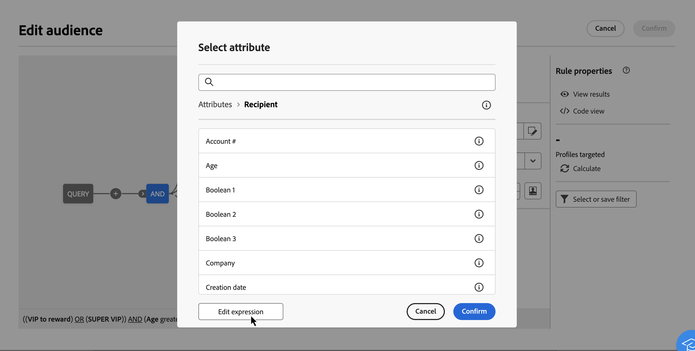

# Modifica espressioni {#expression}

La modifica di un’espressione comporta l’immissione manuale di condizioni per formare una regola. Questa modalità ti consente di utilizzare funzioni avanzate, che ti consentono di manipolare i valori utilizzati per eseguire query specifiche come la manipolazione di date, stringhe, campi numerici, ordinamenti, ecc.

>[!IMPORTANT]
>
>La sezione seguente fornisce informazioni su come utilizzare l’editor di espressioni per creare regole. Tieni presente che la sintassi utilizzata per creare le regole è diversa da quella utilizzata per aggiungere la personalizzazione.

## Utilizzare l’editor di espressioni {#edit}

L&#39;editor espressioni è disponibile dal pulsante **[!UICONTROL Modifica espressione]** del modellatore di query, disponibile per i campi **[!UICONTROL Attributo]** e **[!UICONTROL Valore]** durante la configurazione di una condizione personalizzata.

| Accesso dal campo **[!UICONTROL Attributo]** | Accedi dal campo **[!UICONTROL Valore]** |
|  ---  |  ---  |
| {zoomable="yes"}{width="200" align="center" zoomable="yes"} | {zoomable="yes"}{width="200" align="center" zoomable="yes"} |

L’editor di espressioni mostra:

* Un campo di input **(1)** in cui è definita l&#39;espressione.
* Elenco dei **campi (2)** disponibili che possono essere utilizzati nell&#39;espressione e corrispondenti allo schema della query, noto anche come dimensione di targeting.
* **Funzioni helper (3)**, ordinate per categoria.

Modifica l’espressione immettendo un’espressione direttamente nel campo di input. Per aggiungere un campo o una funzione di supporto, posizionare il cursore nell&#39;espressione nel punto in cui si desidera aggiungerla e fare clic sul pulsante +.

{zoomable="yes"}

Quando l&#39;espressione è pronta, fare clic sul pulsante **[!UICONTROL Conferma]**. L’espressione viene visualizzata nel campo selezionato. Per modificarlo, apri l’editor di espressioni e apporta le modifiche desiderate.

L&#39;esempio seguente mostra un&#39;espressione configurata per il campo **[!UICONTROL Value]**. Per modificarlo, è necessario aprire l&#39;editor espressioni utilizzando il pulsante **[!UICONTROL Modifica espressione]**.

{zoomable="yes"}

## Funzioni Helper

Lo strumento di modifica delle query ti consente di utilizzare funzioni avanzate per eseguire filtri complessi in base ai risultati desiderati e ai tipi di dati manipolati. Sono disponibili le seguenti funzioni:

### Aggregato

Le funzioni di aggregazione vengono utilizzate per eseguire calcoli su un insieme di valori.

<table> 
 <tbody> 
  <tr> 
   <td> <strong>Nome</strong>  </td> 
   <td> <strong>Descrizione</strong>  </td> 
   <td> <strong>Sintassi</strong>  </td> 
  </tr> 
  <tr> 
   <td> <strong>Avg</strong>  </td> 
   <td> Restituisce la media di una colonna di tipo numerico  </td> 
   <td> Avg(&lt;valore&gt;) </td> 
  </tr> 
  <tr> 
   <td> <strong>Conteggio</strong>  </td> 
   <td> Conta i valori non nulli in una colonna  </td> 
   <td> Count(&lt;valore&gt;) </td>  
  </tr> 
  <tr> 
   <td> <strong>CountAll</strong>  </td> 
   <td> Conta i valori restituiti (tutti i campi)  </td> 
   <td> CountAll()  </td> 
  </tr> 
  <tr> 
   <td> <strong>Countdistinct</strong>  </td> 
   <td> Conta i valori distinti non nulli in una colonna  </td> 
   <td> Countdistinct(&lt;valore&gt;) </td> 
  </tr> 
  <tr> 
   <td> <strong>Max</strong>  </td> 
   <td> Restituisce il valore massimo in una colonna numerica, stringa o data  </td> 
   <td> Max(&lt;valore&gt;) </td>  
  </tr> 
  <tr> 
   <td> <strong>Min</strong>  </td> 
   <td> Restituisce il valore minimo in una colonna numerica, stringa o data.  </td> 
   <td> Min(&lt;valore&gt;) </td> 
  </tr> 
  <tr> 
   <td> <strong>StdDev</strong>  </td> 
   <td> Restituisce la deviazione standard in una colonna numerica, stringa o data  </td> 
   <td> StdDev(&lt;valore&gt;) </td> 
  </tr>
  <tr> 
   <td> <strong>AggStringa</strong>  </td> 
   <td> Restituisce la concatenazione dei valori di una colonna di tipo stringa, separati dal carattere nel secondo argomento  </td> 
   <td> StringAgg(&lt;Valore&gt;, &lt;Stringa&gt;) </td> 
  </tr> 
  <tr> 
   <td> <strong>Somma</strong>  </td> 
   <td> Restituisce la somma dei valori in una colonna numerica, stringa o data  </td> 
   <td> Sum(&lt;valore&gt;) </td> 
  </tr> 
 </tbody> 
</table>

### Data

Le funzioni di data vengono utilizzate per manipolare i valori di data o ora.

<table> 
 <tbody> 
  <tr> 
   <td> <strong>Nome</strong>  </td> 
   <td> <strong>Descrizione</strong>  </td> 
   <td> <strong>Sintassi</strong>  </td> 
  </tr> 
  <tr> 
   <td> <strong>AddDays</strong>  </td> 
   <td> Aggiunge un numero di giorni a una data  </td> 
   <td> AddDays(&lt;data&gt;, &lt;numero&gt;)  </td>  
  </tr> 
  <tr> 
   <td> <strong>AddHours</strong>  </td> 
   <td> Aggiunge un numero di ore a una data  </td> 
   <td> AddHours(&lt;data&gt;, &lt;numero&gt;)  </td>  
  </tr> 
  <tr> 
   <td> <strong>AddMinutes</strong>  </td> 
   <td> Aggiunge un numero di minuti a una data  </td> 
   <td> AddMinutes(&lt;data&gt;, &lt;numero&gt;)  </td>  
  </tr> 
  <tr> 
   <td> <strong>AddMonths</strong>  </td> 
   <td> Aggiunge un numero di mesi a una data  </td> 
   <td> AddMonths(&lt;data&gt;, &lt;numero&gt;)  </td>  
  </tr> 
  <tr> 
   <td> <strong>AddSeconds</strong>  </td> 
   <td> Aggiunge un numero di secondi a una data  </td> 
   <td> AddSeconds(&lt;data&gt;, &lt;numero&gt;)  </td>  
  </tr> 
  <tr> 
   <td> <strong>AddYears</strong>  </td> 
   <td> Aggiunge un numero di anni a una data  </td> 
   <td> AddYears(&lt;data&gt;, &lt;numero&gt;)  </td>  
  </tr>
  <tr> 
   <td> <strong>ConvertNTZ</strong>  </td> 
   <td> Converte la marca temporale NTZ (marca temporale senza fuso orario) in TZ (marca temporale con fuso orario) applicando la sessione definita TZ  </td> 
   <td> ConvertNTZ (&lt;data+ora&gt;)  </td>  
  </tr>
  <tr> 
   <!--<td> <strong>ConvertTimezone</strong>  </td> 
   <td>   </td> 
   <td> ConvertNTZ (&lt;date+time&gt;)  </td>  
  </tr>-->
  <tr> 
   <td> <strong>CmpData</strong>  </td> 
   <td> Confronta due date  </td> 
   <td> DateCmp(&lt;data&gt;,&lt;data&gt;)  </td>  
  </tr>
  <tr> 
   <td> <strong>DateOnly</strong>  </td> 
   <td> Restituisce solo la data (con l’ora su 00.00)*  </td> 
   <td> DateOnly(&lt;data&gt;)  </td>  
  </tr> 
  <tr> 
   <td> <strong>Day</strong>  </td> 
   <td> Restituisce il numero che rappresenta il giorno della data  </td> 
   <td> Day(&lt;data&gt;)  </td>  
  </tr> 
  <tr> 
   <td> <strong>DayOfYear</strong>  </td> 
   <td> Restituisce un numero del giorno dell’anno della data  </td> 
   <td> DayOfYear(&lt;data&gt;)  </td>  
  </tr> 
  <tr> 
   <td> <strong>DaysAgo</strong>  </td> 
   <td> Restituisce la data corrispondente alla data corrente meno n giorni  </td> 
   <td> DaysAgo(&lt;numero&gt;)  </td>  
  </tr> 
  <tr> 
   <td> <strong>DaysAgoInt</strong>  </td> 
   <td> Restituisce la data corrispondente (numero intero aaaammgg) alla data corrente meno n giorni  </td> 
   <td> DaysAgoInt(&lt;numero&gt;)  </td>  
  </tr> 
  <tr> 
   <td> <strong>DaysDiff</strong>  </td> 
   <td> Numero di giorni tra due date  </td> 
   <td> DaysDiff(&lt;data di fine&gt;, &lt;data di inizio&gt;)  </td>  
  </tr> 
  <tr> 
   <td> <strong>DaysOld</strong>  </td> 
   <td> Restituisce l’età in giorni di una data  </td> 
   <td> DaysOld(&lt;data&gt;)  </td>  
  </tr> 
  <tr> 
   <td> <strong>GetDate</strong>  </td> 
   <td> Restituisce la data di sistema corrente del server  </td> 
   <td> GetDate()  </td> 
  </tr> 
  <tr> 
   <td> <strong>Hour</strong>  </td> 
   <td> Restituisce l’ora della data  </td> 
   <td> Hour(&lt;data&gt;)  </td>  
  </tr> 
  <tr> 
   <td> <strong>HoursDiff</strong>  </td> 
   <td> Restituisce il numero di ore tra due date  </td> 
   <td> HoursDiff(&lt;data di fine&gt;, &lt;data di inizio&gt;)  </td>  
  </tr> 
  <tr> 
   <td> <strong>Minute</strong>  </td> 
   <td> Restituisce i minuti della data  </td> 
   <td> Minute(&lt;data&gt;)  </td>  
  </tr> 
  <tr> 
   <td> <strong>MinutesDiff</strong>  </td> 
   <td> Restituisce il numero di minuti tra due date  </td> 
   <td> MinutesDiff(&lt;data di fine&gt;, &lt;data di inizio&gt;)  </td>  
  </tr> 
  <tr> 
   <td> <strong>Month</strong>  </td> 
   <td> Restituisce il numero che rappresenta il mese della data  </td> 
   <td> Month(&lt;data&gt;)  </td>  
  </tr> 
  <tr> 
   <td> <strong>MonthsAgo</strong>  </td> 
   <td> Restituisce la data corrispondente alla data corrente meno n mesi  </td> 
   <td> MonthsAgo(&lt;numero&gt;)  </td>  
  </tr> 
  <tr> 
   <td> <strong>MonthsDiff</strong>  </td> 
   <td> Restituisce il numero di mesi tra due date  </td> 
   <td> MonthsDiff(&lt;data di fine&gt;, &lt;data di inizio&gt;)  </td>  
  </tr> 
  <tr> 
   <td> <strong>MonthsOld</strong>  </td> 
   <td> Restituisce l’età in mesi di una data  </td> 
   <td> MonthsOld(&lt;data&gt;)  </td>  
  </tr> 
  <tr> 
   <td> <strong>Oldest</strong>  </td> 
   <td> Restituisce la data meno recente in un intervallo  </td> 
   <td> Oldest (&lt;data, data&gt;)  </td>  
  </tr> 
  <tr> 
   <td> <strong>Second</strong>  </td> 
   <td> Restituisce i secondi della data  </td> 
   <td> Second(&lt;data&gt;)  </td>  
  </tr> 
  <tr> 
   <td> <strong>SecondsDiff</strong>  </td> 
   <td> Restituisce il numero di secondi tra due date  </td> 
   <td> SecondsDiff(&lt;data di fine&gt;, &lt;data di inizio&gt;)  </td>  
  </tr> 
  <tr> 
   <td> <strong>SubDays</strong>  </td> 
   <td> Sottrae un numero di giorni da una data  </td> 
   <td> SubDays(&lt;data&gt;, &lt;numero&gt;)  </td>  
  </tr> 
  <tr> 
   <td> <strong>SubHours</strong>  </td> 
   <td> Sottrae un numero di ore da una data  </td> 
   <td> SubHours(&lt;data&gt;, &lt;numero&gt;)  </td>  
  </tr> 
  <tr> 
   <td> <strong>SubMinutes</strong>  </td> 
   <td> Sottrae un numero di minuti da una data  </td> 
   <td> SubMinutes(&lt;data&gt;, &lt;numero&gt;)  </td>  
  </tr> 
  <tr> 
   <td> <strong>SubMonths</strong>  </td> 
   <td> Sottrae un numero di mesi da una data  </td> 
   <td> SubMonths(&lt;data&gt;, &lt;numero&gt;)  </td>  
  </tr> 
  <tr> 
   <td> <strong>SubSeconds</strong>  </td> 
   <td> Sottrae un numero di secondi da una data  </td> 
   <td> SubSeconds(&lt;data&gt;, &lt;numero&gt;)  </td>  
  </tr> 
  <tr> 
   <td> <strong>SubYears</strong>  </td> 
   <td> Sottrae un numero di anni da una data  </td> 
   <td> SubYears(&lt;data&gt;, &lt;numero&gt;)  </td>  
  </tr> 
  <tr> 
   <td> <strong>ToDate</strong>  </td> 
   <td> Converte una data + ora in una data  </td> 
   <td> ToDate(&lt;data + ora&gt;)  </td>  
  </tr> 
  <tr> 
   <td> <strong>ToDateTime</strong>  </td> 
   <td> Converte una stringa in una data + ora  </td> 
   <td> ToDateTime(&lt;stringa&gt;)  </td>  
  </tr> 
  <tr> 
   <td> <strong>ATimestamp</strong>  </td> 
   <td> Converte una stringa in una marca temporale  </td> 
   <td> ToTimestamp(&lt;stringa&gt;)  </td>  
  </tr> 
  <tr> 
   <td> <strong>ToTimeZone</strong>  </td> 
   <td> Convertire una data + ora in fuso orario  </td> 
   <td> ToTimeZone(&lt;data&gt;,&lt;fuso orario&gt;)  </td>  
  </tr> 
  <tr> 
   <td> <strong>TruncDate</strong>  </td> 
   <td> Arrotonda una data+ora al secondo più vicino  </td> 
   <td> TruncDate(@lastModified, &lt;numero di secondi&gt;)  </td> 
  </tr> 
  <tr> 
   <td> <strong>TruncDateTZ</strong>  </td> 
   <td> Arrotonda una data + ora a una determinata precisione, espressa in secondi  </td> 
   <td> TruncDateTZ(&lt;data&gt;, &lt;numero di secondi&gt;, &lt;fuso orario&gt;)  </td> 
  </tr> 
  <tr> 
   <td> <strong>TruncQuarter</strong>  </td> 
   <td> Arrotonda una data al trimestre  </td> 
   <td> TruncQuarter(&lt;data&gt;)  </td>  
  </tr> 
  <tr> 
   <td> <strong>TruncTime</strong>  </td> 
   <td> Arrotonda la parte dell’ora al secondo più vicino  </td> 
   <td> TruncTime(&lt;data&gt;, &lt;numero di secondi&gt;)  </td>  
  </tr> 
  <tr> 
   <td> <strong>TruncWeek</strong>  </td> 
   <td> Arrotonda una data alla settimana  </td> 
   <td> TruncWeek(&lt;data&gt;)  </td>  
  </tr> 
  <tr> 
   <td> <strong>TruncYear</strong>  </td> 
   <td> Arrotonda una data + ora al 1° gennaio dell’anno  </td> 
   <td> TruncYear(&lt;data&gt;)  </td>  
  </tr> 
  <tr> 
   <td> <strong>WeekDay</strong>  </td> 
   <td> Restituisce un numero che rappresenta il giorno della settimana della data (0=lunedì, 6=domenica)  </td> 
   <td> WeekDay(&lt;data&gt;)  </td>  
  </tr> 
  <tr> 
   <td> <strong>Year</strong>  </td> 
   <td> Restituisce il numero che rappresenta l’anno della data  </td> 
   <td> Year(&lt;data&gt;)  </td>  
  </tr> 
  <tr> 
   <td> <strong>YearAnd Month</strong>  </td> 
   <td> Restituisce il numero che rappresenta l’anno e il mese della data  </td> 
   <td> YearAndMonth(&lt;data&gt;)  </td>  
  </tr>
  <tr> 
   <td> <strong>YearsAgo</strong>  </td> 
   <td> Restituisce il numero di anni tra una data specificata e la data corrente  </td> 
   <td> YearsAgo(&lt;data&gt;)  </td>  
  </tr> 
  <tr> 
   <td> <strong>YearsDiff</strong>  </td> 
   <td> Restituisce il numero di anni tra le due date  </td> 
   <td> YearsDiff(&lt;data di fine&gt;, &lt;data di inizio&gt;)  </td>  
  </tr> 
  <tr> 
   <td> <strong>YearsOld</strong>  </td> 
   <td> Restituisce l’età in anni di una data  </td> 
   <td> YearsOld(&lt;data&gt;)  </td>  
  </tr> 
 </tbody> 
</table>

>[!NOTE]
>
>Tieni presente che la funzione **Dateonly** tiene conto del fuso orario del server, non di quello dell’operatore.

### Geomarketing

Le funzioni di geomarketing vengono utilizzate per manipolare i valori geografici.

<table> 
 <tbody> 
  <tr> 
   <td> <strong>Nome</strong>  </td> 
   <td> <strong>Descrizione</strong>  </td> 
   <td> <strong>Sintassi</strong>  </td> 
  </tr> 
  <tr> 
   <td> <strong>Distance</strong>  </td> 
   <td> Restituisce la distanza tra due punti definiti da longitudine e latitudine espressa in gradi.  </td> 
   <td> Distance(&lt;Longitudine A&gt;, &lt;Latitudine A&gt;, &lt;Longitudine B&gt;, &lt;Latitudine B&gt;)  </td>  
  </tr> 
 </tbody> 
</table>

### Numerico

Le funzioni numeriche vengono utilizzate per convertire il testo in numeri.

<table> 
 <tbody> 
  <tr> 
   <td> <strong>Nome</strong>  </td> 
   <td> <strong>Descrizione</strong>  </td> 
   <td> <strong>Sintassi</strong>  </td> 
  </tr> 
  <tr> 
   <td> <strong>Abs</strong>  </td> 
   <td> Restituisce il valore assoluto di un numero  </td> 
   <td> Abs(&lt;numero&gt;)  </td>  
  </tr> 
  <tr> 
   <td> <strong>Ceil</strong>  </td> 
   <td> Restituisce il numero intero più piccolo maggiore o uguale a un numero  </td> 
   <td> Ceil(&lt;numero&gt;)  </td>  
  </tr> 
  <tr> 
   <td> <strong>Floor</strong>  </td> 
   <td> Restituisce il numero intero maggiore o uguale a un numero  </td> 
   <td> Floor(&lt;numero&gt;)  </td>  
  </tr> 
  <tr> 
   <td> <strong>Greatest</strong>  </td> 
   <td> Restituisce il numero maggiore tra due numeri  </td> 
   <td> Greatest(&lt;numero 1&gt;, &lt;numero 2&gt;)  </td>  
  </tr> 
  <tr> 
   <td> <strong>Least</strong>  </td> 
   <td> Restituisce il minore tra due numeri  </td> 
   <td> Least(&lt;numero 1&gt;, &lt;numero 2&gt;)  </td>  
  </tr> 
  <tr> 
   <td> <strong>Mod</strong>  </td> 
   <td> Restituisce il resto della divisione del numero intero da n1 per n2  </td> 
   <td> Mod(&lt;numero 1&gt;, &lt;numero 2&gt;)  </td>  
  </tr> 
  <tr> 
   <td> <strong>Percent</strong>  </td> 
   <td> Restituisce il rapporto tra due numeri espresso come percentuale  </td> 
   <td> Percent(&lt;numero 1&gt;, &lt;numero 2&gt;)  </td>  
  </tr> 
  <tr> 
   <td> <strong>Random</strong>  </td> 
   <td> Restituisce il valore casuale  </td> 
   <td> Random()  </td> 
  </tr> 
  <tr> 
   <td> <strong>Round</strong>  </td> 
   <td> Arrotonda un numero a n decimali  </td> 
   <td> Round(&lt;numero&gt;, &lt;numero di decimali&gt;)  </td>  
  </tr> 
  <tr> 
   <td> <strong>Sign</strong>  </td> 
   <td> Restituisce il segno del numero  </td> 
   <td> Sign(&lt;numero&gt;)  </td>  
  </tr> 
  <tr> 
   <td> <strong>ToDouble</strong>  </td> 
   <td> Converte un numero intero in un numero in virgola mobile  </td> 
   <td> ToDouble(&lt;numero&gt;)  </td>  
  </tr> 
  <tr> 
   <td> <strong>ToInt64</strong>  </td> 
   <td> Converte un numero in virgola mobile in un numero intero a 64 bit  </td> 
   <td> ToInt64(&lt;numero&gt;)  </td>  
  </tr> 
  <tr> 
   <td> <strong>ToInteger</strong>  </td> 
   <td> Converte un numero in virgola mobile in un numero intero  </td> 
   <td> ToInteger(&lt;numero&gt;)  </td>  
  </tr> 
  <tr> 
   <td> <strong>Trunc</strong>  </td> 
   <td> Tronca n1 a n2 decimali  </td> 
   <td> Trunc(&lt;n1&gt;, &lt;n2&gt;)  </td>  
  </tr> 
 </tbody> 
</table>

### Altri

Questa tabella contiene le altre funzioni disponibili.

<table> 
 <tbody> 
  <tr> 
   <td> <strong>Nome</strong>  </td> 
   <td> <strong>Descrizione</strong>  </td> 
   <td> <strong>Sintassi</strong>  </td> 
  </tr> 
  <tr> 
   <td> <strong>AESEncrypt</strong>  </td> 
   <td> Stringa di crittografia fornita nell'argomento  </td> 
   <td> AESEncrypt(&lt;valore&gt;)  </td> 
  </tr>
  <tr> 
   <td> <strong>Case</strong>  </td> 
   <td> Restituisce il valore 1 se la condizione è vera. In caso contrario, restituisce il valore 2.  </td> 
   <td> Case(When(&lt;condizione&gt;, &lt;valore 1&gt;), Else(&lt;valore 2&gt;))  </td> 
  </tr> 
  <tr> 
   <td> <strong>ClearBit</strong>  </td> 
   <td> Elimina il contrassegno nel valore  </td> 
   <td> ClearBit(&lt;identificatore&gt;, &lt;contrassegno&gt;)  </td>  
  </tr> 
  <tr> 
   <td> <strong>Coalesce</strong>  </td> 
   <td> Restituisce il valore 2 se il valore 1 è zero o nullo, altrimenti restituisce il valore 1  </td> 
   <td> Coalesce(&lt;valore 1&gt;, &lt;valore 2&gt;)  </td>  
  </tr> 
  <tr> 
   <td> <strong>Decode</strong>  </td> 
   <td> Restituisce il valore 3 se il valore 1 = al valore 2. In caso contrario, restituisce il valore 4.  </td> 
   <td> Decode(&lt;valore 1&gt;, &lt;valore 2&gt;, &lt;valore 3&gt;, &lt;valore 4&gt;)  </td>  
  </tr> 
  <!--<tr> 
   <td> <strong>DefaultFolder</strong>  </td> 
   <td> Returns value 3 if value 1 = value 2. If not returns value 4.  </td> 
   <td> Decode(&lt;value 1&gt;, &lt;value 2&gt;, &lt;value 3&gt;, &lt;value 4&gt;)  </td>  
  </tr> -->
  <tr> 
   <td> <strong>Else</strong>  </td> 
   <td> Restituisce il valore 1 (può essere utilizzato solo come parametro della funzione Case)  </td> 
   <td> Else(&lt;valore 1&gt;, &lt;valore 2&gt;)  </td>  
  </tr> 
  <tr> 
   <td> <strong>GetEmailDomain</strong>  </td> 
   <td> Estrae il dominio da un indirizzo e-mail  </td> 
   <td> GetEmailDomain(&lt;valore&gt;)  </td>  
  </tr> 
  <tr> 
   <td> <strong>GetMirrorURL</strong>  </td> 
   <td> Recupera l’URL del server della pagina mirror  </td> 
   <td> GetMirrorURL(&lt;valore&gt;)  </td>  
  </tr> 
  <tr> 
   <td> <strong>Iif</strong>  </td> 
   <td> Restituisce il valore 1 se l’espressione è vera. In caso contrario, restituisce il valore 2  </td> 
   <td> Iif(&lt;condizione&gt;, &lt;valore 1&gt;, &lt;valore 2&gt;)  </td>  
  </tr> 
  <tr> 
   <td> <strong>IsBitSet</strong>  </td> 
   <td> Indica se il contrassegno si trova nel valore  </td> 
   <td> IsBitSet(&lt;identificatore&gt;, &lt;contrassegno&gt;)  </td>  
  </tr> 
  <tr> 
   <td> <strong>IsEmptyString</strong>  </td> 
   <td> Restituisce il valore 2 se la stringa è vuota, altrimenti restituisce il valore 3  </td> 
   <td> IsEmptyString(&lt;valore 1&gt;, &lt;valore 2&gt;, &lt;valore 3&gt;)  </td>  
  </tr> 
  <tr> 
   <td> <strong>NuovoUUID</strong>  </td> 
   <td> Restituisce un ID univoco  </td> 
   <td> NewUUID()  </td>  
  </tr> 
  <tr> 
   <td> <strong>NoNull</strong>  </td> 
   <td> Restituisce la stringa vuota se l’argomento è NULL  </td> 
   <td> NoNull(&lt;valore&gt;)  </td>   
  </tr> 
  <tr> 
   <td> <strong>RowId</strong>  </td> 
   <td> Restituisce il numero di riga  </td> 
   <td> RowId  </td> 
  </tr> 
  <tr> 
   <td> <strong>SetBit</strong>  </td> 
   <td> Forza il contrassegno nel valore  </td> 
   <td> SetBit(&lt;identificatore&gt;, &lt;contrassegno&gt;)  </td>  
  </tr> 
  <tr> 
   <td> <strong>ToBoolean</strong>  </td> 
   <td> Converte un numero in booleano  </td> 
   <td> ToBoolean(&lt;numero&gt;)  </td>   
  </tr> 
  <tr> 
   <td> <strong>When</strong>  </td> 
   <td> Restituisce il valore 1 se l’espressione è vera. In caso contrario, restituisce il valore 2 (può essere utilizzato solo come parametro della funzione Case)  </td> 
   <td> When(&lt;condizione&gt;, &lt;valore 1&gt;)  </td>  
  </tr> 
 </tbody> 
</table>

### Stringa

Le funzioni di stringa vengono utilizzate per manipolare un insieme di stringhe.

<table> 
 <tbody> 
  <tr> 
   <td> <strong>Nome</strong>  </td> 
   <td> <strong>Descrizione</strong>  </td> 
   <td> <strong>Sintassi</strong>  </td> 
  </tr> 
  <tr> 
   <td> <strong>AllNonNull2</strong>  </td> 
   <td> Indica se tutti i parametri non sono nulli e non sono vuoti  </td> 
   <td> AllNonNull2(&lt;stringa&gt;, &lt;stringa&gt;) </td> 
  </tr> 
  <tr> 
   <td> <strong>AllNonNull3</strong>  </td> 
   <td> Indica se tutti i parametri non sono nulli e non sono vuoti  </td> 
   <td> AllNonNull3(&lt;stringa&gt;, &lt;stringa&gt;, &lt;stringa&gt;) </td> 
  </tr> 
  <tr> 
   <td> <strong>Ascii</strong>  </td> 
   <td> Restituisce il valore ASCII del primo carattere della stringa  </td> 
   <td> Ascii(&lt;stringa&gt;) </td> 
  </tr> 
  <tr> 
   <td> <strong>Char</strong>  </td> 
   <td> Restituisce il carattere corrispondente al codice ASCII “n”  </td> 
   <td> Char(&lt;numero&gt;) </td>  
  </tr> 
  <tr> 
   <td> <strong>Charindex</strong>  </td> 
   <td> Restituisce la posizione della stringa 2 nella stringa 1.  </td> 
   <td> Charindex(&lt;stringa&gt;, &lt;stringa&gt;) </td> 
  </tr> 
  <tr> 
   <td> <strong>dataLength</strong>  </td> 
   <td> Restituisce la dimensione in byte della stringa  </td> 
   <td> dataLength(&lt;stringa&gt;) </td> 
  </tr> 
  <tr> 
   <td> <strong>GetLine</strong>  </td> 
   <td> Restituisce l’ennesima riga (da 1 a n) della stringa  </td> 
   <td> GetLine(&lt;stringa&gt;) </td> 
  </tr> 
  <tr> 
   <td> <strong>IfEquals</strong>  </td> 
   <td> Restituisce il terzo parametro se i primi due parametri sono uguali. In caso contrario, restituisce l’ultimo parametro  </td> 
   <td> IfEquals(&lt;stringa&gt;, &lt;stringa&gt;, &lt;stringa&gt;, &lt;stringa&gt;) </td> 
  </tr> 
  <tr> 
   <td> <strong>IsMemoNull</strong>  </td> 
   <td> Indica se il promemoria passato come parametro è nullo  </td> 
   <td> IsMemoNull(&lt;promemoria&gt;) </td> 
  </tr> 
  <tr> 
   <td> <strong>JuxtWords</strong>  </td> 
   <td> Concatena le stringhe passate come parametri. Se necessario, aggiunge spazi tra le stringhe.  </td> 
   <td> JuxtWords(&lt;stringa&gt;, &lt;stringa&gt;) </td> 
  </tr> 
  <tr> 
   <td> <strong>JuxtWords3</strong>  </td> 
   <td> Concatena le stringhe passate come parametri. Se necessario, aggiunge spazi tra le stringhe  </td> 
   <td> JuxtWords3(&lt;stringa&gt;, &lt;stringa&gt;, &lt;stringa&gt;) </td>  
  </tr> 
  <tr> 
   <td> <strong>Left</strong>  </td> 
   <td> Restituisce i primi n caratteri della stringa  </td> 
   <td> Left(&lt;stringa&gt;, &lt;numero&gt;) </td> 
  </tr> 
  <tr> 
   <td> <strong>Length</strong>  </td> 
   <td> Restituisce la lunghezza della stringa  </td> 
   <td> Length(&lt;stringa&gt;) </td> 
  </tr> 
  <tr> 
   <td> <strong>Riga</strong>  </td> 
   <td> Estrai riga n dalla stringa  </td> 
   <td> Line(&lt;stringa&gt;,&lt;numero&gt;) </td> 
  </tr>
  <tr> 
   <td> <strong>Lower</strong>  </td> 
   <td> Restituisce la stringa in caratteri minuscoli  </td> 
   <td> Lower(&lt;stringa&gt;) </td> 
  </tr> 
  <tr> 
   <td> <strong>LPad</strong>  </td> 
   <td> Restituisce la stringa completata a sinistra  </td> 
   <td> LPad (&lt;Stringa&gt;, &lt;Numero&gt;, &lt;Carattere&gt;) </td> 
  </tr> 
  <tr> 
   <td> <strong>Ltrim</strong>  </td> 
   <td> Rimuove gli spazi a sinistra della stringa  </td> 
   <td> Ltrim(&lt;stringa&gt;) </td> 
  </tr> 
  <tr> 
   <td> <strong>Md5Digest</strong>  </td> 
   <td> Restituisce una rappresentazione esadecimale della chiave MD5 di una stringa  </td> 
   <td> Md5Digest(&lt;stringa&gt;) </td> 
  </tr> 
  <tr> 
   <td> <strong>MemoContains</strong>  </td> 
   <td> Specifica se il promemoria contiene la stringa passata come parametro  </td> 
   <td> MemoContains(&lt;promemoria&gt;, &lt;stringa&gt;) </td> 
  </tr> 
  <tr> 
   <td> <strong>ValoreNodo</strong>  </td> 
   <td> Estrae il valore di un campo XML dal relativo XPath e dai dati del campo  </td> 
   <td> NodeValue (&lt;Stringa&gt;, &lt;Stringa&gt;) </td> 
  </tr> 
  <tr> 
   <td> <strong>Replace</strong>  </td> 
   <td> Sostituisce tutte le occorrenze di un valore di stringa specificato con un altro valore di stringa.  </td> 
   <td> Replace(&lt;Stringa&gt;,&lt;Stringa&gt;,&lt;Stringa&gt;) </td> 
  </tr> 
  <tr> 
   <td> <strong>Right</strong>  </td> 
   <td> Restituisce gli ultimi n caratteri della stringa  </td> 
   <td> Right(&lt;stringa&gt;)  </td> 
  </tr> 
  <tr> 
   <td> <strong>RPad</strong>  </td> 
   <td> Restituisce la stringa completata a destra  </td> 
   <td> RPad(&lt;stringa&gt;, &lt;numero&gt;, &lt;carattere&gt;) </td> 
  </tr> 
  <tr> 
   <td> <strong>Rtrim</strong>  </td> 
   <td> Rimuove gli spazi a destra della stringa  </td> 
   <td> Rtrim(&lt;stringa&gt;)  </td> 
  </tr> 
  <tr> 
   <td> <strong>Sha256Digest</strong>  </td> 
   <td> Rappresentazione esadecimale della chiave SHA256 di una stringa.  </td> 
   <td> Sha256Digest (&lt;Stringa&gt;)  </td> 
  </tr> 
  <tr> 
   <td> <strong>Sha512Digest</strong>  </td> 
   <td> Rappresentazione esadecimale della chiave SHA512 di una stringa.  </td> 
   <td> Sha512Digest (&lt;Stringa&gt;)  </td> 
  </tr> 
  <tr> 
   <td> <strong>Smart</strong>  </td> 
   <td> Restituisce la stringa con la prima lettera di ciascuna parola in maiuscolo  </td> 
   <td> Smart(&lt;stringa&gt;)  </td> 
  </tr> 
  <tr> 
   <td> <strong>Substring</strong>  </td> 
   <td> Estrae la stringa secondaria a partire dal carattere n1 della stringa e con una lunghezza n2  </td> 
   <td> Substring(&lt;stringa&gt;, &lt;offset&gt;, &lt;lunghezza&gt;)  </td>  
  </tr> 
  <tr> 
   <td> <strong>ToString</strong>  </td> 
   <td> Converte il numero in una stringa  </td> 
   <td> ToString(&lt;numero&gt;, &lt;numero&gt;)  </td>  
  </tr> 
  <tr> 
   <td> <strong>Upper</strong>  </td> 
   <td> Restituisce la stringa in caratteri maiuscoli  </td> 
   <td> Upper(&lt;stringa&gt;)  </td>  
  </tr> 
  <tr> 
   <td> <strong>VirtualLink</strong>  </td> 
   <td> Restituisce la chiave esterna di un collegamento passato come parametro se gli altri due parametri sono uguali  </td> 
   <td> VirtualLink(&lt;numero&gt;, &lt;numero&gt;, &lt;numero&gt;)  </td>  
  </tr> 
  <tr> 
   <td> <strong>VirtualLinkStr</strong>  </td> 
   <td> Restituisce la chiave esterna (testo) di un collegamento passato come parametro se gli altri due parametri sono uguali  </td> 
   <td> VirtualLinkStr(&lt;stringa&gt;, &lt;numero&gt;, &lt;numero&gt;)  </td>  
  </tr> 
 </tbody> 
</table>

### Finestra

<table> 
 <tbody> 
  <tr> 
   <td> <strong>Nome</strong>  </td> 
   <td> <strong>Descrizione</strong>  </td> 
   <td> <strong>Sintassi</strong>  </td> 
  </tr> 
  <tr> 
   <td> <strong>_Over__</strong>  </td> 
   <td> Esegui la chiamata alla funzione SQL immessa come primo parametro, su Partition o Order By nei campi immessi come secondo parametro  </td> 
   <td> _Over_ (&lt;Valore&gt;, &lt;Valore&gt;)  </td>  
  </tr> 
  <tr> 
   <td> <strong>Desc</strong>  </td> 
   <td> Applica un ordinamento decrescente  </td> 
   <td> Desc(&lt;valore 1&gt;)  </td>  
  </tr> 
  <tr> 
   <td> <strong>OrderBy</strong>  </td> 
   <td> Ordina il risultato all’interno della partizione  </td> 
   <td> OrderBy(&lt;valore 1&gt;)  </td>  
  </tr> 
  <tr> 
   <td> <strong>PartitionBy</strong>  </td> 
   <td> Partiziona il risultato di una query su una tabella  </td> 
   <td> PartitionBy(&lt;valore 1&gt;)  </td>  
  </tr> 
  <tr> 
   <td> <strong>RowNum</strong>  </td> 
   <td> Genera un numero di riga basato sulla partizione della tabella e su una sequenza di ordinamento.  </td> 
   <td> RowNum(PartitionBy(&lt;valore 1&gt;), OrderBy(&lt;valore 1&gt;))  </td> 
  </tr> 
 </tbody> 
</table>
