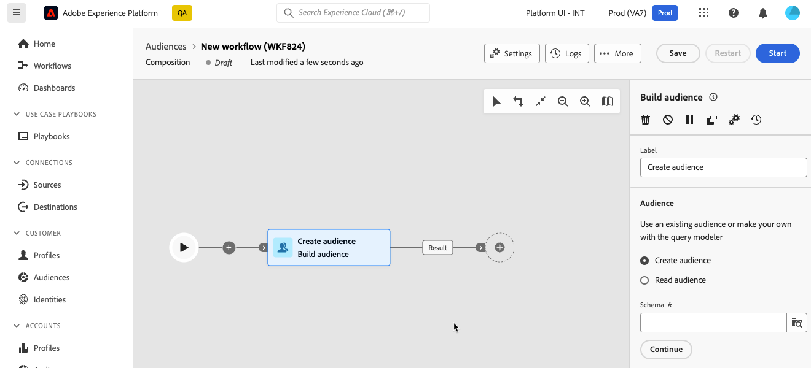

# Utilizzo del query modeler {#segment-builder}

>[!CONTEXTUALHELP]
>id="dc_orchestration_querymodeler_querymessage"
>title="Query modeler"
>abstract="Definisci i criteri di filtro per i destinatari o qualsiasi altro schema, noto anche come dimensione targeting, dal database."

Query Modeler semplifica il processo di filtraggio del database in base a vari criteri. Inoltre, Query Modeler è in grado di gestire in modo efficiente query molto complesse e lunghe, offrendo maggiore flessibilità e precisione. Inoltre, supporta filtri predefiniti all’interno di condizioni, consentendoti di perfezionare le query con facilità e allo stesso tempo di utilizzare espressioni avanzate e operatori per strategie complete di targeting del pubblico e segmentazione.

## Accedere al query modeler

Il query modeler è disponibile in ogni contesto in cui è necessario definire regole per filtrare i dati.

| Utilizzo | Esempio |
|  ---  |  ---  |
| **Definisci i tipi di pubblico**: specifica la popolazione di cui vuoi eseguire il targeting nelle tue composizioni e crea facilmente nuovi tipi di pubblico su misura per le tue esigenze. | {zoomable="yes"}{width="200" align="center" zoomable="yes"} |
| **Personalizza attività**: applica le regole nelle attività di composizione, ad esempio **Dividi** e **Riconciliazione**, per allinearle ai requisiti specifici. [Ulteriori informazioni sulle attività di composizione](../compositions/activities/about-activities.md) | {zoomable="yes"}{width="200" align="center" zoomable="yes"} |

## Interfaccia del query modeler {#interface}

Il modellatore di query fornisce un’area di lavoro centrale in cui creare la query e un riquadro a destra che fornisce informazioni sulla query.

{zoomable="yes"}

### Area di lavoro centrale {#canvas}

L’area di lavoro centrale di Query Modeler è il luogo in cui puoi aggiungere e combinare i diversi componenti che creano la query. [Scopri come creare una query](build-query.md)

La barra degli strumenti situata nell’angolo superiore destro dell’area di lavoro offre opzioni per manipolare facilmente i componenti della query e navigare nell’area di lavoro:

* **[!UICONTROL Modalità di selezione multipla]**: selezionare più componenti filtro per copiarli e incollarli nel percorso desiderato.
* **[!UICONTROL Ruota]**: cambia l&#39;area di lavoro verticalmente.
* **[!UICONTROL Adatta allo schermo]**: adatta il livello di zoom dell&#39;area di lavoro allo schermo.
* **[!UICONTROL Zoom indietro]** / **[!UICONTROL Zoom avanti]**: Zoom indietro o nell&#39;area di lavoro.
* **[!UICONTROL Mappa di visualizzazione]**: apre uno snapshot dell&#39;area di lavoro che mostra che ci si trova.

### Riquadro delle proprietà della regola {#rule-properties}

Sul lato destro, il riquadro **[!UICONTROL Proprietà regola]** fornisce informazioni sulla query. Consente di eseguire varie operazioni per verificare la query e assicurarsi che sia adatta alle tue esigenze. Questo riquadro viene visualizzato quando si crea una query per creare un pubblico. [Scopri come controllare e convalidare la query](build-query.md#check-and-validate-your-query)
