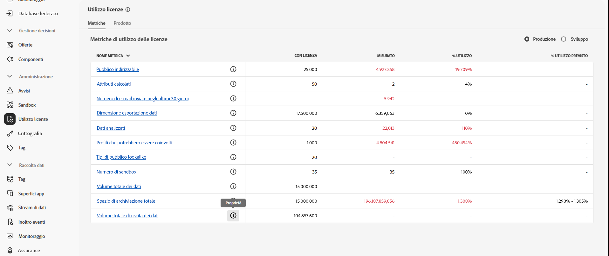
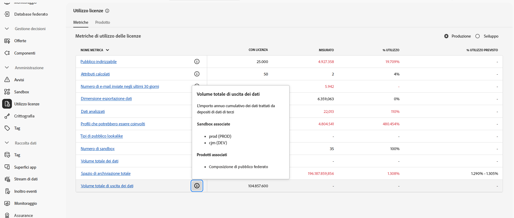

# Prerequisiti e guardrail {#fac-access}

La composizione di pubblico federato richiede i pacchetti Adobe Real-time Customer Data Platform e/o Adobe Journey Optimizer **Prime** o **Ultimate**. Per accedere a questa funzionalità, devi aver acquistato il componente aggiuntivo Composizione di pubblico federato.

>[!AVAILABILITY]
>
>Dopo aver ricevuto la notifica e-mail di benvenuto da Adobe, potrebbero essere necessarie alcune ore prima che l’interfaccia venga aggiornata e le funzioni siano disponibili.

## Sistemi supportati {#supported-systems}

La composizione di pubblico federato supporta i seguenti data warehouse cloud:

* Amazon Redshift
* Azure Synapse
* Databricks
* Google BigQuery
* Snowflake
* Vertica Analytics
* Microsoft Fabric

Scopri come creare una connessione con questi sistemi nella [panoramica sulle connessioni](../connections/home.md).

## Sandbox

Quando acquisti Composizione di pubblico federato, hai diritto a due sandbox. Per ulteriori richieste di provisioning per la sandbox, contatta il tuo rappresentante Adobe.

Per visualizzare l’elenco delle sandbox attive della composizione di pubblico federato, segui i passaggi seguenti:

1. Da Composizione di pubblico federato, accedi al menu **[!UICONTROL Utilizzo licenze]** in **[!UICONTROL Amministrazione]**.

1. Seleziona l’icona  da **[!UICONTROL Volume totale di dati in uscita]** per accedere alle proprietà della sandbox.

   

1. Le informazioni sulla sandbox sono visualizzate nel popover Proprietà.

   

## Autorizzazioni {#permissions}

Per accedere alla Composizione di pubblico federato, gli utenti devono essere aggiunti al profilo di prodotto specifico per la sandbox creato al momento dell’acquisto e si deve assegnare loro l’autorizzazione **[!UICONTROL Gestisci dati federati]**. [Ulteriori informazioni](/help/governance-privacy-security/access-control.md)

## Elenco IP consentiti {#ip}

Per consentire alla composizione di pubblico federato di accedere ai database in modo sicuro, è necessario autorizzare gli indirizzi IP dei server della composizione di pubblico federato che vi accederanno. Questi indirizzi IP vengono visualizzati quando viene aggiunto un database federato nell’interfaccia utente di Adobe Experience Platform. [Ulteriori informazioni](../connections/home.md)

Aggiungi questi indirizzi IP al tuo elenco consentiti per concedere l’accesso a una composizione di pubblico federato.

## Criteri di unione {#merge-policies}

Se la sandbox utilizza un criterio di unione **precedenza set di dati**, contatta l’Assistenza clienti Adobe per aggiungere il set di dati `Halos UPS` al criterio di unione.

Per ulteriori informazioni sui criteri di unione, consulta la [panoramica sui criteri di unione](https://experienceleague.adobe.com/it/docs/experience-platform/profile/merge-policies/overview).

## Guardrail e limitazioni {#fac-guardrails}

* La composizione di pubblico federato è soggetta alle limitazioni del prodotto e ai guardrail delle prestazioni elencati nella [documentazione di Real-time Customer Data Platform di Adobe](https://experienceleague.adobe.com/it/docs/experience-platform/profile/guardrails){target="_blank"}.

* La composizione di pubblico federato supporta l’esportazione di tipi di pubblico di grandi dimensioni, anche con file di dimensioni superiori a 1 GB. Per prestazioni ottimali, la dimensione massima consigliata del file è di 20 GB.
