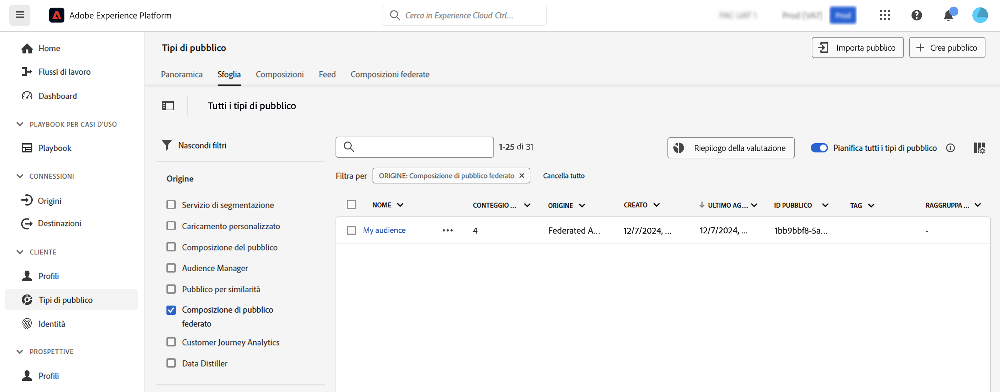

# Utilizzare i tipi di pubblico {#gs-audiences}

La funzione Composizione di pubblico federato di Experience Platform consente di [creare composizioni](../compositions/home.md) sfruttando varie attività in un’area di lavoro visiva e quindi creare e memorizzare i tipi di pubblico in Adobe Experience Platform Audience Portal.

Puoi eseguire il target di questi tipi di pubblico in Journey Optimizer o attivati in qualsiasi destinazione supportata da Adobe Experience Platform.

## Creazione di tipi di pubblico tramite composizioni{#creation}

Per creare tipi di pubblico utilizzando la composizione di pubblico federato, devi creare una composizione che includa un’attività **[!UICONTROL Salva pubblico]**. Questa attività consente di salvare il pubblico in Audience Portal e di selezionare i campi da includere nel pubblico da database esterni. [Scopri come configurare un’attività Salva pubblico](../compositions/activities.md#save-audience)

Il pubblico creato con la composizione di dati federati di Adobe include tutti i campi selezionati nell’attività **[!UICONTROL Salva pubblico]** e viene memorizzato in Audience Portal insieme a tutti i tipi di pubblico di Adobe Experience Platform.

Dopo aver eseguito la composizione, il pubblico risultante viene salvato in Adobe Experience Platform come pubblico esterno e reso disponibile in Adobe Real-Time Customer Data Platform e/o Adobe Journey Optimizer.

Puoi attivare questi tipi di pubblico in qualsiasi destinazione supportata da Adobe Experience Platform. Scopri come utilizzare le destinazioni in [Adobe Experience Platform](https://experienceleague.adobe.com/it/docs/experience-platform/destinations/home){target="_blank"}

>[!NOTE]
>
>I tipi di pubblico creati con Composizione di pubblico federato di Adobe non possono essere modificati. Per apportare modifiche a uno di questi tipi di pubblico, devi creare un nuovo pubblico utilizzando una composizione.

## Accedere al pubblico in Adobe Experience Platform {#access-audience}

I tipi di pubblico creati mediante la composizione di pubblico federato sono resi accessibili in Audience Portal, disponibile dal menu **Tipi di pubblico**.

La scheda **[!UICONTROL Sfoglia]** elenca tutti i tipi di pubblico esistenti memorizzati in Adobe Experience Platform. Per riconoscere, tra i tipi di pubblico elencati, quelli creati con Composizione di pubblico federato, osserva la colonna **[!UICONTROL Origine]** o utilizza i filtri disponibili nel riquadro a sinistra.

Per ulteriori informazioni su come utilizzare i tipi di pubblico in Adobe Experience Platform, consulta la [documentazione di Audience Portal](https://experienceleague.adobe.com/it/docs/experience-platform/segmentation/ui/audience-portal){target="_blank"}

<!-- add link to this donc once published: https://jira.corp.adobe.com/browse/PLAT-198674-->