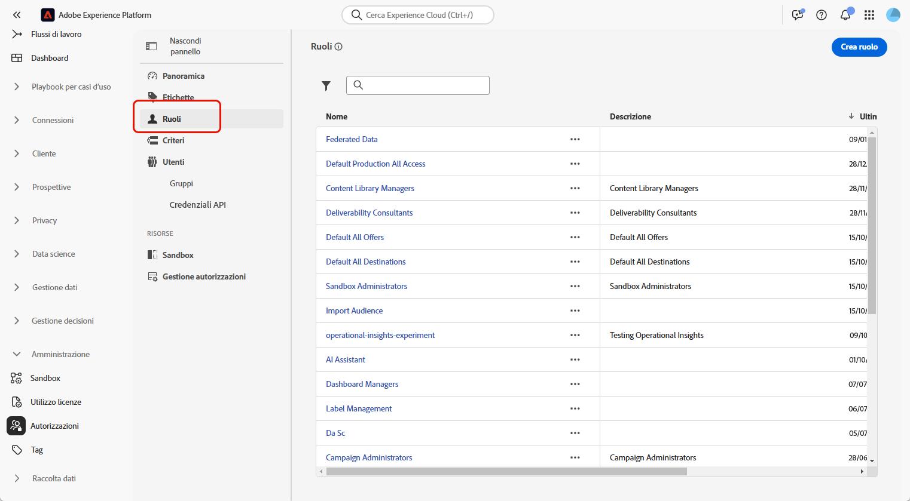
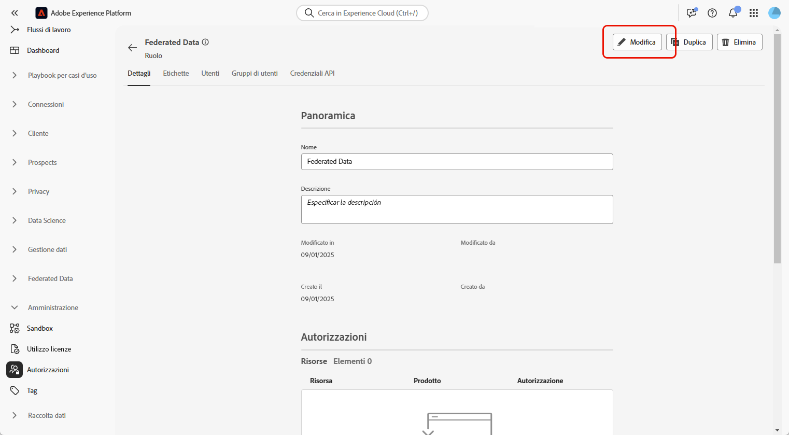
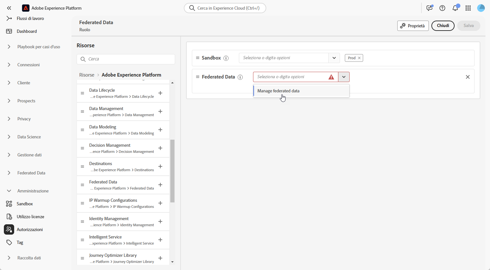
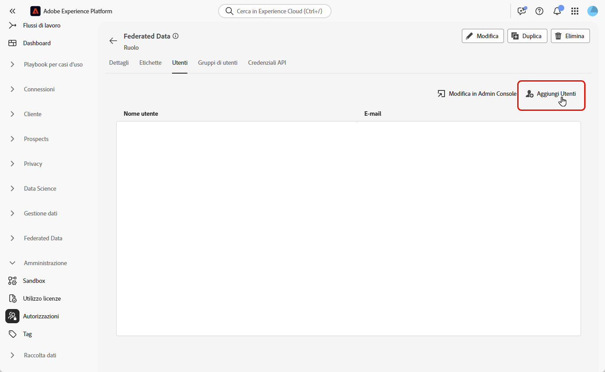

# Accedere alla Composizione di pubblico federato {#feature-access}

## Gestire l’accesso alle sandbox {#access-sandboxes}

Quando acquisti Adobe Experience Platform Federated Audience Composition, viene creato un profilo di prodotto per ogni sandbox attiva in quel momento. Questo profilo di prodotto viene creato in Admin Console nella scheda prodotto di **Adobe Experience Platform** e segue questa convenzione di denominazione: `ACP_FAC - <<SandboxName>> - admin.` per accedere alla composizione di pubblico federato per una sandbox specifica, è necessario aggiungere gli utenti al profilo di prodotto creato per tale sandbox.

Ad esempio, se viene attivata una nuova sandbox denominata “fac-test”, viene creato il profilo di prodotto corrispondente “ACP_FAC - fac-test - admin”. Per accedere alle composizione di pubblico federato con questa sandbox, gli utenti devono essere aggiunti a questo profilo di prodotto.

## Gestire l’accesso alla Composizione di pubblico federato

Per accedere alla **Composizione di pubblico federato**, devi prima verificare che l’autorizzazione **Gestisci dati federati** sia assegnata ai ruoli appropriati. Questi ruoli devono quindi essere assegnati agli utenti che devono accedere alla **Composizione di pubblico federato**.

Nota: solo gli amministratori possono assegnare le autorizzazioni.

1. Passa al menu **[!UICONTROL Autorizzazioni]**.

1. Dal menu **[!UICONTROL Ruoli]**, seleziona il **[!UICONTROL Ruolo]** che desideri aggiornare.

   

1. Fai clic su **[!UICONTROL Modifica]** per modificare le autorizzazioni dei ruoli.

   

1. Aggiungi la risorsa **Dati federati**, quindi seleziona **[!UICONTROL Gestisci dati federati]** dal menu a discesa.

   

1. Dopo aver apportato le modifiche necessarie, fai clic su **[!UICONTROL Salva]**.

Tutti gli utenti già assegnati a questo ruolo avranno le autorizzazioni aggiornate automaticamente e l’accesso alla Composizione di pubblico federato.

Per assegnare questo ruolo ai nuovi utenti:

1. Passa alla scheda **[!UICONTROL Utenti]** nella dashboard dei ruoli e fai clic su **[!UICONTROL Aggiungi utenti]**.

   

1. Inserisci il nome o l’indirizzo e-mail dell’utente oppure selezionalo dall’elenco disponibile. Al termine, fai clic su **[!UICONTROL Salva]**.

L’utente riceverà quindi un’e-mail con istruzioni per accedere all’istanza. Se l’utente non è già stato creato in precedenza, consulta [questa documentazione](https://experienceleague.adobe.com/it/docs/experience-platform/access-control/abac/permissions-ui/users).
