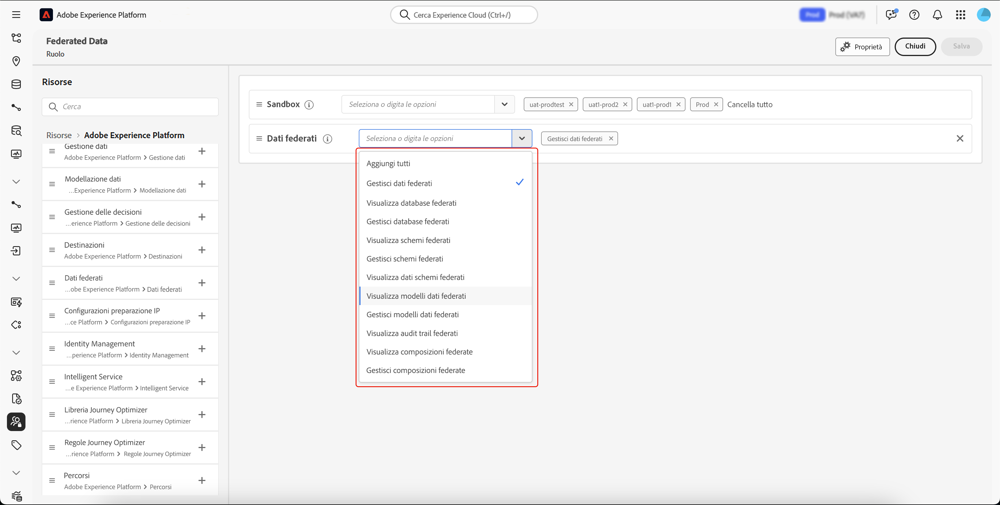

# Accedere alla Composizione di pubblico federato {#feature-access}

## Gestire l’accesso alle sandbox {#access-sandboxes}

Quando acquisti la funzionalità Composizione di pubblico federato di Adobe Experience Platform, viene creato un profilo di prodotto per ogni sandbox attiva in quel momento. Questo profilo di prodotto viene creato in Admin Console nella scheda prodotto di **Adobe Experience Platform** e segue questa convenzione di denominazione: `ACP_FAC - <<SandboxName>> - admin.` per accedere alla composizione di pubblico federato per una sandbox specifica, è necessario aggiungere gli utenti al profilo di prodotto creato per tale sandbox.

Ad esempio, se viene attivata una nuova sandbox denominata “fac-test”, viene creato il profilo di prodotto corrispondente “ACP_FAC - fac-test - admin”. Per accedere alle composizione di pubblico federato con questa sandbox, gli utenti devono essere aggiunti a questo profilo di prodotto.

## Gestire l’accesso alla Composizione di pubblico federato

Per accedere alla **Composizione di pubblico federato** e ai relativi diversi aspetti, devi prima assicurarti di assegnare le autorizzazioni necessarie. Questi ruoli devono quindi essere assegnati agli utenti che devono accedere alla **Composizione di pubblico federato**.

Nota: solo gli amministratori possono assegnare le autorizzazioni.

1. Passa al menu **[!UICONTROL Autorizzazioni]**.

1. Dal menu **[!UICONTROL Ruoli]**, seleziona il **[!UICONTROL Ruolo]** che desideri aggiornare.

   

1. Seleziona **[!UICONTROL Modifica]** per modificare le autorizzazioni del ruolo.

   

1. Aggiungi le autorizzazioni richieste per l’utente. Per accedere alla Composizione di pubblico federato, puoi aggiungere le seguenti autorizzazioni:

   | Autorizzazione | Descrizione |
   | ---------- | ----------- |
   | Gestione dati federati | Utilizza questa autorizzazione per gestire tutti gli aspetti della Composizione di pubblico federato. Questa autorizzazione include: Gestione database federato, Gestione schema federato, Gestione modello dati federato e Gestione composizioni federate. |
   | Gestione database federato | Utilizza questa autorizzazione per aggiungere, visualizzare, aggiornare ed eliminare le connessioni ai database federati. |
   | Visualizzazione database federato | Utilizza questa autorizzazione per visualizzare le connessioni ai database federati. |
   | Gestione schema federato | Utilizza questa autorizzazione per creare, visualizzare, aggiornare, eliminare e aggiornare schemi. |
   | Visualizzazione dati schema federato | Utilizza questa autorizzazione per visualizzare la scheda dati all’interno della sezione dello schema. |
   | Visualizzazione schema federato | Utilizza questa autorizzazione per visualizzare le tabelle dello schema. |
   | Gestione modello dati federato | Utilizza questa autorizzazione per creare, visualizzare, aggiornare ed eliminare modelli di dati. |
   | Visualizzazione modello dati federato | Utilizza questa autorizzazione per visualizzare i modelli di dati. |
   | Visualizzazione audit trail della federazione | Utilizza questa autorizzazione per visualizzare l’audit trail per la Composizione di pubblico federato. |
   | Gestione composizioni federate | Utilizza questa autorizzazione per creare, visualizzare, aggiornare ed eliminare composizioni federate. |
   | Visualizzazione composizioni federate | Utilizza questa autorizzazione per visualizzare le composizioni federate. |

   

1. Dopo aver apportato le modifiche necessarie, seleziona **[!UICONTROL Salva]**.

Tutti gli utenti già assegnati a questo ruolo avranno le autorizzazioni aggiornate automaticamente e l’accesso alla Composizione di pubblico federato.

Per assegnare questo ruolo ai nuovi utenti:

1. Passa alla scheda **[!UICONTROL Utenti]** nella dashboard dei ruoli e seleziona **[!UICONTROL Aggiungi utenti]**.

   

1. Inserisci il nome o l’indirizzo e-mail dell’utente oppure selezionalo dall’elenco disponibile. Al termine, seleziona **[!UICONTROL Salva]**.

<!-- Alternatively, you can assign one of the pre-existing roles to the users, depending on what permissions they need. For more information on assigning pre-existing roles to a user, please read the [guide on managing users for a product profile](https://experienceleague.adobe.com/en/docs/experience-platform/access-control/ui/users).

| Role name | Permissions |
| --------- | ----------- |
| FAC Data Managers | <ul><li>Manage Federated Compositions</li><li>View Federated Databases</li><li>View Federated Schemas</li><li>View Federated Schema Data</li><li>View Federated Data Models</li></ul> |
| FAC Composition Managers | <ul><li>Manage Federated Compositions</li></ul> |
| FAC Administrators | <ul><li>Manage Federated Data</li></ul> | -->

L’utente riceverà quindi un’e-mail con istruzioni per accedere all’istanza. Se l’utente non è già stato creato in precedenza, consulta [questa documentazione](https://experienceleague.adobe.com/it/docs/experience-platform/access-control/abac/permissions-ui/users).
