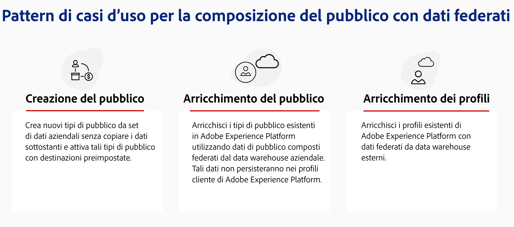

# Introduzione alla composizione di pubblico federato {#gs-fac}

La composizione di pubblico federato è un componente aggiuntivo di [Adobe Real-time Customer Data Platform](https://experienceleague.adobe.com/it/docs/experience-platform/segmentation/home){target="_blank"} e [Adobe Journey Optimizer](https://experienceleague.adobe.com/it/docs/journey-optimizer/using/ajo-home){target="_blank"} che consente all‘utente di creare e arricchire i tipi di pubblico dai data warehouse di terze parti e di importarli in Adobe Experience Platform. La composizione di pubblico federato offre una soluzione semplice e potente per collegare il data warehouse aziendale direttamente all’interno di Adobe Real-time Customer Data Platform e/o Adobe Journey Optimizer ed eseguire query sulle tabelle del data warehouse.

La composizione di pubblico federato di Adobe consente agli utenti delle app Adobe Experience Platform di accedere ai dati dei propri clienti archiviati nei data warehouse e nelle piattaforme di archiviazione cloud, come Amazon Redshift, Azure Synapse Analytics e altro ancora. I dati della clientela possono risiedere in più data warehouse e sono ora accessibili immediatamente, senza replica. Le piattaforme supportate sono elencate in questa [pagina](../connections/federated-db.md#supported-db).

## Funzionalità {#rn-capabilities}

La composizione di pubblico federato estende il valore di Real-Time CDP e Journey Optimizer con un approccio completo alla cura e all’attivazione del pubblico:

* Espandi l’accesso ai set di dati critici basati su data warehouse per creare tipi di pubblico di alto valore: utilizza i data warehouse esistenti come sistema principale di record, sfruttando al contempo le applicazioni leader di settore per fornire esperienze ottimali alla clientela.

* Supporto completo per casi d’uso di coinvolgimento: la composizione di pubblico federato, in combinazione con Real-Time CDP o Journey Optimizer, supporta esperienze personalizzate avviate dal marchio con tipi di pubblico federato e offre esperienze istantanee attivate da eventi in tempo reale, combinate con attributi di persona per soddisfare i requisiti dei casi d’uso tra i team.

* Riduci al minimo lo spostamento e la duplicazione dei dati: crea tipi di pubblico da set di dati che si trovano in un data warehouse aziendale senza copiare i dati sottostanti per gestire profili di marketing e tipi di pubblico utilizzabili.

* Utilizza un singolo sistema per flussi di lavoro basati sull’esperienza: cura i tipi di pubblico acquisiti e federati in Adobe Experience Platform e coordina le esperienze in uscita in tutti i canali.

## Casi d’uso {#rn-uc}

Tramite un’interfaccia utente ottimizzata per il marketing, crea regole di segmento per eseguire query nel data warehouse su un elenco di utenti idonei per un segmento specifico necessario per le campagne di marketing, accedi ai tipi di pubblico esistenti nel data warehouse per l’attivazione o arricchisci i tipi di pubblico di Adobe Experience Platform con punti dati aggiuntivi esistenti nel data warehouse.

In questa versione sono disponibili due casi d’uso:

1. Creazione di pubblico: crea nuovi tipi di pubblico dai set di dati aziendali senza copiare i dati sottostanti e attivali con le destinazioni predefinite.

1. Arricchimento del pubblico: arricchisci i tipi di pubblico esistenti in Adobe Experience Platform utilizzando dati del pubblico composti che sono stati federati dal data warehouse aziendale. Questi dati non verranno mantenuti nei profili cliente di Adobe Experience Platform.

{zoomable="yes"}{width="75%" align="center"}

## Passaggi chiave {#gs-steps}

La composizione di pubblico federato di Adobe consente di creare e aggiornare i tipi di pubblico di Adobe Experience Platform direttamente dal database, senza alcun processo di acquisizione.

<!--{zoomable="yes"}{width="85%" align="center"}-->

Passaggi chiave:

1. **Integrazione dei dati**: raccogli i dati provenienti da varie origini e uniscili in un set di dati unificato. Scopri come connettere le app Adobe Experience Platform al tuo data warehouse aziendale e ai database supportati, quindi come configurarli in [questa sezione](../connections/federated-db.md).

1. **Modellazione dati**: progetta e crea modelli di dati e schemi che definiscono la struttura, le relazioni e i vincoli dei dati. Per ulteriori informazioni sugli schemi consulta [questa pagina](../customer/schemas.md). Per scoprire come creare collegamenti per i modelli di dati, consulta [questa pagina](../data-management/gs-models.md).

1. **Trasformazione dei dati**: applica tecniche di manipolazione dei dati per modificare il formato, la struttura o i valori degli elementi dati in modo da renderli compatibili o idonei per applicazioni o analisi specifiche.

1. **Utilizzo dati**: crea, orchestra e crea tipi di pubblico. Scopri come creare i tipi di pubblico in [questa pagina](../compositions/gs-compositions.md). Puoi anche aggiornare o riutilizzare i tipi di pubblico esistenti tramite Adobe Experience Platform Audience Portal e le destinazioni. Per ulteriori informazioni, consulta [questa pagina](../connections/destinations.md).

>[!NOTE]
>
>Dopo aver eseguito la composizione, il pubblico risultante viene salvato in Adobe Experience Platform come pubblico esterno e reso disponibile in Adobe Real-Time Customer Data Platform e/o Adobe Journey Optimizer. È reso accessibile nel menu **Tipi di pubblico**. [Ulteriori informazioni](https://experienceleague.adobe.com/it/docs/experience-platform/segmentation/ui/audience-portal){target="_blank"}

## Ulteriori informazioni {#learn}

<!-- Workflow + Workflow activities-->

Scopri come accedere alla composizione di pubblico federato, a guardrail e limitazioni in [questa pagina](access-prerequisites.md).

Consulta le domande frequenti in [questa pagina](faq.md).

>[!CONTEXTUALHELP]
>id="dc_workflow_settings_execution"
>title="Impostazioni di esecuzione"
>abstract="In questa sezione, puoi configurare le impostazioni relative all’esecuzione del flusso di lavoro, ad esempio il numero di giorni in cui viene mantenuta la cronologia della composizione."

>[!CONTEXTUALHELP]
>id="dc_orchestration_query_enrichment_noneditable"
>title="Attività non modificabile"
>abstract="Quando un’attività **Query** o **Arricchimento** è configurata con dati aggiuntivi nella console; i dati di arricchimento vengono presi in considerazione e trasmessi nella transizione in uscita, ma non possono essere modificati."

<!-- Create a link -->

>[!CONTEXTUALHELP]
>id="dc_federated_database_create_link"
>title="Creare un collegamento"
>abstract="Definisci le impostazioni del collegamento."
